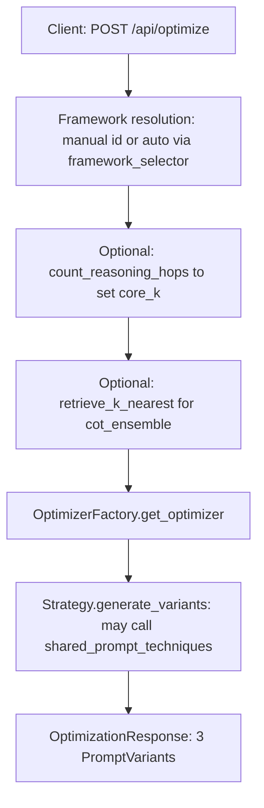

# APOST Optimization Engine: The Definitive Guide

> **"Bridging the gap between human intent and machine execution."**

This document is the authoritative guide to the `optimization` package in the APOST (Automated Prompt Optimisation & Structuring Tool) backend. The module turns underspecified natural-language requests into **three** prompt **variants**—Conservative, Structured, and Advanced—each produced by one of **eight** concrete optimization **frameworks** behind a single strategy interface.

**How to read this guide**

- If you are **new to prompt optimization**, read [Part I: Foundations](#part-i-foundations-for-new-readers) first, then skim the [architecture diagram](#part-ii-end-to-end-architecture) and [framework reference](#part-vi-framework-reference) as needed.
- If you are **implementing or extending** the system, read sequentially from [Part II](#part-ii-end-to-end-architecture) through [Part VII](#part-vii-software-engineering-patterns), and keep the [framework ID table](#framework-ids-and-python-classes) open for quick lookup.

---

## Table of contents

1. [Part I: Foundations for new readers](#part-i-foundations-for-new-readers)  
2. [Part II: End-to-end architecture](#part-ii-end-to-end-architecture)  
3. [Part III: Auto-select (deterministic framework routing)](#part-iii-auto-select-deterministic-framework-routing)  
4. [Part IV: Module map and cross-cutting parameters](#part-iv-module-map-and-cross-cutting-parameters)  
5. [Part V: Shared prompt techniques](#part-v-shared-prompt-techniques)  
6. [Part VI: Framework reference](#part-vi-framework-reference)  
7. [Part VII: Software engineering patterns](#part-vii-software-engineering-patterns)  
8. [Companion documentation](#companion-documentation)

---

## Part I: Foundations for new readers

### What “prompt optimization” means here

People write prompts in plain language. Large language models (LLMs) often follow instructions more reliably when those instructions are **scoped**, **ordered**, and **bounded** (what to do, what not to do, and in what shape to answer). In APOST, **prompt optimization** is not vague “make it better” rewriting: it is a **structured compilation step**. A framework **parses** the user’s intent into named parts (often via a small LLM call that returns JSON), then **assembles** deterministic strings in Python so that the three variants stay predictable and auditable.

That separation—**learned extraction** versus **deterministic assembly**—is why you can reason about behaviour: the “shape” of the prompt is encoded in code, not left to free-form continuation.

### Why three variants?

Each framework returns exactly **three** `PromptVariant` objects:

| Variant | Role in practice |
| :--- | :--- |
| **Conservative** | Minimal structure: lighter headings or prose cleanup. Lower token overhead; good when the model should stay flexible (e.g. creative tasks). |
| **Structured** | Clear sections, markdown or XML boundaries, repeatable layout. Good for production workflows and tooling. |
| **Advanced** | Strongest guards: high-contrast boundaries, repetition of critical constraints, persona locks, ensemble instructions, or iterative checkpoints—depending on the framework. |

**Escalation** means the same underlying intent, with **monotonically stronger** structural commitment—not three unrelated prompts.

### Mini-glossary

- **TCRTE** — Five dimensions used across APOST: **T**ask, **C**ontext, **R**ole, **T**one, **E**xecution. Gap analysis scores each dimension; some frameworks consume those scores to decide what to repair.
- **Primacy / recency** — Models often weight the **beginning** and **end** of a prompt more heavily than the middle (“lost in the middle”). Techniques that place constraints first (primacy) or repeat them at the end (recency) exploit that behaviour.
- **CoRe (Context Repetition)** — Repeats critical context at multiple attention positions (parameterized by `core_k`) to mitigate U-shaped attention decay over long prompts.
- **RAL-Writer** — Restates critical constraints at the **tail** of the prompt so they sit in the recency zone.
- **XML bounding** — Wrapping instructions and context in explicit tags (e.g. `<system_directives>` vs `<dynamic_context>`) so the model separates **rules** from **data**.
- **Medprompt-style CoT Ensemble** — Few-shot examples with reasoning traces plus instructions for multiple reasoning paths and reconciliation (implementation: CoT Ensemble framework).
- **TextGrad-style loop** — Iterative evaluate → localize flaws → rewrite targeted spans; checkpoints map to the three variants (implementation: TextGrad Iterative framework).

These terms reappear in [Part V](#part-v-shared-prompt-techniques) and [Part VI](#part-vi-framework-reference); the glossary is the conceptual on-ramp.

---

## Part II: End-to-end architecture

### The request path

Optimization is invoked by the API route [`POST /api/optimize`](../../api/routes/optimization.py). The route is intentionally thin: it resolves **which framework** to run, computes **cross-cutting parameters**, and delegates all algorithmic work to a **strategy** class. The logical order is:

1. **Framework resolution** — If `framework == "auto"`, a **deterministic** Python selector (no LLM) chooses a concrete framework id from session metadata (`task_type`, `complexity`, TCRTE overall score, reasoning-model flag, recommended techniques). See [Part III](#part-iii-auto-select-deterministic-framework-routing).
2. **CoRe hop count** — For `kernel`, `xml_structured`, and `cot_ensemble`, the backend estimates how many “hops” of reasoning the prompt implies and sets `core_k` for context repetition (default `2` if not in that set).
3. **kNN few-shot retrieval** — For `cot_ensemble` only, up to **k = 3** examples are retrieved from the embedded corpus using Gemini embeddings. If retrieval is unavailable or fails, the strategy **falls back to synthetic** few-shot examples generated by an LLM.
4. **Strategy execution** — [`OptimizerFactory.get_optimizer(framework_id)`](base.py) returns the concrete class; [`generate_variants(...)`](#part-iv-module-map-and-cross-cutting-parameters) returns an [`OptimizationResponse`](../../models/responses.py).

Every framework, including TextGrad, follows this **same** strategy pipeline—there are no parallel “special” HTTP routes per optimizer.

### Architecture diagram



Note: `shared_prompt_techniques` are pure helpers invoked **inside** each strategy where needed—not a separate HTTP step.

### Framework IDs and Python classes

The registry in [`OptimizerFactory`](base.py) maps **exact** string ids (also used by the frontend) to classes:

| `framework_id` | Python class | Module file |
| :--- | :--- | :--- |
| `kernel` | `KernelOptimizer` | [`frameworks/kernel_optimizer.py`](frameworks/kernel_optimizer.py) |
| `xml_structured` | `XmlStructuredOptimizer` | [`frameworks/xml_structured_optimizer.py`](frameworks/xml_structured_optimizer.py) |
| `create` | `CreateOptimizer` | [`frameworks/create_optimizer.py`](frameworks/create_optimizer.py) |
| `progressive` | `ProgressiveDisclosureOptimizer` | [`frameworks/progressive_disclosure_optimizer.py`](frameworks/progressive_disclosure_optimizer.py) |
| `reasoning_aware` | `ReasoningAwareOptimizer` | [`frameworks/reasoning_aware_optimizer.py`](frameworks/reasoning_aware_optimizer.py) |
| `cot_ensemble` | `ChainOfThoughtEnsembleOptimizer` | [`frameworks/cot_ensemble_optimizer.py`](frameworks/cot_ensemble_optimizer.py) |
| `tcrte` | `TcrteCoverageOptimizer` | [`frameworks/tcrte_coverage_optimizer.py`](frameworks/tcrte_coverage_optimizer.py) |
| `textgrad` | `TextGradIterativeOptimizer` | [`frameworks/textgrad_iterative_optimizer.py`](frameworks/textgrad_iterative_optimizer.py) |

`"auto"` is **not** registered in the factory. The API resolves `"auto"` to one of the ids above **before** calling `get_optimizer`.

---

## Part III: Auto-select (deterministic framework routing)

When the user chooses **auto**, [`select_framework`](../analysis/framework_selector.py) runs in pure Python. Given the same inputs, it always returns the same `framework_id` and a human-readable **`auto_reason`** string (surfaced in analysis for transparency).

**Priority order (highest first):**

1. **Reasoning models** (`is_reasoning_model`) → `reasoning_aware` — External chain-of-thought scaffolding conflicts with built-in extended thinking.
2. **QA** or **multi-document** signals (`task_type == "qa"` or recommended techniques such as `multi-document`, `xml_bounding`, `structured_retrieval`) → `xml_structured` — Strong structural boundaries for retrieval-style tasks.
3. **Complex planning or coding** (`task_type` in `planning` / `coding` and `complexity == "complex"`) → `progressive` — Layered disclosure for heavy workflows.
4. **Complex reasoning or analysis** (`task_type` in `reasoning` / `analysis` and `complexity` in `complex` / `expert`) → `cot_ensemble` — Few-shot reasoning traces (Medprompt pattern).
5. **Underspecified prompt** (`tcrte_overall_score < 50`) → `tcrte` — Fill structural gaps before style-heavy optimization.
6. **Simple or tool-oriented tasks** (`routing`, `extraction`, `classification`, or `complexity == "simple"`) → `kernel` — Lean, logically ordered prompts.
7. **Creative** (`task_type == "creative"`) → `create` — Sequential pillars without over-constraining format.
8. **Default** → `textgrad` — Iterative hardening when no rule above fires.

**Example** (illustrative):  
`auto_reason` might read: `Complex reasoning task — CoT Ensemble injects kNN-retrieved few-shot reasoning traces (Medprompt pattern) to anchor step quality.`  
That string is not decorative: it documents *why* the router made its choice.

---

## Part IV: Module map and cross-cutting parameters

| Location | Responsibility |
| :--- | :--- |
| [`base.py`](base.py) | `BaseOptimizerStrategy` abstract interface and `OptimizerFactory` registry. |
| [`optimizer_configuration.py`](optimizer_configuration.py) | Central thresholds, token limits, provider defaults. |
| [`shared_prompt_techniques.py`](shared_prompt_techniques.py) | Pure functions: gap-answer merge, input variables, CoRe, RAL-Writer, Claude prefill, provider formatting, coverage strings. |
| [`knn_retriever.py`](knn_retriever.py) | Embedding-based retrieval for `cot_ensemble` (Gemini embeddings, cosine similarity). |
| [`few_shot_corpus.py`](few_shot_corpus.py) | Curated in-memory corpus and helpers used with kNN. |
| [`frameworks/*.py`](frameworks/) | The eight concrete strategies. |

### `generate_variants` parameters

Every strategy implements:

```python
async def generate_variants(
    self,
    request: OptimizationRequest,
    core_k: int = 2,
    few_shot_examples: Optional[List[Any]] = None,
    auto_reason: Optional[str] = None,
) -> OptimizationResponse
```

- **`core_k`** — Depth for CoRe-style repetition (`k` evenly spaced insertions where applicable). Supplied by the route for frameworks that use hop counting; others may ignore it.
- **`few_shot_examples`** — Populated only for `cot_ensemble` (from kNN or `None`; the strategy may synthesize examples).
- **`auto_reason`** — Appended to model notes when present so variants can reflect auto-selection context.

Unknown `framework_id` values raise **`ValueError`** (fail-fast) at factory resolution time; the API maps that to HTTP 400.

---

## Part V: Shared prompt techniques

[`shared_prompt_techniques.py`](shared_prompt_techniques.py) centralizes cross-cutting behaviour so each framework stays focused on its own structural pattern. Typical pipeline stages (not every framework calls every function):

1. **`integrate_gap_interview_answers_into_prompt`** — Merges gap-interview answers into the raw prompt **before** extraction so parsers see enriched text.
2. **`inject_input_variables_block`** — Appends user-declared variables in a fenced block.
3. **`inject_context_repetition_at_attention_positions`** — CoRe: repeats critical context at `core_k` positions (addresses “lost in the middle”).
4. **`apply_ral_writer_constraint_restatement`** — Echoes key constraints at the end for recency.
5. **`generate_claude_prefill_suggestion`** — Suggests leading tokens for Anthropic-style prefill to lock format.
6. **`format_prompt_for_target_provider`** — Provider-aware shaping (e.g. XML vs markdown emphasis).
7. **`compute_coverage_delta_description`** — Human-readable “coverage improved from X% → Y%” strings where analysis reports deltas.

**Bridge to frameworks:** KERNEL and XML Structured lean on **logical order** and **bounding**; CoT Ensemble and TCRTE Coverage often stack **CoRe + RAL** on top of their macro-structure; TextGrad uses gap integration and prefill helpers while the **core loop** is evaluate → gradient → rewrite.

---

## Part VI: Framework reference

Each subsection follows the same pattern: **Beginner** (when to use, mental model) → **Advanced** (extraction schema, variant logic, integration notes).

---

### 1. KERNEL (`kernel`) — `KernelOptimizer`

**Beginner.** Best for **simple, discrete** tasks: classification, routing, extraction, or anything that should stay lean. Mental model: **one clean story** in a fixed order—context, then task, then must/must-not rules, then format—so the model does not blend objectives.

**Advanced.**

- **Extraction (JSON):** `context`, `task`, `positive_constraints` (list), `negative_constraints` (list), `format`.
- **Assembly:** Variants are built in **Python** from those fields—no second LLM pass for variant text. Conservative → light prose cleanup; Structured → KERNEL headings (e.g. `### Context`); Advanced → stronger boundaries and guards.
- **Integration:** Participates in **CoRe hop counting** at the API layer (`core_k`).

**Micro-example (ordering):**  
`Context` → `Task` → bullet lists for **must** / **must not** → `Format` mirrors a compiler pipeline: facts, goal, rules, output contract.

---

### 2. XML Structured (`xml_structured`) — `XmlStructuredOptimizer`

**Beginner.** Best for **Claude-class** models and tasks where **instructions must not bleed into data** (tool use, extraction, strict QA). Mental model: put **directives** and **dynamic context** in different XML “rooms.”

**Advanced.**

- **Extraction:** `task`, `constraints` (bulleted), `format`.
- **Assembly:** Programmatic tag injection: e.g. `<system_directives>` (constraints often **first** for primacy) vs `<dynamic_context>` with `<input_variables>` for injection-safe separation.
- **Variants:** Escalating constraint emphasis; Advanced may add **RAL-Writer**-style `<restate_critical>` echoes.
- **Integration:** CoRe hop counting applies; may suggest **Claude prefill** via shared helpers.

---

### 3. CREATE (`create`) — `CreateOptimizer`

**Beginner.** Best for **creative** or **persona-heavy** work where order matters: role, ask, examples, tweaks, output type, safety extras. Mental model: **six pillars** in sequence so the model “walks” the request in a deliberate order.

**Advanced.**

- **Extraction:** `character`, `request`, `examples`, `adjustments`, `type_of_output`, `extras`.
- **Assembly:** Conservative → light sequential structure; Structured → explicit pillar headers; Advanced → stricter sequential blocks and persona or safety **locks**.

---

### 4. Progressive Disclosure (`progressive`) — `ProgressiveDisclosureOptimizer`

**Beginner.** Best for **agents**, **tools**, and **multi-step** workflows. Mental model: do not dump everything at once—separate **what exists**, **when to use it**, and **how to run it**.

**Advanced.**

- **Extraction:** Four fields align with the implementation: `discovery_metadata`, `activation_rules`, `execution_logic`, `output_format` (the architecture is still described as a **layered** progressive disclosure pattern: discovery / activation / execution, plus explicit **output format**).
- **Assembly:** Conservative → plain layered text; Structured → markdown sectioning; Advanced → nested XML (e.g. skill or system architecture blocks) for maximum separation.

---

### 5. Reasoning-Aware (`reasoning_aware`) — `ReasoningAwareOptimizer`

**Beginner.** Best for **o-series**, **extended thinking**, or similar models that already spend internal compute on reasoning. Mental model: give **declarative boundaries**, not “how to think” tutorials.

**Advanced.**

- **Extraction:** `absolute_task`, `hard_constraints` (list), `output_format` — the LLM parser is instructed to **strip** “how to think” scaffolding from those fields.
- **Assembly:** Three declarative system prompts: Conservative (`OBJECTIVE` / `RULES` / `FORMAT`); Structured puts **format** earlier (primacy); Advanced adds explicit **no chain-of-thought** execution mandate.

---

### 6. CoT Ensemble (`cot_ensemble`) — `ChainOfThoughtEnsembleOptimizer`

**Beginner.** Best when **few-shot reasoning traces** help more than zero-shot prose—e.g. difficult clinical or analytical prompts. Mental model: show **how** similar prompts were solved, then ask for **multiple paths** and reconciliation.

**Advanced.**

- **Few-shot path:** Route may pass **kNN** examples (`retrieve_k_nearest`, k = 3). If corpus or API is unavailable, the strategy uses **synthetic** examples via a dedicated LLM sub-call.
- **Assembly:** Conservative → one example, single path; Structured → two examples, dual path + self-check; Advanced → three examples, tri-path + ensemble language + stronger anti-hallucination framing; **CoRe** and **RAL** apply on Advanced where configured.
- **Integration:** CoRe hop counting at API; `few_shot_examples` and `core_k` threaded from route.

---

### 7. TCRTE Coverage (`tcrte`) — `TcrteCoverageOptimizer`

**Beginner.** Best when the **prompt itself** is incomplete: missing task, audience, format, or role. Mental model: **triage each TCRTE dimension**, merge user gap answers, then **backfill** what is still missing.

**Advanced.**

- **Triage thresholds (per dimension score):**
  - **MISSING:** score **&lt; 35** — must be filled.
  - **WEAK:** score **35–69** — should be enhanced.
  - **GOOD:** score **≥ 70** — preserve unless the variant strategy demands fuller sections.
- **Assembly:** Conservative → targeted insertions for **MISSING** only; Structured → full five-section TCRTE layout addressing MISSING + WEAK; Advanced → full architecture plus guards and optional CoRe / RAL as implemented.

**Micro-example:** If **Execution** is MISSING and the user supplied a gap answer “JSON array of {id, label}”, that answer is woven in before LLM gap-filling runs on remaining holes.

---

### 8. TextGrad Iterative (`textgrad`) — `TextGradIterativeOptimizer`

**Beginner.** Best when you want **iterative hardening**: evaluate the prompt like a loss function, localize weak spans, rewrite only those spans. Mental model: **three optimization steps**, **three checkpoints**, **three variants**.

**Advanced.**

- **Loop:** For each iteration: **forward** (TCRTE-style evaluation), **backward** (localize critique to spans), **update** (rewrite spans; keep the rest stable). Default iteration count is configured in [`optimizer_configuration.py`](optimizer_configuration.py).
- **Checkpoint mapping:** Iteration **1** → Conservative, **2** → Structured, **3** → Advanced (see module docstring in [`textgrad_iterative_optimizer.py`](frameworks/textgrad_iterative_optimizer.py)).
- **Cost:** Multiple LLM calls per iteration; documented in-code for operators tuning spend.

---

## Part VII: Software engineering patterns

### SOLID and the Strategy / Factory pairing

- **Single responsibility** — Each file under `frameworks/` implements one framework’s extraction and assembly story.
- **Open/closed** — New frameworks add a class and a registry entry; existing strategies stay untouched.
- **Liskov substitution** — Callers depend on `BaseOptimizerStrategy.generate_variants`; any registered class can replace another at runtime.
- **Dependency direction** — Strategies depend on abstractions (`BaseOptimizerStrategy`, shared utilities, `LLMClient`) rather than on the HTTP layer.

The factory [`OptimizerFactory`](base.py) uses **lazy imports** to avoid circular dependencies and raises **`ValueError`** for unknown ids (explicit failure, not silent fallback).

### Fail-fast behaviour

Mis-typed `framework_id` strings fail at `get_optimizer` with an error listing **available** ids—this matches the contract expected from the API layer.

---

## Companion documentation

For a **line-by-line code-quality review** of the eight frameworks—SOLID checklist, per-optimizer ASCII flow diagrams, scoring, and a consolidated **recommendations** list (shared utilities, magic-number constants, error-handling consistency, testing)—see [`frameworks/OPTIMIZER_ANALYSIS.md`](frameworks/OPTIMIZER_ANALYSIS.md). This README explains **what** the system does and **how** to think about it; that document adds **maintainer-level** audit detail and improvement backlog.

---

*The optimization service treats prompt authoring as engineering: explicit structure, measurable coverage, and repeatable pipelines—so beginners can learn the vocabulary and experts can trust the machinery.*
