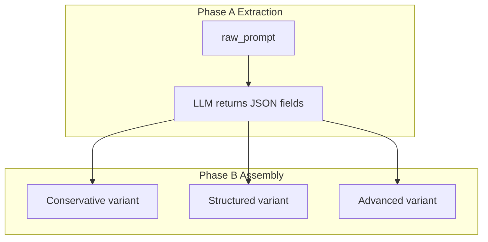
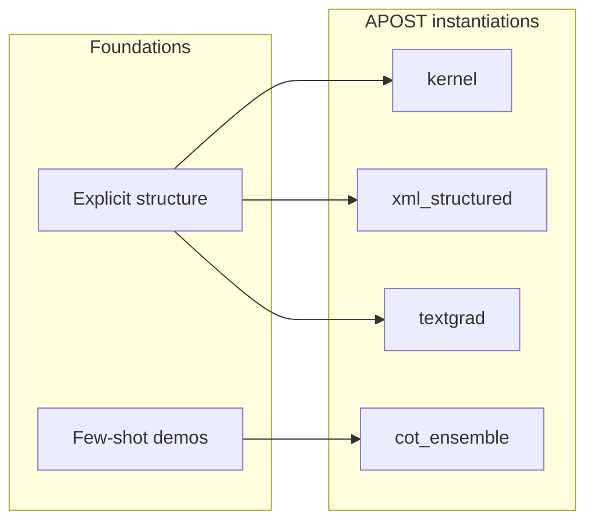

# APOST Optimizer Frameworks: Principles, Mechanisms, and Practice

This document is a **standalone learning resource** for developers who want to understand *why* each optimization framework exists, *what research or practice it draws on*, *how it is implemented in code*, and *when to prefer one approach over another*. It complements the service-level overview in [`../README.md`](../README.md), which documents API wiring, registry IDs, and the auto-select router.

**Reading order:** Start with [Cognitive foundations](#1-cognitive-foundations-why-structure-matters), then skim the [conceptual map](#9-conceptual-map-relationships-among-frameworks). Dive into each [framework deep dive](#3-framework-deep-dives) as needed.

---

## Table of contents

1. [Cognitive foundations: why structure matters](#1-cognitive-foundations-why-structure-matters)
2. [Implementation shape in APOST](#2-implementation-shape-in-apost)
3. [Framework deep dives](#3-framework-deep-dives)  
   - [KERNEL](#31-kernel-structured-decomposition-and-logical-order)  
   - [XML Structured](#32-xml-structured-semantic-bounding-and-context-isolation)  
   - [CREATE](#33-create-sequential-creative-instruction)  
   - [Progressive Disclosure](#34-progressive-disclosure-layered-agent-design)  
   - [Reasoning-Aware](#35-reasoning-aware-declarative-prompts-for-test-time-reasoning-models)  
   - [CoT Ensemble (Medprompt pattern)](#36-cot-ensemble-medprompt-pattern--knn-few-shot)  
   - [TCRTE Coverage](#37-tcrte-coverage-dimension-wise-gap-repair)  
   - [TextGrad Iterative](#38-textgrad-iterative-evaluate-critique-rewrite)
4. [Cross-cutting techniques used by multiple frameworks](#4-cross-cutting-techniques-used-by-multiple-frameworks)
5. [Choosing and combining approaches](#5-choosing-and-combining-approaches)
6. [References and further reading](#6-references-and-further-reading)

---

## 1. Cognitive foundations: why structure matters

### 1.1 The core problem: soft instructions in a noisy channel

Large language models (LLMs) map a **token sequence** (your prompt) to a **distribution over next tokens**. They do not execute programs; they **complete patterns**. When instructions are vague, contradictory, or buried in the middle of a long context, completion quality drops—not because the model “refuses,” but because **attention** and **pattern match** are imperfect.

Three ideas recur across modern prompt engineering and the frameworks below:

| Idea | Seminal reference | What it means for prompts |
| :--- | :--- | :--- |
| **Lost in the middle** | Liu et al. (2023) — *Lost in the Middle: How Language Models Use Long Contexts* | Performance on facts placed in the **middle** of long contexts is often worse than for facts at the **start** or **end**. Long prompts need **repetition** or **re-ordering** of critical facts. |
| **Instruction following and format** | Industry practice + model cards (e.g. OpenAI, Anthropic) | Models follow **explicit** boundaries (tags, sections) more reliably than **implicit** prose. **Primacy** (first) and **recency** (last) matter for constraints. |
| **Few-shot + retrieval** | Nori et al. (2023) — Medprompt; classic in-context learning (Brown et al., 2020) | Showing **similar** input–output transformations beats random examples; **dynamic retrieval** of similar cases improves robustness. |

APOST encodes these ideas as **deterministic assembly** (Python string building) after **one structured extraction call** (JSON from an LLM), so the *shape* of the prompt is stable and reviewable.

### 1.2 Illustrative “before / after” pattern (all frameworks share this shape)

**Bottleneck:** A single blob of text mixes task, data, and format; the model answers the wrong question or ignores the format.

**Pattern in code (conceptual):**

```text
# Phase A — Extraction (often one LLM call, JSON only)
components = extract_json(raw_prompt)   # schema depends on framework

# Phase B — Assembly (pure Python; no LLM)
variant_conservative = assemble(components, level="low")
variant_structured   = assemble(components, level="medium")
variant_advanced     = assemble(components, level="high")
```

**Illustrative metrics** (not benchmark claims—typical engineering observations):

| Stage | What you measure | Typical direction of travel |
| :--- | :--- | :--- |
| **Spec compliance** | Does output match JSON schema / section count? | Structured variants ↑ |
| **Token cost** | System prompt length | Advanced variants ↑ |
| **Latency** | One-shot vs TextGrad multi-pass | TextGrad ≫ single-pass |

---

## 2. Implementation shape in APOST

Every framework is a **concrete strategy** implementing `BaseOptimizerStrategy.generate_variants()` in [`../base.py`](../base.py). The factory maps string IDs (`kernel`, `xml_structured`, …) to classes. The HTTP route resolves `auto` **before** the factory (see [`../../analysis/framework_selector.py`](../../analysis/framework_selector.py)).



**Exception:** **TextGrad** runs a **multi-iteration** loop (several LLM calls) and maps iteration checkpoints to variants; see [§3.8](#38-textgrad-iterative-evaluate-critique-rewrite).

---

## 3. Framework deep dives

Each subsection follows the same pattern: **origins → problem → internal mechanism → concrete example → how it relates to others**.

---

### 3.1 KERNEL — structured decomposition and logical order

**Origins and theory.** KERNEL is an APOST mnemonic (**K**eep it simple, **E**xplicit rules, **N**arrow scope, **L**ogical order) aligned with widespread prompt-engineering practice: **decompose** intent into **context**, **task**, **constraints**, and **output contract**. It is not tied to a single paper; it operationalizes clarity principles discussed in instruction-tuning and alignment literature (e.g. emphasis on unambiguous objectives in system prompts).

**Problem solved.** Unstructured prompts cause **constraint blending**—the model mixes “background” with “must-do” rules. KERNEL forces a **total order**: context → task → positive/negative constraints → format.

**Internal mechanism (`kernel_optimizer.py`).**

1. **Extraction:** One LLM call with a strict JSON schema: `context`, `task`, `positive_constraints[]`, `negative_constraints[]`, `format`.
2. **Assembly:** Pure Python f-strings—three templates (Conservative prose, `###` headings, bordered “layer” blocks). No second LLM pass for variant bodies.

**Pseudocode aligned with the implementation:**

```python
extracted = llm_json(kernel_extraction_prompt, raw_prompt)
ctx, task = extracted["context"], extracted["task"]
pos, neg = extracted["positive_constraints"], extracted["negative_constraints"]
fmt = extracted["format"]

v1 = f"{ctx}\n\nYour objective is: {task}\n\nRequirements:\n{bullets(pos+neg)}\n\nOutput Format: {fmt}"
v2 = f"### Context\n{ctx}\n\n### Task\n{task}\n\n### Constraints\n*MUST DO:*\n{bullets(pos)}\n*MUST NOT DO:*\n{bullets(neg)}\n\n### Format\n{fmt}"
# v3 adds high-contrast delimiters and extra guardrails (see source)
```

**Concrete example.**

| | Content |
| :--- | :--- |
| **Before (raw)** | “Summarize the patient chart and don’t hallucinate.” |
| **After (Structured excerpt)** | `### Task` → summarize; `### Constraints` → MUST NOT hallucinate; `### Format` → bullets. |
| **Effect** | Separates **task** from **safety**; model sees negations in a dedicated block. |

**Relations.** KERNEL is the **default “lean”** shape: prefer it over **XML** when you do not need strong **data/instruction isolation**. Prefer **TCRTE** first if scores show **missing** dimensions (KERNEL does not fill gaps—it **reorders** what is there). **CoT Ensemble** adds **examples**; KERNEL does not.

---

### 3.2 XML Structured — semantic bounding and context isolation

**Origins and theory.** Anthropic and other providers document **XML-tagged prompts** for Claude-class models: tags create **hard semantic boundaries** so the model treats **system directives** differently from **user or tool data**. This mitigates **instruction drift** when variable content is long or adversarial.

**Problem solved.** Without tags, “constraints” and “input text” **blend** in one channel; the model may follow an example in the data as if it were a rule. XML separates **what must be true** from **what was observed**.

**Internal mechanism (`xml_structured_optimizer.py`).**

1. **Extraction:** `task`, `constraints` (bulleted), `format`.
2. **Assembly:** Nests fields under `<system_directives>` vs `<dynamic_context>` / `<input_variables>` so **directives** and **data** are not co-located.

**Illustrative structure (simplified):**

```xml
<system_directives>
  <constraints>...</constraints>   <!-- often ordered for primacy -->
  <task>...</task>
  <output_format>...</output_format>
</system_directives>
<dynamic_context>
  <input_variables>...</input_variables>
</dynamic_context>
```

Advanced variants may add **RAL-style** `<restate_critical>` blocks (recency).

**Concrete example.**

| | Content |
| :--- | :--- |
| **Bottleneck** | Ten pages of EHR pasted after “answer in JSON”—model outputs prose. |
| **Change** | JSON rules live in `<system_directives>`; charts in `<dynamic_context>`. |
| **Effect** | Format rules stay in the **directive** channel; data stops overriding schema. |

**Relations.** **XML vs KERNEL:** both order information; XML adds **machine-readable fences** for Claude-style models and **injection-aware** layout. **vs CoT Ensemble:** XML does not inject few-shot chains; combine at the **application** level if needed.

---

### 3.3 CREATE — sequential creative instruction

**Origins and theory.** CREATE (**C**haracter, **R**equest, **E**xamples, **A**djustments, **T**ype of output, **E**xtras) packages **creative** and **persona** workflows where **order** signals priority: who speaks, what is asked, what examples anchor style, what must not change, and what output shape is required. It parallels sequential “scene setting” in interactive fiction and structured briefs in content generation.

**Problem solved.** Creative prompts often **shuffle** role, task, and safety. CREATE **fixes a narrative order** so the model locks persona before absorbing constraints.

**Internal mechanism (`create_optimizer.py`).**

1. **Extraction:** Six string fields: `character`, `request`, `examples`, `adjustments`, `type_of_output`, `extras`.
2. **Assembly:** Escalating sectioning—light structure → `###` per pillar → strong borders and persona lock on Advanced.

**Concrete example.**

| | Content |
| :--- | :--- |
| **Before** | “Write something fun about APIs, be safe.” |
| **After (Structured)** | `### Character` senior technical writer; `### Request` 500-word blog; `### Extras` no unsafe code. |
| **Effect** | Persona and safety are **first-class** sections, not afterthoughts. |

**Relations.** **CREATE vs KERNEL:** KERNEL optimizes **tool-like** clarity; CREATE optimizes **creative** sequencing. **Auto-select** often routes `creative` tasks to CREATE (see `framework_selector.py`).

---

### 3.4 Progressive Disclosure — layered agent design

**Origins and theory.** **Progressive disclosure** comes from HCI (e.g. **Jack Carroll**, **Nielsen**): show **essentials first**, reveal **detail on demand** so users are not overwhelmed. In LLM agents, the analogue is **layering skills**: what exists → when it fires → how it runs → what it returns.

**Problem solved.** Long single-shot prompts overload the model with **tools + policies + procedures** at once; errors rise (wrong tool, wrong order). Layering reduces **simultaneous cognitive load** in the prompt channel.

**Internal mechanism (`progressive_disclosure_optimizer.py`).**

1. **Extraction (four fields in code):** `discovery_metadata`, `activation_rules`, `execution_logic`, `output_format`.
2. **Assembly:** Plain layers → markdown headings → nested XML (`<system_architecture>` style) for Advanced.

**Pseudocode:**

```text
layer1 = discovery_metadata    # what skills/tools exist
layer2 = activation_rules    # when to invoke
layer3 = execution_logic       # how to run
layer4 = output_format         # contract on completion
variant = stack(layer1..layer4, formatting=escalation)
```

**Concrete example.**

| | Content |
| :--- | :--- |
| **Bottleneck** | One paragraph lists six APIs and five policies—model picks wrong API. |
| **Change** | Layer 1 lists APIs; Layer 2 defines triggers (“if user says ‘refund’…”); Layer 3 gives steps. |
| **Effect** | **When vs how** are separated—fewer spurious tool calls in reasoning traces. |

**Relations.** **vs XML:** both structure prompts; Progressive Disclosure optimizes **staged agent logic**, not **data vs directive** separation alone. **vs CoT Ensemble:** Progressive Disclosure does not add retrieved examples; it **structures** policy.

---

### 3.5 Reasoning-Aware — declarative prompts for test-time reasoning models

**Origins and theory.** **Test-time compute** models (e.g. OpenAI **o1/o3**-style, extended thinking) allocate extra internal computation to reasoning. External “think step by step” scaffolding can **duplicate** or **fight** internal chains, sometimes **hurting** quality or wasting tokens. Practice (and model documentation) emphasizes **declarative** objectives and **output contracts** instead of procedural CoT.

**Problem solved.** User prompts often contain **CoT induction** (“reason carefully,” “list your steps”). For reasoning models, the optimizer **re-expresses** the task as **OBJECTIVE / RULES / FORMAT** without prescribing *how* to think internally.

**Internal mechanism (`reasoning_aware_optimizer.py`).**

1. **Extraction:** JSON fields `absolute_task`, `hard_constraints[]`, `output_format` with instructions to **strip** “how to think” phrasing from those fields.
2. **Assembly:** Three variants—simple declarative blocks; **Structured** emphasizes **format primacy**; **Advanced** adds explicit **no chain-of-thought output** mandates.

**Concrete example.**

| | Content |
| :--- | :--- |
| **Before** | “Think step by step, then output JSON…” |
| **After (Advanced excerpt)** | “You must proceed directly to emitting the exact final Output Format” + schema-bound format block. |
| **Effect** | Frees the model to use **internal** reasoning without echoing **external** CoT. |

**Relations.** **Opposite of CoT Ensemble:** Ensemble **adds** reasoning demonstrations; Reasoning-Aware **removes** redundant CoT instructions. **Auto-select** routes reasoning models to `reasoning_aware` first.

---

### 3.6 CoT Ensemble (Medprompt pattern + kNN few-shot)

**Origins and theory.** Nori et al. (2023), *Can Generalist Foundation Models Outcompete Special-Purpose Tuning?* — **Medprompt** combines **dynamic few-shot selection** (examples similar to the query) with **chain-of-thought**-style reasoning in demonstrations, pushing strong general models toward specialist-level accuracy without fine-tuning. APOST implements the **retrieval + multi-path** spirit via **Gemini embeddings** and **cosine similarity** ([`../knn_retriever.py`](../knn_retriever.py)).

**Problem solved.** Zero-shot prompts lack **procedure**; static few-shot picks **irrelevant** demonstrations. **kNN** aligns demonstrations with the **current** task; **multi-path** instructions ask for independent reasoning lines and reconciliation.

**Internal mechanism (`cot_ensemble_optimizer.py`).**

1. **Examples:** Prefer **kNN** examples from `few_shot_corpus` (precomputed embeddings). If unavailable, **synthetic** examples via an LLM sub-call.
2. **Assembly:** Escalating path count (1 → 2 → 3) and ensemble / self-check language; **CoRe**, **RAL**, prefill via [`shared_prompt_techniques.py`](../shared_prompt_techniques.py).

**Illustrative retrieval pseudocode:**

```python
# Route supplies few_shot_examples when GOOGLE_API_KEY + corpus exist
examples = retrieve_k_nearest(query=raw_prompt, k=3) or synthesize_examples_via_llm()
prompt = build_medprompt_style_prompt(examples, raw_prompt, variant_level)
```

**Concrete example.**

| | Content |
| :--- | :--- |
| **Bottleneck** | Hard diagnosis-style question with no worked format. |
| **Change** | Inject 2–3 retrieved Q→rationale→answer pairs, then ask for dual/tri paths + check. |
| **Effect** | Model **mirrors** demonstrated reasoning structure; failure modes shift from “no plan” to “over-copying” (mitigated by self-check text in Structured+). |

**Relations.** **Complements KERNEL/XML:** Ensemble **adds data-dependent demonstrations**; KERNEL/XML **shape** instructions. **Cost:** kNN embedding + longer prompts vs KERNEL’s single extraction call.

---

### 3.7 TCRTE Coverage — dimension-wise gap repair

**Origins and theory.** **TCRTE** (**T**ask, **C**ontext, **R**ole, **T**one, **E**xecution) is APOST’s **coverage rubric**—aligned with the observation that robust prompts **explicitly** specify task, grounding, persona, style, and output contract (similar dimensions appear across prompt-quality checklists and evaluation harnesses).

**Problem solved.** If overall gap score is low, **stylistic** optimization (KERNEL, CREATE) cannot fix **missing** task or format. TCRTE Coverage **triages** each dimension and **fills** gaps using user answers + LLM backfill.

**Internal mechanism (`tcrte_coverage_optimizer.py`).**

- **Thresholds:** `score < 35` → **MISSING**; `35–69` → **WEAK**; `≥ 70` → **GOOD** (see module constants).
- **Variants:** Conservative → patch **MISSING** only; Structured/Advanced → full five-section architecture + enhancements as implemented.

**Concrete example.**

| Dimension | Score | Action |
| :--- | :---: | :--- |
| Task | 20 (MISSING) | Generate explicit imperative task |
| Execution | 25 (MISSING) | Inject JSON schema from gap interview or default |
| Tone | 75 (GOOD) | Preserve |

**Relations.** **Prerequisite to style:** auto-select picks `tcrte` when **overall TCRTE &lt; 50**. After repair, users may **re-run** with KERNEL/XML/CoT. **Not interchangeable** with TextGrad: TCRTE fills **content holes**; TextGrad **refines** wording and structure iteratively.

---

### 3.8 TextGrad Iterative — evaluate → critique → rewrite

**Origins and theory.** Yuksekgonul et al. (2024), *TextGrad: Automatic “Differentiation” via Text* — treat the **prompt** as a variable; define a **textual loss** (critique); **localize** “gradients” to spans; **update** only those spans. APOST implements a **lightweight** loop without the external TextGrad library ([`textgrad_iterative_optimizer.py`](textgrad_iterative_optimizer.py)).

**Problem solved.** Single-pass rewriting may **miss** subtle TCRTE violations. Iteration provides **targeted** edits with checkpoints.

**Internal mechanism.**

1. **Forward:** LLM evaluates current prompt against TCRTE-style criteria (scores + violations).
2. **Backward:** LLM maps critique to **specific spans** to change.
3. **Update:** LLM rewrites **only** those spans; checkpoint saved.
4. **Mapping:** Iteration 1 → Conservative, 2 → Structured, 3 → Advanced.

**Pseudocode:**

```python
prompt = integrate_gaps(raw_prompt)
for i in 1..N:
    critique = evaluate_tcrte(prompt)
    spans = localize_gradients(prompt, critique)
    prompt = rewrite_spans(prompt, spans)
    save_checkpoint(i)  # maps to variant i
```

**Cost note.** Multiple LLM calls per iteration—higher latency and spend than single-pass frameworks; suitable when quality dominates cost.

**Relations.** **vs all single-pass:** only TextGrad **optimizes over iterations**. **vs TCRTE Coverage:** Coverage **fills** missing dimensions; TextGrad **polishes** an existing prompt through **critique**. **Auto-select** uses TextGrad as a **default hardener** when no higher-priority rule matches.

---

## 4. Cross-cutting techniques used by multiple frameworks

| Technique | Origin / citation | Role in APOST |
| :--- | :--- | :--- |
| **CoRe** (context repetition) | Liu et al. (2023) — lost-in-the-middle | `inject_context_repetition_at_attention_positions` — repeat critical text at **k** positions (`core_k` from hop counter for selected frameworks). |
| **RAL-Writer** (restatement) | Recency bias in transformers | `apply_ral_writer_constraint_restatement` — echo constraints at **end** of prompt. |
| **Claude prefill** | Anthropic API patterns | `generate_claude_prefill_suggestion` — suggest first assistant tokens to lock format. |
| **Gap-answer integration** | APOST gap interview | `integrate_gap_interview_answers_into_prompt` — enrich raw text **before** extraction. |

These live in [`../shared_prompt_techniques.py`](../shared_prompt_techniques.py).

---

## 5. Choosing and combining approaches

### 5.1 Trade-off axes

| Axis | Low end | High end |
| :--- | :--- | :--- |
| **Structure strength** | KERNEL Conservative | XML / Progressive Advanced |
| **Demonstration use** | None (KERNEL) | CoT Ensemble |
| **Iterations / cost** | Single extraction | TextGrad multi-pass |
| **Gap completeness** | Assumes prompt is “there” | TCRTE Coverage |

### 5.2 Evolution of ideas (conceptual)



**Narrative:** Early reliable wins came from **clear decomposition** (KERNEL, XML). **Retrieved few-shot** (Medprompt) addresses **procedure** when decomposition alone is insufficient. **Reasoning models** inverted part of that story—**remove** external CoT. **TextGrad** adds **optimization in prompt space** for stubborn failure modes.

### 5.3 Operational routing

For **deterministic** framework selection when `framework == "auto"`, see [`../../analysis/framework_selector.py`](../../analysis/framework_selector.py) and [`../README.md`](../README.md) § Part III.

---

## 6. References and further reading

1. **Liu, N. F., et al.** (2023). *Lost in the Middle: How Language Models Use Long Contexts.* [arXiv:2307.03172](https://arxiv.org/abs/2307.03172) — foundation for CoRe-style repetition.
2. **Nori, H., et al.** (2023). *Can Generalist Foundation Models Outcompete Special-Purpose Tuning? Case Study in Medicine.* — Medprompt; dynamic few-shot and related strategies.
3. **Yuksekgonul, M., et al.** (2024). *TextGrad: Automatic “Differentiation” via Text.* — iterative textual optimization.
4. **Anthropic** — documentation on **long context**, **XML prompts**, and **Claude** best practices (official docs).
5. **APOST** — [`APOST_v4_Documentation.md`](../../../../../APOST_v4_Documentation.md) (repository root) for full product and rubric context.

---

## Appendix: code layout

| File | Role |
| :--- | :--- |
| `kernel_optimizer.py` | KERNEL extraction + assembly |
| `xml_structured_optimizer.py` | XML bounding |
| `create_optimizer.py` | CREATE six pillars |
| `progressive_disclosure_optimizer.py` | Four-layer progressive disclosure |
| `reasoning_aware_optimizer.py` | Declarative reasoning-model prompts |
| `cot_ensemble_optimizer.py` | Medprompt-style ensemble + enhancements |
| `tcrte_coverage_optimizer.py` | TCRTE triage and gap fill |
| `textgrad_iterative_optimizer.py` | Evaluate / localize / rewrite loop |

For **registry IDs**, **API pipeline**, and **SOLID-oriented** engineering notes, see [`../README.md`](../README.md).
