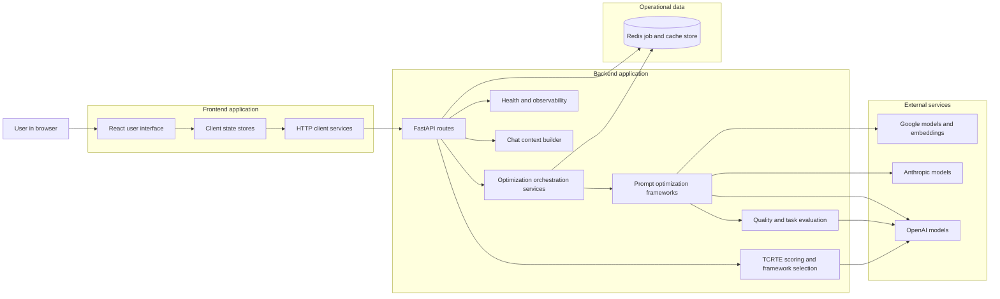
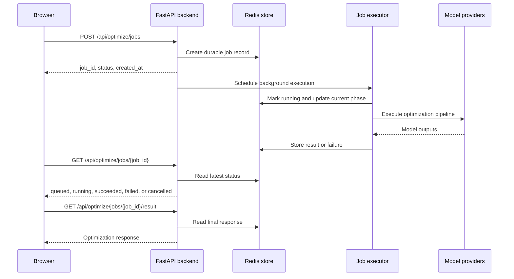

# APOST End-to-End System Architecture

## Purpose and scope

APOST, which stands for Automated Prompt Optimisation and Structuring Tool, is a web application that helps a user turn a rough prompt into a more reliable prompt package. The product does this in four connected steps. It first analyses the prompt for missing information across Task, Context, Role, Tone, and Execution. It then asks targeted follow-up questions when important details are missing. After that, it generates three optimized prompt variants. Finally, it keeps the full session context available for follow-up refinement through chat. This document explains the full system design for that experience, covering the frontend, backend, data storage, and infrastructure layers in one place.[^repo-readme][^repo-what][^backend-main]

The document is written so that someone new to the project can understand how the system works without reading any other project material first. At the same time, the design stays close to the actual implementation in the repository, so the explanation is concrete rather than aspirational. Where the design depends on a product choice rather than a hard technical fact, that choice is called out directly.

## System overview

The system is built as a single web application with a browser frontend and a Python backend. The frontend presents a three-part workflow: configuration, guided workflow, and chat refinement. The backend exposes application programming interface routes for gap analysis, prompt optimization, asynchronous optimization jobs, chat, and health checks. Redis is used for durable job state and shared caching. Large language model providers are called from the backend at request time using a provider key supplied by the user in the request, rather than storing end-user keys in backend state.[^repo-readme][^backend-requests][^redis-store]

The important architectural decision is that APOST is a domain-focused application, not a general workflow platform. Most of the product value lives in the backend services that decide how prompts are analysed, enriched, scored, and rewritten. The frontend is intentionally thinner. It gathers user input, shows progress, and renders results, but the business rules remain in the backend so that they are testable, consistent, and reusable across synchronous and asynchronous execution paths.[^frontend-hook][^backend-optimization-jobs]

## End-to-end component map

The diagram shows the main idea of the system. The browser does not talk directly to model providers or to Redis. Every meaningful action goes through the backend. That gives the backend one place to enforce request validation, consistent scoring rules, model routing, redaction, logging, and job handling. It also means the frontend can stay simple: it only needs to know how to collect data and render the current state of the workflow.

## User journey and causal flow

A user begins by entering a raw prompt, input variables, provider choice, target model, and application programming interface key in the frontend. The frontend sends this information to the gap analysis route. The backend scores the prompt across the five TCRTE dimensions, identifies weak areas, and returns targeted questions. The user answers those questions in the same browser session. The frontend then sends the original prompt, the enriched answers, and the chosen optimization framework to the optimization route. The backend generates three prompt variants, evaluates their quality, and returns the completed result. The frontend stores that result locally and uses it to seed the chat panel so that later refinement requests already include the optimization context.[^backend-requests][^backend-responses][^frontend-hook]

This flow matters because each stage improves the next stage. Gap analysis reduces ambiguity before optimization. Optimization adds structure before chat refinement. Chat refinement starts from an informed baseline instead of forcing the user to repeat the same context in free text. That causal chain is the main product design decision. The application does not treat prompt optimization as a single model call. It treats it as a staged process where each earlier stage lowers the chance of poor output in the next stage.

## Frontend architecture

The frontend is built with React, TypeScript, Vite, Tailwind CSS, Framer Motion, and Zustand. Its responsibility is to keep the user journey understandable. It does that through a clear screen structure, explicit workflow phases, and local state stores that separate configuration state from workflow state and chat state.[^repo-readme][^frontend-tree]

The user interface is organized around three areas. The configuration area captures prompt text, provider, model, variables, and key. The workflow area shows the current phase, such as idle, analysing, interview, optimizing, or results. The chat area supports follow-up refinement. This layout is not cosmetic. It matches the application’s execution model. Configuration state changes less often, workflow state changes as the user moves through the process, and chat state continues after optimization. That separation makes the frontend easier to reason about and reduces accidental coupling between unrelated interface concerns.[^frontend-tree]

The frontend does not implement optimization logic itself. The service layer contains lightweight functions such as `analyzePromptGaps`, `optimizePrompt`, and `sendChatMessage`, and the hooks coordinate those calls with the client stores. The optimization hook is especially important because it shows the intended interaction pattern. It reads the current prompt, provider, model, TCRTE answers, and framework from the stores, sends the optimization request, stores the successful response, and seeds the chat with a summary of the returned variants. This is a clean frontend design because the browser owns presentation flow, while the backend owns domain logic.[^frontend-gap-service][^frontend-opt-service][^frontend-chat-service][^frontend-hook]

The main trade-off in this frontend design is that the browser must keep more transient session state, including the chat seed and the user’s answers. That is acceptable for the current product goal because APOST behaves like a focused studio tool rather than a long-lived collaboration platform. If the product later needs saved histories, multi-user review, or shared workspaces, the design should add persistent application storage and authenticated user accounts rather than trying to stretch the current browser-only session model.

## Backend architecture

The backend is built with FastAPI, Pydantic, HTTPX, and Uvicorn. Its main role is to turn a simple browser request into a reliable, multi-stage prompt engineering workflow. It does this through route handlers, request and response models, domain services, Redis-backed job orchestration, and observability middleware.[^repo-readme][^backend-main][^backend-requests][^backend-responses]

The route layer is intentionally thin. It validates input, resolves request context, calls services, and returns typed response models. This keeps the route code understandable and reduces duplication. The important work happens in services. TCRTE scoring services assess prompt coverage. Analysis services normalize task information and select frameworks. Optimization services generate the prompt variants and related metadata. Evaluation services run internal quality checks and optional task-level scoring. Chat prompt builders assemble a context-rich prompt for refinement. Because these concerns are separated into modules, each area can evolve without rewriting the whole application.[^backend-tree][^backend-main]

A key strength of the backend design is its use of explicit contracts. Requests and responses are defined with Pydantic models. For example, the optimization request includes the raw prompt, task type, framework, quality gate mode, provider, model, prior gap analysis data, optional user answers, optional evaluation dataset, and the provider key. The optimization response returns analysis metadata, applied techniques, three prompt variants, and run metadata. This matters architecturally because it gives the frontend, the route layer, and the deeper services one consistent language for the same business object.[^backend-requests][^backend-responses]

The backend also centralizes cross-cutting operational behavior. Cross-origin resource sharing is configured in one place. Request context middleware attaches correlation identifiers. Logging is structured. Health checks actively probe dependencies. Static frontend assets are served by the same application process when the production build is present. Serving the built frontend from the same backend process simplifies deployment and avoids needing a separate frontend hosting tier for the current scale.[^backend-main][^dockerfile]

The main trade-off here is between simplicity and independent scaling. A single deployable unit is easier to run and easier for a new developer to understand. The cost is that frontend and backend are deployed together in production. That is a reasonable choice for APOST because the expensive part of the workload is model execution, not static file serving.

## Domain workflow inside the backend

The backend workflow follows the product journey closely. When a prompt is submitted for analysis, the system calculates TCRTE scores, derives an overall score, estimates complexity, recommends techniques, and generates gap questions. Those fields are not informal text. They are structured response elements, which makes them usable by both the user interface and later backend stages.[^backend-responses]

When a prompt is submitted for optimization, the system receives the raw prompt plus any enrichment gathered during the gap interview. It then selects or applies a framework, produces three variants, estimates TCRTE coverage for each variant, and optionally runs quality and task-level evaluation. The variants contain system prompt text, user prompt text, estimated token count, strengths, use cases, and guard rails against over-answering and under-answering. That design is important because APOST is not only generating prompt text. It is generating an explainable result package that helps the user understand why the variants differ.[^backend-responses]

The quality gate is a separate concern from generation. This is a sound system design choice. Prompt generation can succeed while quality evaluation degrades, and the response model reflects that distinction through explicit status fields such as `ok`, `degraded`, and `failed`. That gives the interface and any future automation a truthful signal instead of forcing a binary success or failure that hides useful partial results.[^backend-responses]

## Asynchronous jobs and background execution

APOST supports both synchronous optimization and asynchronous optimization jobs. The synchronous route is useful for simple interactive use because the browser sends one request and receives a completed result. The asynchronous route exists for heavier or longer-running workloads. The browser can create a job, poll for status, request the final result, or cancel the work if needed.[^backend-optimization-jobs]

This diagram shows why Redis is part of the core architecture rather than an optional cache. Job state is written durably before background execution starts. During execution, the system records status changes such as queued, running, completed, failed, or cancelled. When the browser polls, the backend reads Redis rather than relying on process memory. That means job metadata can survive ordinary process restarts, and different API instances can still report consistent status if the application is scaled horizontally.[^redis-store][^backend-job-service]

The job service also shows several careful design choices. Job records are updated atomically in Redis, so cancellation and completion do not silently overwrite each other. Time-to-live values are applied so old records expire instead of growing forever. Request budgets are enforced before expensive work begins. Cancellation is cooperative, which is safer than forcefully killing work mid-step. Each of these choices improves reliability without introducing a more complex queueing platform.[^redis-store][^backend-job-service]

The trade-off is that Redis is simpler than a full workflow engine, but it also offers fewer built-in features for long-term history, reporting, and replay. For the current product, that is the right balance. The workload is request-oriented, the job lifecycle is short, and the business does not currently require permanent execution archives.

## Data storage architecture

The current system has two kinds of data: transient session data in the browser and operational data in Redis. There is no general-purpose relational database in the current architecture. That is an important fact because it shapes what the product can and cannot do today.[^repo-readme][^redis-store]

Browser-side state holds the prompt being edited, the chosen model and provider, the answers given during the gap interview, the current workflow phase, and the chat session derived from the last optimization run. This data is convenient and fast to manage on the client, but it is not durable across devices or long time spans. That matches the current use case, which is an active work session by one user.[^frontend-hook]

Redis stores operational records that need to outlive a single in-memory request. That includes optimization jobs, job status transitions, cached values, and short-lived locks. The Redis adapter serializes values as JSON and validates job records through Pydantic models, which prevents the common failure mode where a background worker and an application route gradually drift apart in how they understand the same data.[^redis-store]

The absence of a relational database is a deliberate simplification, not an oversight. It keeps setup light and makes the local development story easy. It also means the product currently does not provide first-class support for user accounts, long-term prompt history, billing, tenancy, audit retention, or advanced analytics. If those become business requirements, the design should add a relational store for durable business data while keeping Redis for operational coordination.

## Data contracts

The most important external contract in APOST is the Hypertext Transfer Protocol and JavaScript Object Notation application programming interface between the frontend and backend. The design is strong here because the backend defines typed request and response models for each route and the frontend mirrors them in its TypeScript types.[^backend-requests][^backend-responses][^frontend-types]

A gap analysis request contains the raw prompt, optional input variables, task type, provider, model details, reasoning-model flag, and application programming interface key. The corresponding response returns the five TCRTE dimension scores, the score source, an overall score, a complexity estimate with explanation, recommended techniques, interview questions, and auto-enrichments. That contract makes the first phase explicit: the system is not guessing what to ask next in the user interface. It is receiving a structured plan from the backend.[^backend-requests][^backend-responses]

An optimization request extends that pattern. It carries the raw prompt, task type, selected framework, quality gate mode, provider and model details, optional prior gap data, optional user answers, optional evaluation examples, and the provider key. The response returns analysis, applied techniques, three prompt variants, and run metadata. Each variant contains both generated content and explanation fields such as strengths, best-fit use case, quality evaluation, and guard rails. This is a good business-facing contract because it gives users something to compare, not just something to copy.[^backend-requests][^backend-responses]

The asynchronous job contract uses a smaller set of focused payloads. Job creation returns a job identifier, status, timestamps, and tracing identifiers. Job status returns the current phase and any failure message. Final result retrieval returns the same optimization response used by the synchronous route. Reusing the same final response contract reduces frontend complexity and lowers the risk of one execution path drifting away from the other.[^backend-responses][^backend-optimization-jobs]

## Infrastructure and deployment design

The infrastructure is intentionally compact. The repository contains a multi-stage Docker build. The first stage builds the frontend with Node.js. The second stage builds the Python runtime, installs dependencies, copies the backend application, copies the built frontend assets into a static directory, creates a non-root user, and starts Uvicorn. Docker Compose runs this application container alongside a Redis container and wires the backend to Redis through environment variables.[^dockerfile][^compose]

This design has three practical benefits. First, it keeps local setup approachable because a new developer can run the full stack with one command path. Second, it keeps production packaging predictable because the application and its built assets are versioned together. Third, it reduces infrastructure sprawl by avoiding separate frontend hosting, separate background worker images, and separate cache tiers at the current maturity level.[^repo-readme][^dockerfile][^compose]

The infrastructure is still structured enough for production hardening. Redis has a health check. The application has liveness and dependency health endpoints. Configuration is read from environment variables. The container runs as a non-root user. Cross-origin resource sharing can be restricted by environment. These are basic but meaningful controls for a small production deployment.[^compose][^backend-main][^dockerfile]

The main trade-off is that a single container serving both the application programming interface and static assets is not the most elastic design for very large scale. If traffic grows, the next logical step would be to place a reverse proxy or cloud load balancer in front, run multiple backend replicas, keep Redis as a shared service, and optionally move the static assets to a content delivery network. The current design does not block that future step.

## Scaling strategy

The scaling strategy starts with a simple observation: the expensive work in APOST is not page rendering or ordinary application logic. It is model latency, evaluation work, and occasional retrieval or embedding calls. That means the system should scale around request concurrency and long-running jobs rather than around static asset delivery.[^backend-job-service][^health-checks]

The frontend scales naturally because it is static content. Once built, it can be served by the backend, a reverse proxy cache, or a content delivery network. There is no server-side session affinity requirement in the frontend architecture because the browser keeps its own transient state and all durable backend job state lives in Redis.[^backend-main][^frontend-hook]

The backend scales horizontally if deployed behind a load balancer, because request handling is mostly stateless apart from shared Redis coordination. The synchronous optimization route still consumes compute and outbound model capacity per request, so high concurrency should be controlled through application-level budgets, worker pools, and provider-aware rate limiting. The asynchronous path is especially important at higher scale because it prevents long optimization runs from tying up client connections and gives the system better control over backlog behavior.[^backend-job-service][^backend-config]

Redis scales well for the current role of job and cache storage, but it should remain operational storage, not business history. Memory limits, expiration policy, and connection pool sizing need active attention. The configuration already exposes limits such as maximum connections, timeouts, and worker process count, which is a good sign that the implementation expects operational tuning rather than assuming one fixed deployment shape.[^backend-config][^redis-store]

A practical scaling plan for the next stages would look like this. For small deployments, one application instance and one Redis instance are enough. For moderate production traffic, run multiple application instances behind a load balancer and move Redis to a managed service with persistence enabled. For heavier enterprise traffic, separate web-serving replicas from dedicated job-execution replicas, introduce rate-limiting at the edge, and add a relational database for customer and history data. This progression preserves the core design while adding capacity only where needed.

## Fault tolerance and operational resilience

The system already includes several resilience controls that are worth preserving. On startup, the application initializes the Redis store and pings it. In strict mode, startup fails fast if Redis is unavailable. That is a sensible production posture because accepting optimization jobs without durable job storage would create silent data loss. In less strict environments, the setting can be relaxed to favor developer convenience.[^backend-main][^backend-config]

During job execution, Redis updates are handled defensively. The job service attempts atomic updates and logs failures rather than immediately destroying already-completed model work because of a brief storage interruption. This is a pragmatic reliability choice. It recognizes that outbound model calls are slower and more expensive than a single Redis write, so the system should try hard not to waste successful model work because of a transient operational problem.[^backend-job-service][^redis-store]

Health endpoints are also designed with useful nuance. Liveness is lightweight and suitable for container orchestration checks. The broader health endpoint actively probes dependencies and distinguishes between healthy, degraded, and not configured states. That is better than a binary health signal because some dependencies, such as optional embedding support, should not necessarily take the whole service down if they are temporarily unavailable.[^backend-main][^health-checks]

The main resilience limitation is architectural rather than accidental: the system does not yet include durable business storage, replayable workflows, or cross-region failover. Those capabilities are unnecessary complexity for the current scope, but they should be added if business requirements move toward enterprise-grade retention, compliance, or strict recovery objectives.

## Security and privacy controls

The first security boundary is between the browser and the backend. The frontend sends provider keys with each request, and the backend request models require those keys explicitly. The settings layer also states that application programming interface keys are not persisted in backend settings objects. This is a good design for a tool where users bring their own model credentials, because it reduces the risk of accumulating sensitive user secrets in application storage.[^backend-requests][^backend-config][^repo-readme]

The second security boundary is logging and observability. The job route uses redaction before logging request payloads, and request identifiers are attached through middleware so operations can correlate events without dumping raw secrets into logs. This is an important control because prompt text and provider keys can both be sensitive. A prompt engineering tool often handles confidential business instructions, so log hygiene matters as much as credential hygiene.[^backend-optimization-jobs][^backend-main]

The third security boundary is deployment. The container runs as a non-root user. Cross-origin resource sharing is configurable and can be restricted to known origins. Environment variables are used for backend configuration. These are standard controls, but they are appropriate for the current application shape.[^dockerfile][^backend-main][^compose]

There are also clear gaps that should be stated plainly. The current architecture does not provide built-in end-user authentication, authorization, tenant isolation, billing security, or long-term audit retention. That is acceptable only if the business model is a trusted-user tool or a developer-operated internal system. If the product becomes a multi-tenant software-as-a-service offering, it should add identity, access control, rate limits, secure secret management, encryption for retained business data, and a durable audit trail.

## Architectural reasoning and trade-offs

The decision to keep the frontend thin and the backend domain-heavy is the right one for maintainability. Prompt scoring, optimization, evaluation, and framework selection are business logic. If those rules were copied into the browser, every change would become harder to test and easier to drift. Centralizing them in Python services keeps the product behavior consistent and easier to validate.

The decision to package the built frontend and backend into one deployable unit is the right one for operational simplicity. It reduces moving parts, shortens onboarding time, and fits a product where the backend does the expensive work. The trade-off is reduced independence in deployment, but that is a worthwhile trade at the current size.

The decision to use Redis for jobs and cache is the right one for short-lived operational state. It is faster and simpler than introducing both a relational database and a queueing platform on day one. The trade-off is that Redis should not be stretched into a permanent business record system. The design remains healthy as long as that boundary stays clear.

The decision to support both synchronous and asynchronous optimization is also sound. Synchronous execution keeps the basic product experience simple. Asynchronous execution creates room for heavier optimization pipelines, better user experience under long latency, and future workload shaping. Returning the same final response shape from both paths is especially good because it protects frontend simplicity.

The choice to generate three variants instead of one is not just a prompt engineering idea. It is a user experience and risk-management choice. Prompt optimization is not deterministic in the same way a compiled program is deterministic. Returning several intentionally different variants helps the user choose the right balance between clarity, structure, and aggressiveness, and it makes the system’s reasoning more inspectable.[^backend-responses]

## Assumptions

This design assumes that APOST is currently a session-oriented prompt engineering application rather than a multi-tenant records platform. It assumes that most user sessions are interactive and moderately short. It assumes that long-term storage of customer prompts, accounts, and billing data is not yet a core requirement. It assumes that Redis is acceptable for operational state retention measured in days rather than months. It also assumes that provider credentials are usually supplied at request time by the user rather than stored and managed centrally by the backend.[^backend-job-service][^backend-config][^repo-readme]

A second assumption is that model-provider behavior may differ by provider and model family, so backend-side formatting and routing remain valuable. This assumption aligns with provider guidance. Anthropic explicitly recommends structured prompting with XML tags and allows prefilling assistant output for tighter format control in supported modes. OpenAI recommends simpler, direct prompting for reasoning models and notes that explicit chain-of-thought prompting may not help those models. Those differences justify keeping provider-aware optimization logic on the server rather than assuming one universal prompt layout.[^anthropic-xml][^anthropic-prefill][^openai-reasoning]

A third assumption is that prompt structure materially affects output quality in long or complex contexts. Research on long-context behavior found that performance is often strongest when relevant information appears near the beginning or end of the context and weaker when important details sit in the middle. That supports APOST’s emphasis on structure, explicit separation of sections, and repeated importance around critical instructions.[^lost-middle]

## Recommended evolution path

If the product remains a single-user or team-operated prompt studio, the current architecture is appropriate with only incremental hardening. The best improvements would be managed Redis, better edge protection, stricter origin controls, more explicit rate limiting, and production secret management.

If the product moves into paid multi-tenant software-as-a-service, the next architectural additions should be introduced in this order. First, add authentication and authorization. Second, add a relational database for users, workspaces, saved prompt runs, billing references, and audit records. Third, split background execution from the web-serving tier so optimization jobs can scale independently. Fourth, move static assets to a dedicated delivery tier. Fifth, add tenant-aware quotas and stronger observability for per-customer usage.

If the product moves into regulated or high-trust environments, the current design will need stronger data governance. That would include durable audit retention, encryption for retained business data, clearer data classification for prompt contents, and region-aware infrastructure choices. Those changes are beyond the present implementation, but the current separation between frontend, backend, Redis, and external providers makes that future path manageable.

## Conclusion

APOST is well-designed for its current goal: guiding a user from a weak prompt to a structured, explainable, and refinable prompt package. The architecture succeeds because it matches the product workflow closely. The frontend keeps the journey understandable. The backend owns the real business logic. Redis provides practical operational durability without unnecessary infrastructure weight. The deployment model is simple enough for fast onboarding but structured enough for production hardening.

The design is not trying to solve every future requirement today. That restraint is a strength. It keeps the current system maintainable while leaving clear extension points for scale, multi-tenancy, and stronger operational controls when the business actually needs them.

## References

[^repo-readme]: Repository README, product scope, stack, routes, and deployment summary: [README.md](D:/Generative%20AI%20Portfolio%20Projects/APOST/README.md)
[^repo-what]: Product workflow summary: [what_APOST_does.md](D:/Generative%20AI%20Portfolio%20Projects/APOST/what_APOST_does.md)
[^frontend-tree]: Frontend source layout and feature modules: [frontend/src](D:/Generative%20AI%20Portfolio%20Projects/APOST/frontend/src)
[^frontend-gap-service]: Gap analysis frontend service: [frontend/src/services/gapAnalysisService.ts](D:/Generative%20AI%20Portfolio%20Projects/APOST/frontend/src/services/gapAnalysisService.ts)
[^frontend-opt-service]: Optimization frontend service: [frontend/src/services/optimizationService.ts](D:/Generative%20AI%20Portfolio%20Projects/APOST/frontend/src/services/optimizationService.ts)
[^frontend-chat-service]: Chat frontend service: [frontend/src/services/chatService.ts](D:/Generative%20AI%20Portfolio%20Projects/APOST/frontend/src/services/chatService.ts)
[^frontend-hook]: Frontend optimization workflow hook: [frontend/src/hooks/useOptimization.ts](D:/Generative%20AI%20Portfolio%20Projects/APOST/frontend/src/hooks/useOptimization.ts)
[^frontend-types]: Frontend shared request and response types: [frontend/src/types](D:/Generative%20AI%20Portfolio%20Projects/APOST/frontend/src/types)
[^backend-main]: FastAPI application setup, routing, health checks, static serving, and startup lifecycle: [backend/app/main.py](D:/Generative%20AI%20Portfolio%20Projects/APOST/backend/app/main.py)
[^backend-tree]: Backend service structure: [backend/app](D:/Generative%20AI%20Portfolio%20Projects/APOST/backend/app)
[^backend-requests]: Backend request models: [backend/app/models/requests.py](D:/Generative%20AI%20Portfolio%20Projects/APOST/backend/app/models/requests.py)
[^backend-responses]: Backend response models: [backend/app/models/responses.py](D:/Generative%20AI%20Portfolio%20Projects/APOST/backend/app/models/responses.py)
[^backend-optimization-jobs]: Asynchronous job routes: [backend/app/api/routes/optimization_jobs.py](D:/Generative%20AI%20Portfolio%20Projects/APOST/backend/app/api/routes/optimization_jobs.py)
[^backend-job-service]: Durable job orchestration service: [backend/app/services/optimization/optimization_job_service.py](D:/Generative%20AI%20Portfolio%20Projects/APOST/backend/app/services/optimization/optimization_job_service.py)
[^backend-config]: Runtime configuration and scaling controls: [backend/app/config.py](D:/Generative%20AI%20Portfolio%20Projects/APOST/backend/app/config.py)
[^redis-store]: Redis store adapter for jobs, cache, and locks: [backend/app/services/store/redis_store.py](D:/Generative%20AI%20Portfolio%20Projects/APOST/backend/app/services/store/redis_store.py)
[^health-checks]: Active dependency probes: [backend/app/services/health_checks.py](D:/Generative%20AI%20Portfolio%20Projects/APOST/backend/app/services/health_checks.py)
[^dockerfile]: Production container build and non-root runtime: [Dockerfile](D:/Generative%20AI%20Portfolio%20Projects/APOST/Dockerfile)
[^compose]: Local full-stack deployment with Redis and health checks: [docker-compose.yml](D:/Generative%20AI%20Portfolio%20Projects/APOST/docker-compose.yml)
[^lost-middle]: Nelson F. Liu et al., "Lost in the Middle: How Language Models Use Long Contexts," Transactions of the Association for Computational Linguistics 12, 2024. [https://direct.mit.edu/tacl/article/doi/10.1162/tacl_a_00638/119630/Lost-in-the-Middle-How-Language-Models-Use-Long](https://direct.mit.edu/tacl/article/doi/10.1162/tacl_a_00638/119630/Lost-in-the-Middle-How-Language-Models-Use-Long)
[^anthropic-xml]: Anthropic, "Use XML tags to structure your prompts." [https://docs.anthropic.com/en/docs/build-with-claude/prompt-engineering/use-xml-tags](https://docs.anthropic.com/en/docs/build-with-claude/prompt-engineering/use-xml-tags)
[^anthropic-prefill]: Anthropic, "Prefill Claude’s response for greater output control." [https://docs.anthropic.com/en/docs/build-with-claude/prompt-engineering/prefill-claudes-response](https://docs.anthropic.com/en/docs/build-with-claude/prompt-engineering/prefill-claudes-response)
[^openai-reasoning]: OpenAI, "Reasoning best practices." [https://developers.openai.com/api/docs/guides/reasoning-best-practices](https://developers.openai.com/api/docs/guides/reasoning-best-practices)

