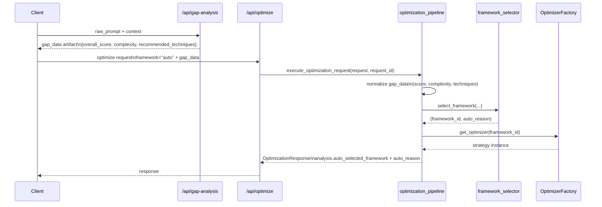

# Auto-Selection Prompt Optimization Framework - High Level Design (HLD)

## 1) Executive Summary
Auto-Selection chooses a concrete optimization framework when the client sends `framework="auto"` to `/api/optimize`. It runs inside the optimization pipeline before variant generation, using request context (task type, model type), optional `gap_data` (TCRTE score, complexity, recommended techniques), and whether an evaluation dataset is present.

Auto-Selection does **not** execute optimizer internals, score prompt quality, or evaluate task outcomes. It only resolves routing (`framework_id`) and explanation metadata (`auto_reason`) for downstream optimizer execution.

### Invariants
- Deterministic: same normalized input should yield the same framework decision.
- Explainable: every auto decision should have human-readable reasoning.
- Safe defaults: missing optional inputs should not crash routing.
- Fail-fast compatibility: selected framework must be supported by the optimizer factory.
- Bounded scope: selection must stay lightweight relative to full optimization runtime.

See detailed lifecycle in §4 and rule model in §6.

## 2) System Scope and Boundaries
### In Scope
- Auto framework resolution for `/api/optimize` and `/api/optimize/jobs` via shared pipeline.
- Input shaping from request + `gap_data`.
- Rule-order policy and first-match-wins behavior.
- Observability for routing decisions.

### Out of Scope
- Internal generation logic of each optimizer framework.
- Prompt quality gate internals.
- Task-level evaluation scoring internals.

## 3) Glossary
- `framework=auto`: Client asks backend to choose framework automatically.
- Gap analysis: Prior step (`/api/gap-analysis`) that returns TCRTE, complexity, and technique hints.
- TCRTE score: Coverage quality score (0-100) summarizing Task/Context/Role/Tone/Execution.
- Complexity: Prompt/task complexity label from gap analysis (`simple|medium|complex` in current API contract).
- Recommended techniques: Technique hints from gap analysis output.
- `reason_code`: Stable machine-readable reason for decision. **TBD in current code** (see §11).
- `matched_rule`: Rule identifier that won routing. **TBD in current code** (see §11).
- `policy_version`: Version tag for routing policy. **TBD in current code** (see §11).
- `auto_reason`: Human-readable explanation returned by current selector.
- `request_id`: Correlation id used in logs/traces.

### Framework IDs in this product
The factory currently supports (see `app/services/optimization/base.py`):
- `reasoning_aware`: For reasoning models; avoids external CoT injection. Avoid when target model is non-reasoning and needs explicit scaffolding.
- `xml_structured`: For QA/multi-document style structure. Avoid for unconstrained creative tasks.
- `progressive`: For staged scaffolding on complex planning/coding. Avoid for simple extraction where overhead is unnecessary.
- `cot_ensemble`: For complex reasoning/analysis with few-shot style anchoring. Avoid when reasoning traces are not needed or budget is strict.
- `tcrte`: Structural gap filling when coverage is low. Avoid as first choice when coverage is already strong.
- `kernel`: Lean default for simple/tool-oriented tasks. Avoid for high-complexity needs requiring richer scaffolding.
- `create`: Creativity-oriented structure. Avoid for strict deterministic outputs.
- `textgrad`: Iterative hardening for difficult low-coverage prompts. Avoid for simple tasks due to extra complexity.
- `overshoot_undershoot`: Scope/depth calibration for moderate coverage. Avoid when hard structural repair is needed first.
- `core_attention`: Context retention biasing. Avoid for short/simple prompts with low context-loss risk.
- `ral_writer`: Constraint restatement and recency emphasis. Avoid when prompt has minimal hard constraints.
- `opro`: Empirical trajectory optimization; requires evaluation data. Avoid without `evaluation_dataset`.
- `sammo`: Topology mutation for structure-aware high-complexity tasks. Avoid where simple deterministic routing suffices.

## 4) Architecture and Request Lifecycle
### 4.1 Context Diagram

```mermaid
flowchart LR
    U["Client UI/API"] --> GA["POST /api/gap-analysis"]
    GA --> GAP["GapAnalysisResponse\n(overall_score, complexity, recommended_techniques)"]

    U --> OP["POST /api/optimize\n(framework=auto)"]
    GAP --> OP

    OP --> PIPE["execute_optimization_request"]
    PIPE --> NORM["normalize_gap_data_for_auto_selection"]
    NORM --> SEL["select_framework"]
    SEL --> FACT["OptimizerFactory.get_optimizer"]
    FACT --> OPT["Concrete Optimizer"]
    OPT --> RESP["OptimizationResponse\n(analysis + variants)"]
```


### 4.2 Request Lifecycle with Data Artifacts


## 5) Component Responsibilities
- `app/api/routes/optimization.py`: HTTP entrypoint, error mapping, request logging, delegates to pipeline.
- `app/services/optimization/optimization_pipeline.py`:
  - auto-selection trigger for `framework="auto"`
  - normalization of selection inputs from `request.gap_data`
  - invocation of selector
  - optimizer factory call and downstream execution
- `app/services/analysis/auto_selection_normalizer.py`: safe coercion + canonical mapping for score, complexity, and techniques.
- `app/services/analysis/framework_selector.py`: deterministic first-match-wins decision logic.
- `app/services/optimization/base.py::OptimizerFactory`: validates framework compatibility and returns concrete optimizer.
- `app/models/requests.py`: optimize request contract, including optional `gap_data` and dataset fields.

## 6) Decision Model (Policy Layers)
This section maps conceptual HLD policy layers to concrete selector behavior. Current implementation is rule-ordered in one function; layers below are conceptual grouping.

### Layer 1: Hard Constraints
Purpose: enforce non-negotiable model/method constraints first.
- Inputs: `is_reasoning_model`, `has_evaluation_dataset`, `recommended_techniques`.
- Output: framework + `auto_reason`.
- Current examples:
  - Match: reasoning model => `reasoning_aware`.
  - Match: empirical signal + dataset => `opro`.
  - Skip: no reasoning model, no empirical preconditions.

Must not be overridden by lower layers.

### Layer 2: Safety / Structural Recovery
Purpose: route low-coverage prompts to structural repair when needed.
- Inputs: `tcrte_overall_score`, `complexity`.
- Current examples:
  - Match: complex + low score => `textgrad`.
  - Match: low score otherwise => `tcrte`.
  - Skip: score not low.

Current implementation evaluates safety before task-specialized routing, so low-score recovery is not bypassed by QA/reasoning branches.

### Layer 3: Task-Specialized Routing
Purpose: select frameworks strongly aligned to task category.
- Inputs: `task_type`, `complexity`, techniques.
- Current examples:
  - Match: `qa` or multi-doc cues => `xml_structured`.
  - Match: complex planning/coding => `progressive`.
  - Match: complex reasoning/analysis => `cot_ensemble`.
  - Match: creative => `create`.
  - Skip: no task-specific rule hit.

### Layer 4: Technique-Specialized Routing
Purpose: react to specific risk/technique signals.
- Inputs: `recommended_techniques`, `task_type`.
- Current examples:
  - Match: context-loss signals => `core_attention`.
  - Match: constraint-restatement/coding signal => `ral_writer`.
  - Skip: no matching technique tokens.

### Layer 5: Cost-Aware Fallback
Purpose: always produce a valid framework when no higher rule matches.
- Inputs: `task_type`, `complexity`.
- Current examples:
  - Match: simple/tool-oriented => `kernel`.
  - Match: complex unmatched => `progressive`.
  - Final default => `kernel`.

## 7) End-to-End Golden Path Walkthrough
### 7.1 Synthetic Input Artifacts
Gap analysis output (stored client-side as `gap_data`):
```json
{
  "overall_score": 62,
  "complexity": "medium",
  "recommended_techniques": ["CoRe", "RAL-Writer"]
}
```

Optimize request:
```json
{
  "raw_prompt": "Summarize findings and output strict JSON.",
  "task_type": "analysis",
  "framework": "auto",
  "provider": "openai",
  "model_id": "gpt-4.1-mini",
  "model_label": "GPT-4.1 Mini",
  "is_reasoning_model": false,
  "gap_data": {
    "overall_score": 62,
    "complexity": "medium",
    "recommended_techniques": ["CoRe", "RAL-Writer"]
  },
  "api_key": "***",
  "quality_gate_mode": "off"
}
```

### 7.2 Numbered Trace (Module/Function Mapping)
1. Route receives request: `optimize_prompt` (`app/api/routes/optimization.py`).
2. Pipeline starts: `execute_optimization_request`.
3. Auto mode check: `request.framework == "auto"`.
4. Input normalization from `gap_data`:
   - safe score parse + clamp to `0..100` (default `0`)
   - complexity alias map (`medium -> standard`, unknown -> `standard`)
   - technique alias map (`CoRe`, `RAL-Writer`, `XML-Bounding`, etc. -> canonical routing signals)
   - unknown techniques ignored (captured in logs)
   - malformed/non-mapping `gap_data` handled with defaults
5. Selector called: `select_framework(...)`.
6. First-match-wins evaluation through rule order.
7. Returned `(framework_id, auto_reason)` logged as `optimize.framework_selected`.
8. Factory validation: `OptimizerFactory.get_optimizer(framework_id)`.
9. Selected strategy generates variants.
10. Client sees effective framework in response analysis fields.

With current code, this sample is normalized and routed predictably (no silent `kernel` fallback caused by vocabulary mismatch alone).

## 8) API Contracts (HLD View)
### 8.1 Optimize Request Fields relevant to Auto-Selection
| Field | Type | Required | Source | Default if Missing |
|---|---|---:|---|---|
| `framework` | string | yes | client | n/a |
| `task_type` | string | no | client | `reasoning` |
| `is_reasoning_model` | bool | no | client | `false` |
| `gap_data.overall_score` | number/string | no | derived from gap analysis (client passes through) | `0` |
| `gap_data.complexity` | string | no | derived from gap analysis | `standard` |
| `gap_data.recommended_techniques` | list[string] | no | derived from gap analysis | `[]` |
| `evaluation_dataset` | list | no | client | absent/`None` |

### 8.2 Response Fields visible to client
| Field | Type | Meaning |
|---|---|---|
| `analysis.framework_applied` | string | Concrete optimizer used |
| `analysis.auto_selected_framework` | string\|null | Chosen auto framework when auto was requested |
| `analysis.auto_reason` | string\|null | Human-readable reason |

### 8.3 Canonicalization Status
Current implementation performs internal canonicalization before selection:
- complexity aliases: `simple|medium|standard|complex|expert`
- technique aliases for product and legacy tokens (for example `CoRe`, `RAL-Writer`, `XML-Bounding`, `CoT-Ensemble`, `Progressive-Disclosure`)
- `Prefill` is recognized and ignored for routing in this pass

## 9) Failure Modes and Operational Playbook
| Symptom | Likely Cause | What to Check | Safe Mitigation |
|---|---|---|---|
| Unexpected framework for known scenario | Rule policy changed or task/score genuinely matches another higher-priority rule | `optimize.framework_selected` payload (normalized fields + defaults + ignored techniques) | Validate against selector rule order and tests before changing policy |
| Always `kernel` on auto | Low-signal inputs after normalization (for example no recognized techniques, non-complex, non-specialized task) | normalized complexity/score/techniques in logs | Verify upstream `gap_data` quality and intended policy thresholds |
| Missing auto reason | framework not auto or framework strategy didn't surface analysis fields as expected | request payload + response analysis object | Ensure auto path invoked and analysis fields populated |
| 400 framework not found | Selector returned unsupported id | route warning `optimize.framework_not_found`; factory registry | Align selector outputs with factory registry |
| OPRO rejected | No evaluation dataset with OPRO precondition | 422 detail from budget check | Provide dataset or choose non-OPRO |

Shadow rollout behavior: **TBD**.
- Question: Do we run dual-policy compare in production logs today, or only single active policy?

## 10) Observability Guide
### Log events to rely on
- `optimize.request_started`
- `optimize.framework_selected`
- `optimize.request_completed`
- `optimize.framework_not_found`

### Correlation
- Use `request_id` from both gap-analysis and optimize calls.
- Compare gap-analysis output and optimize input artifacts for drift.

### Metrics recommended
- Framework selection distribution over time.
- Auto-selection fallback rate (`kernel` defaults).
- Rule-hit distribution (requires `reason_code`/`matched_rule`, currently TBD).
- Invalid/unknown technique rate (currently TBD telemetry).

## 11) Explicit Configuration Surface
| Item | Current Behavior | Source of Truth | Notes |
|---|---|---|---|
| Low-score threshold | `< 50` | `framework_selector.py` hardcoded | Not currently externalized |
| Moderate band | `50 <= score < 70` | `framework_selector.py` hardcoded | Used for `overshoot_undershoot` path |
| Missing complexity default | `standard` | `optimization_pipeline.py` | Differs from gap-analysis enum (`medium`) |
| Missing score default | `0` | `optimization_pipeline.py` | Causes low-score routing if no score |
| Missing techniques default | `[]` | `optimization_pipeline.py` | Safe fallback |
| Complexity enum contract | `simple|medium|complex` (gap-analysis response) | `models/responses.py` | Internally normalized to selector-friendly canonical values |
| Unknown techniques | Ignored for routing, logged for debugging | `auto_selection_normalizer.py` + `optimization_pipeline.py` | Preserves compatibility while preventing hard failures |
| Policy version field | **TBD** | not present in response/log contract | Recommend adding |
| Reason code / matched rule | **TBD** | not present in selector output | Recommend adding |

## 12) Security Requirements
- Never log API keys or sensitive prompt payloads without redaction.
- Continue using request payload redaction in route logging.
- Treat `gap_data` as untrusted input; validate types safely before casting.
- Keep framework selection deterministic and side-effect free.

## 13) Scalability and Performance Considerations
- Selector itself is in-process deterministic logic; overhead is negligible.
- Heavy latency comes from downstream LLM optimization/evaluation, not routing.
- To scale safely, ensure selector remains pure and stateless.
- Preserve bounded defaults to avoid expensive frameworks being selected accidentally due to malformed input.

## 14) Integration Points
- Upstream: `/api/gap-analysis` response format affects auto routing quality.
- Peer: optimizer factory registry must remain in sync with selector outputs.
- Downstream: framework strategies must correctly propagate `analysis.auto_selected_framework` and `analysis.auto_reason`.

## 15) Deployment Plan (High-Level)
1. Add or update docs + tests first.
2. Introduce normalization and reason-code telemetry behind a feature flag.
3. Run shadow comparisons (old vs new policy) if available; otherwise stage-only replay.
4. Canary rollout with monitoring on selection distribution and error rate.
5. Promote gradually; keep rollback path to previous policy.

## 16) FAQ
### Q1: Why can a medium-complexity request fall to `kernel` unexpectedly?
Now `medium` is normalized to `standard`. If auto still lands on `kernel`, it usually means no higher-priority safety/task/technique rule matched after normalization.

### Q2: Is Auto-Selection retried if selection fails?
Selection itself is deterministic and not retried. Failures usually come from invalid framework id or downstream optimizer execution.

### Q3: Where do I start debugging wrong routing?
Start with `optimize.framework_selected` and inspect exact `gap_data` sent in optimize request (not what gap-analysis originally emitted).

### Q4: Can I add a new framework id in selector only?
No. Add it to selector and factory registry, then cover with tests.

### Q5: Do we expose `policy_version` to clients today?
No. This is a recommended addition; current code exposes human-readable `auto_reason` only.
