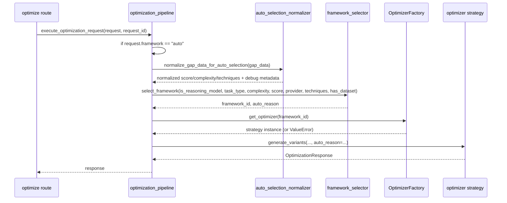

# Auto-Selection Prompt Optimization Framework - Low Level Design (LLD)

## 1) Executive Summary
This document explains how Auto-Selection is implemented in the backend today, how to trace a decision end-to-end, and how to change rules safely.

Auto-Selection runs only when `OptimizationRequest.framework == "auto"`. It extracts routing hints from request fields and `gap_data`, calls deterministic selector logic, validates the chosen framework via the optimizer factory, and then proceeds with normal optimization.

Auto-Selection does **not** perform optimizer generation, quality critique, or task-evaluation scoring.

### Invariants
- First-match-wins rule evaluation.
- Defaults used when optional `gap_data` fields are missing.
- Factory must recognize selected framework id.
- Route returns safe HTTP errors for invalid framework selections.

Cross-reference: HLD lifecycle in `§4` and policy model in `§6`.

## 2) Module and Function Map (Current Code)
| Concern | Module | Function(s) | Responsibility |
|---|---|---|---|
| HTTP entrypoint | `app/api/routes/optimization.py` | `optimize_prompt` | Request logging, exception mapping, delegates to pipeline |
| Pipeline orchestration | `app/services/optimization/optimization_pipeline.py` | `execute_optimization_request` | Auto trigger, input normalization, selector call, factory handoff |
| Normalization adapter | `app/services/analysis/auto_selection_normalizer.py` | `normalize_gap_data_for_auto_selection` | Safe coercion and canonical mapping for score/complexity/techniques |
| Rule engine | `app/services/analysis/framework_selector.py` | `select_framework` | Deterministic routing rules |
| Framework compatibility | `app/services/optimization/base.py` | `OptimizerFactory.get_optimizer` | Ensure selected id exists and instantiate strategy |
| Request schema | `app/models/requests.py` | `OptimizationRequest` | API contract for fields feeding selection |
| Response schema | `app/models/responses.py` | `OptimizationAnalysis` | `auto_selected_framework` + `auto_reason` output fields |

## 3) Request Lifecycle with Data Artifacts


## 4) Golden Path Walkthrough (Worked Example)
### Input artifacts
`gap_data` from prior analysis:
```json
{
  "overall_score": 48,
  "complexity": "complex",
  "recommended_techniques": ["CoT-Ensemble", "XML-Bounding"]
}
```

Optimize request (`framework=auto`):
```json
{
  "raw_prompt": "Rank incidents by urgency and return strict JSON.",
  "task_type": "reasoning",
  "framework": "auto",
  "provider": "openai",
  "model_id": "gpt-4.1-mini",
  "model_label": "GPT-4.1 Mini",
  "is_reasoning_model": false,
  "gap_data": {
    "overall_score": 48,
    "complexity": "complex",
    "recommended_techniques": ["CoT-Ensemble", "XML-Bounding"]
  },
  "evaluation_dataset": null,
  "api_key": "***"
}
```

### Numbered execution trace
1. `optimize_prompt` receives request and logs `optimize.request_started`.
2. `execute_optimization_request` starts and checks budget constraints.
3. Auto mode branch entered (`request.framework == "auto"`).
4. Input normalization via `normalize_gap_data_for_auto_selection(...)`:
   - safe score parse + clamp to `0..100`
   - complexity aliasing (`medium -> standard`, unknown -> `standard`)
   - technique aliasing to canonical routing signals
   - malformed/non-mapping `gap_data` falls back safely
   - unknown/non-routing techniques tracked for logging
5. `select_framework(...)` called.
6. Selector evaluates rules in file order (see §6).
7. First matching rule returns `(framework_id, auto_reason)`.
8. Pipeline logs `optimize.framework_selected`.
9. `OptimizerFactory.get_optimizer(framework_id)` validates support.
10. Strategy runs and response returns with analysis fields populated.

## 5) Decision Model (Layered View Mapped to Current Rules)
Current selector uses a single ordered list. For maintainability, treat it as five policy layers.

### Layer 1 - Hard Constraints
Purpose: enforce non-negotiable constraints first.
- Reads: `is_reasoning_model`, `has_evaluation_dataset`, `recommended_techniques`.
- Produces: `(framework_id, auto_reason)`.
- Current matches:
  - Reasoning model -> `reasoning_aware`
  - Empirical signal + dataset -> `opro`
- Fall-through examples:
  - Non-reasoning model without empirical prerequisites.
  - Dataset present but no empirical signal tokens.

### Layer 2 - Structural Recovery
Purpose: recover low-coverage prompts.
- Reads: `tcrte_overall_score`, `complexity`.
- Current matches:
  - complex + score < 50 -> `textgrad`
  - score < 50 -> `tcrte`
- Fall-through examples:
  - score >= 50
  - earlier layers already matched

### Layer 3 - Task-Specialized
Purpose: pick frameworks strongly aligned to task category.
- Reads: `task_type`, `complexity`, some technique cues.
- Current matches:
  - QA/multi-doc -> `xml_structured`
  - complex planning/coding -> `progressive`
  - complex reasoning/analysis -> `cot_ensemble`
  - creative -> `create`
  - structure-aware high-complex extraction/qa/analysis -> `sammo`
- Fall-through examples:
  - unknown task + no qualifying complexity
  - no qualifying task-specialized signal after normalization

### Layer 4 - Technique-Specialized
Purpose: react to context/constraint risk signatures.
- Reads: `recommended_techniques`, `task_type`.
- Current matches:
  - context cues -> `core_attention`
  - constraint cues/coding -> `ral_writer`
- Fall-through examples:
  - technique names that do not exactly match expected selector tokens
  - empty or missing techniques list

### Layer 5 - Fallback
Purpose: always return a supported framework.
- Reads: `task_type`, `complexity`.
- Current matches:
  - simple/tool tasks -> `kernel`
  - unmatched complex -> `progressive`
  - final default -> `kernel`

## 6) Explicit Configuration Surface (Routing-Relevant)
| Setting/Enum | Current Value/Behavior | Where to Confirm | Change Risk |
|---|---|---|---|
| Low-score threshold | hardcoded `< 50` | `framework_selector.py` | High: changes safety routing |
| Moderate score band | `50 <= score < 70` | `framework_selector.py` | Medium |
| Default score missing gap_data | `0` | `optimization_pipeline.py` | Medium |
| Default complexity missing gap_data | `standard` | `auto_selection_normalizer.py` | Low (intentional canonical default) |
| Default techniques missing gap_data | `[]` | `auto_selection_normalizer.py` | Low |
| Gap-analysis complexity enum | `simple|medium|complex` | `models/responses.py` | High contract dependency |
| Internal complexity canonicalization | `medium -> standard`, unknown -> `standard` | `auto_selection_normalizer.py` | High if changed without tests |
| Technique canonicalization | product + legacy aliases mapped to canonical signals | `auto_selection_normalizer.py` | High if changed without tests |
| Supported framework ids | factory registry keys | `base.py` | Must stay in sync with selector |

### TBD items to resolve before major policy changes
1. Should thresholds be moved to config/env instead of hardcoded constants?
2. Should `policy_version`, `reason_code`, and `matched_rule` be added to response and logs?
3. Is shadow policy comparison available in production or only proposed?

## 7) Data Contracts (API-Grade)
### 7.1 Optimize request fields used by selector
| Field | Type | Required | Source | Default |
|---|---|---:|---|---|
| `framework` | string | yes | client | n/a |
| `task_type` | string | no | client | `reasoning` |
| `is_reasoning_model` | bool | no | client | `false` |
| `provider` | string | no | client | `anthropic` |
| `gap_data.overall_score` | int/string | no | gap-analysis passthrough | `0` |
| `gap_data.complexity` | string | no | gap-analysis passthrough | `standard` |
| `gap_data.recommended_techniques` | list[string] | no | gap-analysis passthrough | `[]` |
| `evaluation_dataset` | list\|null | no | client | `None` |

### 7.2 Selection result fields (current vs target)
| Field | Current | Target |
|---|---|---|
| `framework_id` | yes (internal) | yes |
| `auto_reason` | yes (string) | yes |
| `reason_code` | no | **TBD addition** |
| `matched_rule` | no | **TBD addition** |
| `policy_version` | no | **TBD addition** |

### 7.3 Canonicalization tables
Current implementation includes alias canonicalization.

#### Complexity mapping (current)
| Raw value | Canonical used by selector today |
|---|---|
| missing | `standard` |
| `simple` | `simple` |
| `medium` | `standard` |
| `standard` | `standard` |
| `complex` | `complex` |
| `expert` | `expert` |
| unknown string | `standard` |

#### Technique mapping (current)
| Raw value | Canonical used by selector today |
|---|---|
| missing | `[]` |
| `CoRe`/`context_repetition`/`long_context` | `context_repetition` |
| `RAL-Writer`/`constraint_restatement` | `constraint_restatement` |
| `XML-Bounding`/`xml_bounding`/`multi-document`/`structured_retrieval` | `xml_bounding` |
| `CoT-Ensemble` | `cot_ensemble` |
| `Progressive-Disclosure` | `progressive_disclosure` |
| `iterative_refinement`/`empirical_optimization` | `empirical_optimization` |
| `structure_aware`/`topological_mutation`/`prompt_compression` | `structure_aware` |
| `Prefill` | ignored for routing |
| unknown labels | ignored for routing |

Unknown/ignored technique telemetry is emitted in `optimize.framework_selected` log metadata.

## 8) Failure Modes and Retry Logic
### 8.1 Failure matrix
| Symptom | Likely cause | Checks | Mitigation |
|---|---|---|---|
| Auto selected framework seems wrong | Rule precedence or normalized inputs differ from raw payload intuition | `optimize.framework_selected` (`normalized_*`, `defaults_applied`, ignored fields) | Validate with selector tests before changing rules |
| Unexpected 400 framework error | Selector returns id absent in factory | `optimize.framework_not_found` + factory registry | Keep selector outputs and factory registry synchronized |
| Mostly `kernel` decisions | Inputs normalize to low-signal scenario with no higher-priority matches | normalized score/complexity/techniques in logs | Re-check upstream gap_data quality and policy intent |
| OPRO path not selected | missing dataset or signal token mismatch | evaluate request.evaluation_dataset and techniques | provide dataset + align token names |

### 8.2 Retry behavior
- Auto-selection logic itself has no retries; it is synchronous deterministic logic.
- Route-level transient retries are not part of selector path.
- Downstream LLM retries belong to other subsystems and should not be conflated with routing behavior.

## 9) Observability Guide for New Contributors
### What to log per request
Minimum fields:
- `request_id`
- `request.framework`
- normalized `complexity`, `score`, `techniques`
- `defaults_applied`, malformed gap-data flag, ignored unknown/non-routing techniques
- selected `framework`
- `auto_reason`

Current key events:
- `optimize.request_started`
- `optimize.framework_selected`
- `optimize.request_completed`

### Correlation strategy
- Use `request_id` from optimize route.
- To compare with gap-analysis decisions, retain and inspect client-provided `gap_data` artifact.

### Metrics that matter
- Framework distribution over time.
- Default/fallback rate (`kernel`).
- Selection error rate (framework-not-found).
- Rule-hit distribution (**TBD when reason_code/matched_rule added**).

## 10) Testing Story for a New Contributor
### Existing test coverage
- Selector behavior: `tests/test_framework_selector.py`
- Route/provenance behavior: `tests/test_optimization_route_provenance.py`
- Request model validation: `tests/test_optimization_request_validation.py`
- Normalization + pipeline input hardening: `tests/test_auto_selection_normalizer.py`

### Minimum tests when changing one rule
1. Positive match case for new/changed rule.
2. Negative fall-through case proving ordering behavior.
3. Regression case for adjacent rule that must remain unchanged.
4. Route-level test verifying response still contains analysis provenance.

### Policy version bump checklist (recommended)
Current implementation does not expose policy version. If introduced:
1. Increment `policy_version` constant.
2. Update golden fixtures.
3. Add migration note in changelog/docs.
4. Validate dashboard/alerts use new version tag.

## 11) Integration Points with Other Services
- `gap-analysis` contract is upstream dependency for good auto routing quality.
- `OptimizerFactory` is hard compatibility boundary; selector outputs must be registry-valid.
- Cache, quality-gate, and evaluation services are downstream and independent of selection correctness but affect total request behavior.

## 12) Scalability, Performance, and Security (LLD View)
### Scalability/Performance
- Selector is O(number_of_rules), in-memory, no network IO.
- Selection overhead is tiny vs optimizer LLM calls.
- Keep selector pure/stateless to simplify scaling.

### Security
- Treat `gap_data` as untrusted input.
- Avoid unsafe casts without guards for `overall_score`.
- Keep redaction at route boundaries.
- Never add secret-bearing fields to routing logs.

## 13) High-Level Deployment Plan for Routing Changes
1. Add rule change + tests locally.
2. Run selector and route provenance tests.
3. Stage deploy with log comparison against baseline.
4. Canary rollout with framework distribution monitoring.
5. Full rollout with rollback trigger on anomaly.

## 14) Example Snippets for Contributors
### Pseudocode: safe extraction before selector
```python
# Documentation pseudocode (illustrative)
normalized = normalize_gap_data_for_auto_selection(gap_data)
framework, reason = select_framework(
    complexity=normalized.complexity,
    tcrte_overall_score=normalized.tcrte_overall_score,
    recommended_techniques=normalized.recommended_techniques,
    ...
)
```

### Example config (proposed, not current)
```yaml
auto_selection:
  policy_version: auto_select_v1
  low_score_threshold: 50
  moderate_score_min: 50
  moderate_score_max_exclusive: 70
```

Status: **TBD** to implement; current thresholds are hardcoded in selector.

## 15) FAQ
### Q1: Why do docs mention reason_code/matched_rule if code returns only auto_reason?
Because they are operationally useful for stable debugging and dashboards; they are recommended additions, not current behavior.

### Q2: What is the safest first change for a new contributor?
Add tests around current behavior first, then introduce small normalization updates behind a guarded rollout.

### Q3: How do I confirm if a bug is in selector vs optimizer strategy?
If `framework` chosen is wrong, debug selector inputs/rules. If chosen framework is correct but output quality is bad, debug optimizer strategy internals.

### Q4: Should I modify gap-analysis output tokens or selector token checks first?
Prefer adding canonicalization in selector path so routing is resilient to token variants.

### Q5: Is `medium` complexity supported by selector rules today?
Yes. It is normalized to `standard` before rule evaluation.
