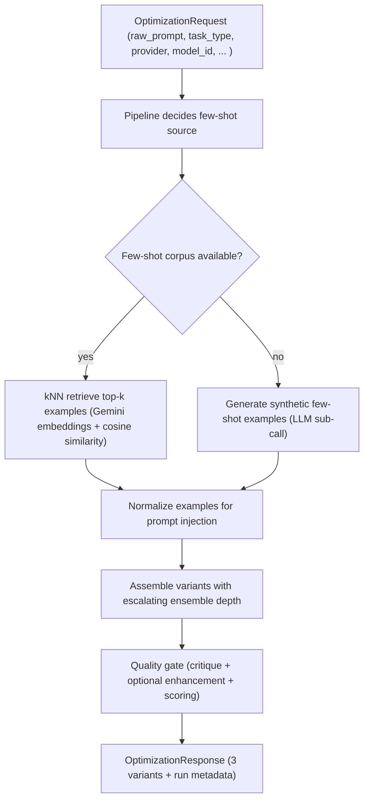
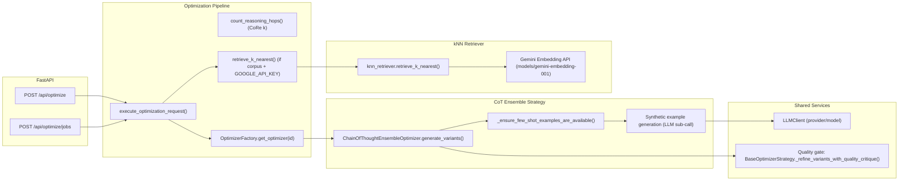

# CoT Ensemble (Medprompt Pattern: kNN Few-Shot + Multi-Path Reasoning + Self-Check)

## 1. Introduction to the Framework

### 1.1 Purpose
CoT Ensemble is APOST's implementation of the Medprompt-style prompt engineering pattern: combine semantically relevant few-shot examples (ideally retrieved via k-nearest-neighbor search in embedding space) with explicit multi-path reasoning instructions and a self-check / synthesis step.

The intent is to improve accuracy and robustness on complex reasoning tasks where:

- a single chain-of-thought path is brittle,
- the model benefits from demonstrations that are structurally similar to the task,
- a verification step (self-check) can catch obvious inconsistencies.

In APOST, CoT Ensemble constructs three variants with escalating ensemble depth:

1. Conservative: single-path reasoning + 1 example
2. Structured: dual-path reasoning + 2 examples + self-check
3. Advanced: tri-path reasoning + 3 examples + explicit ensemble synthesis and guards

### 1.2 Benefits
CoT Ensemble tends to improve:

- **Reasoning accuracy** via multiple independent attempts and synthesis.
- **Stability** via few-shot demonstrations that anchor the desired transformation.
- **Error detection** via self-check and majority-vote style aggregation.
- **Generalization** by retrieving examples that are close in embedding space instead of using static examples.

### 1.3 Research and Practice Basis (Why This Works)
This framework is explicitly inspired by Microsoft Research's Medprompt pattern (and broader few-shot + self-consistency practices). The key underlying ideas are:

- **Semantically similar few-shot selection**: examples that are structurally analogous to the query outperform generic examples.
- **Ensembling / self-consistency**: generating multiple independent solutions and reconciling them improves final accuracy and reduces random failure.
- **Verification**: an explicit self-check phase reduces hallucination drift and catches format deviations.

APOST also applies a shared post-pass quality gate that critiques and optionally enhances the generated prompts.

## 2. Flow Diagram of the Algorithm



**Key decision points**
1. **kNN availability**: requires `GOOGLE_API_KEY` and a precomputed corpus in app state (or cache). If unavailable, APOST falls back to synthetic example generation.
2. **Variant depth**: the number of examples and reasoning paths increases from Conservative -> Advanced.
3. **Quality gate mode**: controls critique/enhancement cost and latency.

## 3. High-Level Implementation Diagram (Codebase Integration)



**Where it lives**
- Strategy: `backend/app/services/optimization/frameworks/cot_ensemble_optimizer.py`
- kNN retrieval: `backend/app/services/optimization/knn_retriever.py`
- Pipeline orchestration: `backend/app/services/optimization/optimization_pipeline.py`
- Auto-router: `backend/app/services/analysis/framework_selector.py`

## 4. Sectioned Explanation

### 4.1 Problem Statement
Complex reasoning prompts fail in predictable ways:

- Single-path reasoning is brittle; one bad intermediate step ruins the final output.
- Generic few-shot examples can mislead the model by introducing irrelevant patterns.
- Without a verification phase, plausible hallucinations pass through unchallenged.

CoT Ensemble addresses this by:

1. retrieving or generating relevant demonstrations, and
2. forcing multiple independent reasoning paths and synthesis.

### 4.2 Inputs and Data Preparation
CoT Ensemble consumes:

- `OptimizationRequest.raw_prompt`
- `OptimizationRequest.task_type` (used to pick a corpus subset for kNN)
- `OptimizationRequest.provider`, `model_id`, `api_key` (used for generation calls)
- `few_shot_examples` (provided by pipeline if kNN succeeded)
- environment: `GOOGLE_API_KEY` for embedding-based retrieval

### 4.3 Data Sources for Few-Shot Examples
APOST uses two sources:

1. **kNN few-shot retrieval (preferred)**:
   - Precompute embeddings for a small curated corpus.
   - Embed the query prompt once.
   - Retrieve top-k by cosine similarity.
2. **Synthetic example generation (fallback)**:
   - If kNN is unavailable, generate a small set of examples using a cheaper sub-call.

This makes CoT Ensemble robust: it can still run even when the embedding path is not configured.

### 4.4 Optimization Strategy (Escalating Ensemble Depth)
The framework assembles three variants with increasing depth:

1. **Conservative**
   - Basic few-shot grounding and single reasoning path.
2. **Structured**
   - Dual-path reasoning plus a self-check stage that validates consistency and format.
3. **Advanced**
   - Tri-path reasoning and explicit ensemble synthesis (majority-vote / consensus), plus stronger anti-hallucination and "do not skip paths" guards.

This is a prompt-space ensemble: all "paths" are produced within a single response via instructions, rather than by the system calling the model multiple times.

### 4.5 Evaluation (Quality Gate)
After variant assembly, the shared quality gate critiques and optionally enhances the prompts, replacing naive estimates with judge-derived quality metadata while preserving API contract stability.

## 5. Algorithmic Detail

### 5.1 Optimization Mechanism
CoT Ensemble can be viewed as a demonstration- and instruction-based optimization:

- Decision variable: the assembled system prompt `p` that includes demonstrations and ensemble instructions.
- Constraints: preserve task intent and output contract, include self-check, avoid unsafe hallucinations.
- Objective (informal): maximize correctness probability by reducing variance across reasoning paths and anchoring behavior with relevant examples.

### 5.2 Pseudo-code

```python
def cot_ensemble_optimize(request, few_shot_examples_from_knn=None):
    # 1) Ensure few-shot examples exist
    if few_shot_examples_from_knn:
        examples = normalize_knn_examples(few_shot_examples_from_knn)
    else:
        examples = generate_synthetic_examples(request.raw_prompt, task_type=request.task_type)

    # 2) Assemble variants with escalating ensemble depth
    v1 = assemble_variant(examples[:1], n_paths=1, self_check=False)
    v2 = assemble_variant(examples[:2], n_paths=2, self_check=True)
    v3 = assemble_variant(examples[:3], n_paths=3, self_check=True, synthesis="ensemble_consensus")

    response = build_three_variants(v1, v2, v3)
    return quality_gate(response, request)
```

### 5.3 kNN Retrieval: Embeddings + Cosine Similarity
The kNN retriever:

1. Uses Gemini Embedding API (`models/gemini-embedding-001`) to embed corpus entries and the query.
2. Computes cosine similarity between the query vector and corpus vectors.
3. Returns the top-k corpus entries as few-shot demonstrations.

This is a classic retrieval-augmented few-shot selection method.

## 6. Implementation Highlights

### 6.1 Key Files and Entry Points
- Strategy: `backend/app/services/optimization/frameworks/cot_ensemble_optimizer.py`
  - Class: `ChainOfThoughtEnsembleOptimizer`
  - Entry point: `generate_variants()`
  - Few-shot guard: `_ensure_few_shot_examples_are_available()`
- kNN retrieval: `backend/app/services/optimization/knn_retriever.py`
  - `precompute_corpus_embeddings()`
  - `retrieve_k_nearest()`
- Pipeline: `backend/app/services/optimization/optimization_pipeline.py`
  - resolves few-shot examples and sets `response.analysis.few_shot_source`

### 6.2 Configuration Parameters

| Parameter | Location | Role |
|---|---|---|
| `MAX_TOKENS_SYNTHETIC_EXAMPLE_GENERATION` | optimizer_configuration | bounds fallback synthetic generation output |
| k (neighbors) | optimization_pipeline | typically `k=3` |
| embedding dimensionality | `knn_retriever.py` | `output_dimensionality=768` (MRL) |
| `quality_gate_mode` | OptimizationRequest | controls judge critique/enhancement |

### 6.3 Observability and Provenance
Pipeline metadata includes whether few-shot examples came from:

- `knn` (embedding retrieval), or
- synthetic fallback / unavailable.

This improves diagnosability when performance differs across environments.

## 7. Integration and Workflow

### 7.1 API Invocation
CoT Ensemble is invoked via standard endpoints:

- `POST /api/optimize` with `framework="cot_ensemble"`
- `POST /api/optimize/jobs` for async execution

### 7.2 Auto-selection Behavior
When `framework="auto"`, APOST selects `cot_ensemble` for complex reasoning/analysis tasks (when a more specific rule does not match). This is encoded in `backend/app/services/analysis/framework_selector.py`.

### 7.3 End-to-End Local Testing
`backend/app/services/optimization/frameworks/cot_ensemble_optimizer.py` includes a standalone entry point for manual testing, and `backend/test_optimizers_locally.py` covers CoT Ensemble as part of the full framework suite.

## 8. Testing and Validation

### 8.1 Unit and Route Tests
CoT Ensemble selection is covered by:

- `backend/tests/test_framework_selector.py` (auto-router selection)

Few-shot route provenance and pipeline wiring are exercised by:

- `backend/tests/test_optimization_route_provenance.py` (pipeline response handling and metadata paths)

### 8.2 Diagnosing Common Issues

| Symptom | Likely cause | Where to look |
|---|---|---|
| Few-shot is always missing | `GOOGLE_API_KEY` absent or corpus not loaded | `optimization_pipeline.py`, `knn_retriever.py` |
| Bad examples injected | corpus entry quality or retrieval mismatch | `few_shot_corpus.py` / corpus content |
| Outputs too long | too many paths + verbose model | reduce path count or tighten prompts |
| Self-check ignored | guard language too weak | Structured/Advanced assembly blocks |

## 9. Performance Tips

1. Prefer kNN retrieval when possible; synthetic examples are a fallback and may be lower quality.
2. Use `quality_gate_mode="off"` during iteration and debugging; enable full mode for production.
3. Keep the number of reasoning paths bounded in high-throughput scenarios.
4. Ensure the corpus is task-type aligned; retrieval is only as good as the examples it can choose from.

## 10. Future Work and Extensions

1. Add deterministic scoring of candidate few-shot sets (small evaluation dataset) to choose the best demonstrations empirically.
2. Add diversity constraints to retrieval (avoid near-duplicate examples).
3. Support provider-native tool use in the self-check stage (for example, schema validation).
4. Extend the corpus to cover more task types and edge cases.

## References

1. Wei, J., et al. (2022). "Chain-of-Thought Prompting Elicits Reasoning in Large Language Models." arXiv:2201.11903.
2. Wang, X., et al. (2022). "Self-Consistency Improves Chain of Thought Reasoning in Language Models." arXiv:2203.11171.
3. Kojima, T., et al. (2022). "Large Language Models are Zero-Shot Reasoners." arXiv:2205.11916.
4. Liu, N. F., et al. (2023). "Lost in the Middle: How Language Models Use Long Contexts." arXiv:2307.03172.
5. APOST internal documentation: `APOST_v4_Documentation.md` and `backend/app/services/optimization/frameworks/OPTIMIZERS.md`.
6. APOST code: `backend/app/services/optimization/frameworks/cot_ensemble_optimizer.py` and `backend/app/services/optimization/knn_retriever.py`.
