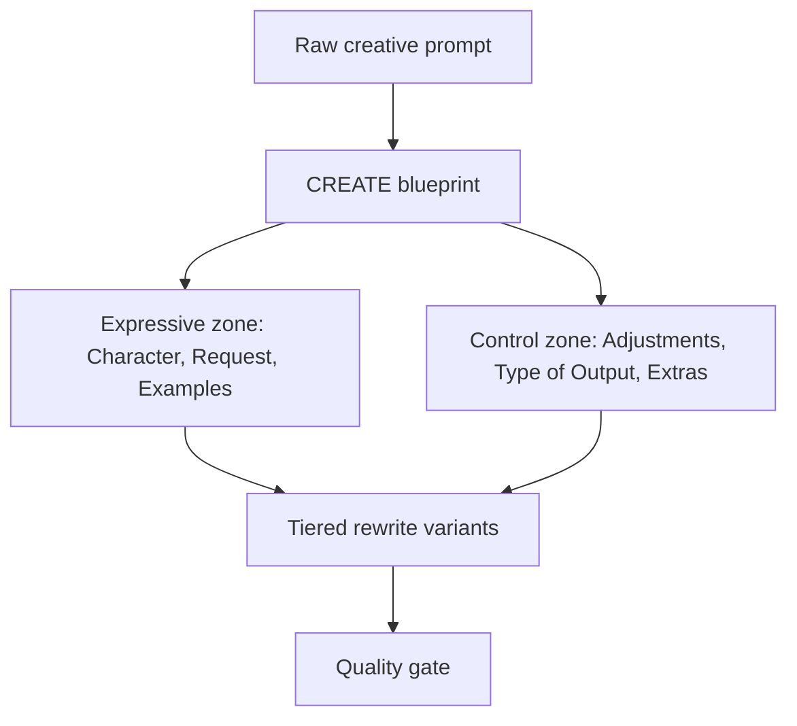
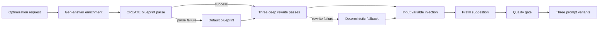
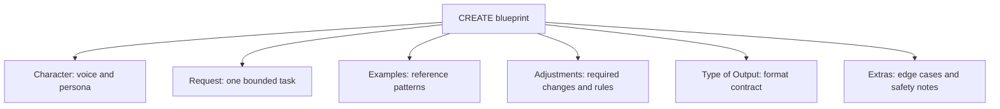
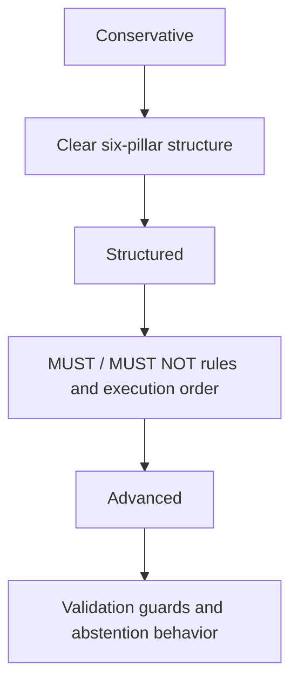

# CREATE Prompt Optimization: Educational Guide
### Character, Request, Examples, Adjustments, Type of Output, Extras

> **Who this guide is for:** Readers who want to understand CREATE as APOST implements it: a deep rewrite framework for prompts that need expressive voice, clear creative direction, hard constraints, and reliable output shape at the same time.

## 1. Introductory Overview

CREATE is APOST's prompt optimization framework for tasks where style and structure both matter. It is especially useful for writing, editing, messaging, creative drafting, persona-driven assistants, and user-facing responses where the model must sound a certain way while still following strict rules.

CREATE stands for **Character, Request, Examples, Adjustments, Type of Output, Extras**. These six parts are called the framework's **pillars**, meaning they are the named categories that CREATE uses to separate the prompt's creative instructions from its operational requirements.

The framework solves a familiar production problem: creative prompts often mix voice, task, examples, rules, format, and edge cases in one blob. A model may follow the tone but ignore the format, copy the example too literally, or obey a style instruction while breaking a business rule. CREATE reduces that confusion by extracting a **CREATE blueprint**, which is a structured intermediate map of the six pillars plus safety and verification fields, then using that blueprint to generate three progressively stronger prompt variants.

In the codebase, CREATE is implemented by `CreateOptimizer` in `backend/app/services/optimization/frameworks/create_optimizer.py`. It is not a static heading template. The optimizer enriches the raw prompt with gap-interview answers, parses the CREATE blueprint as JSON, runs three objective-specific deep rewrites, falls back to a deterministic template if a model call fails, injects runtime variables, optionally adds provider-specific prefill metadata, and finally runs the shared quality gate.

Use CREATE when a prompt needs a controlled creative voice without becoming loose or unparseable. It is the framework for "make it expressive, but keep it reliable."

## 2. Framework-Specific Terminology Explained

This terminology is specific to CREATE as an APOST optimization framework.

### CREATE

**Plain meaning:** A six-part framework for organizing creative or persona-heavy prompts.

**Example:** A campaign email prompt can be split into character, request, examples, adjustments, output type, and extras.

**Why it matters:** CREATE keeps voice and creativity from colliding with constraints and output format.

**How it connects:** Every parse, rewrite, fallback, and variant in the optimizer is built around these six pillars.

### Pillar

**Plain meaning:** One of CREATE's six required prompt categories.

**Example:** `Character` is a pillar that defines the voice or persona. `Type of Output` is a pillar that defines the response format.

**Why it matters:** Pillars make the prompt reviewable. If the voice fails, inspect Character. If the format fails, inspect Type of Output.

### Character

**Plain meaning:** The persona, role, expertise, or voice the model should adopt.

**Example:** "You are a senior lifecycle marketer writing with warmth and restraint."

**Why it matters:** Creative tasks often fail when the model defaults to a generic assistant voice.

**How it connects:** The parser extracts `character`, the rewrite preserves it, and the variants use it to anchor tone and perspective.

### Request

**Plain meaning:** The single bounded task the model must complete.

**Example:** "Write a welcome email for a new trial user."

**Why it matters:** Creative prompts can sprawl. Request keeps the model focused on one deliverable.

### Examples

**Plain meaning:** Reference material that shows the model a style, format, or pattern to imitate.

**Example:** A sample subject line and email body that demonstrate the desired pacing.

**Why it matters:** Examples are powerful, but ambiguous examples can cause copying or unintended style transfer. CREATE isolates them so the model knows they are references, not the live task.

### Adjustments

**Plain meaning:** Hard rules, constraints, and refinements that modify how the request should be fulfilled.

**Example:** "MUST mention the product name. MUST NOT promise a refund."

**Why it matters:** This pillar separates rules from voice. A fun tone should never override a compliance boundary.

### Type of Output

**Plain meaning:** The required response structure or format.

**Example:** "Return JSON with `subject` and `body` fields."

**Why it matters:** Creative quality is not enough in production if downstream code cannot parse the result.

### Extras

**Plain meaning:** Edge-case handling, safety notes, reliability instructions, or additional context that does not fit the other pillars.

**Example:** "If the user's name is missing, use a neutral greeting."

**Why it matters:** Extras prevent brittle behavior when inputs are incomplete or ambiguous.

### CREATE Blueprint

**Plain meaning:** The structured JSON representation extracted from the raw prompt before the final rewrites.

**Example:** The blueprint contains `character`, `request`, `examples`, `adjustments`, `type_of_output`, `extras`, `forbidden_behaviors`, and `verification_checks`.

**Why it matters:** The blueprint is the optimizer's intermediate representation. It lets CREATE reason about the prompt before rewriting it.

### Forbidden Behaviors

**Plain meaning:** Explicit things the model must not do.

**Example:** "Do not invent unsupported claims" or "Do not include legal guarantees."

**Why it matters:** Users often imply boundaries without stating them as MUST NOT rules. CREATE makes those boundaries explicit.

### Verification Checks

**Plain meaning:** Conditions the model should check before producing the final answer.

**Example:** "Confirm the output has exactly two fields" or "Confirm no unsupported factual claim was added."

**Why it matters:** Verification turns the prompt into a small checklist, making format and rule adherence easier to audit.

### Deep Rewrite

**Plain meaning:** A full end-to-end rewrite of the prompt from the blueprint, not a simple heading insertion.

**Example:** The Structured tier may reorganize rules into MUST and MUST NOT boundaries and add ordered execution logic.

**Why it matters:** Deep rewrites produce genuinely different prompt architectures across tiers.

### Guarded Fallback

**Plain meaning:** A deterministic backup prompt generated when blueprint parsing or tier rewriting fails.

**Example:** `_fallback_create_prompt()` serializes the blueprint into CHARACTER, REQUEST, EXAMPLES, ADJUSTMENTS, TYPE OF OUTPUT, EXTRAS, and VERIFICATION sections.

**Why it matters:** APOST should still return usable variants even when an LLM sub-call misbehaves.

### Input Variables

**Plain meaning:** Runtime placeholders appended to the generated system prompt.

**Example:** `{{user_name}}`, `{{product_name}}`, or `{{customer_segment}}`.

**Why it matters:** CREATE must show the model what dynamic data will be supplied without letting those variables blur into the static creative brief.

### Prefill Suggestion

**Plain meaning:** A suggested first token or phrase for providers that support assistant prefill behavior.

**Example:** For JSON tasks, the suggestion may be `{`.

**Why it matters:** It can help lock the output format for some provider/task combinations.

### Quality Gate

**Plain meaning:** A shared APOST critique step that can score and improve generated variants.

**Example:** If a variant has weak constraints or unclear output format, the quality gate may enhance it before the response returns.

**Why it matters:** CREATE handles creative structure, but the quality gate checks whether the resulting prompt is strong enough.

## 3. Problem the Framework Solves

CREATE addresses production failures that happen when creative prompts are not structurally separated.

The first failure is **persona drift**. The model starts in the requested voice but gradually returns to a generic assistant style. CREATE counters this by isolating Character as its own pillar.

The second failure is **example confusion**. The model may copy example content instead of using the example as a style or format reference. CREATE separates Examples from the live Request and Adjustments.

The third failure is **constraint dilution**. A prompt may say "be playful" near "do not promise discounts," and the model may treat both with equal authority. CREATE separates expressive instructions from mandatory rules.

The fourth failure is **format drift**. Creative tasks often produce beautiful prose that does not fit a required schema. CREATE gives Type of Output its own pillar.

The fifth failure is **edge-case collapse**. If a variable is missing or the source material is ambiguous, the model may invent details. CREATE uses Extras, forbidden behaviors, and verification checks to make fallback behavior explicit.

## 4. Core Mental Model

CREATE is best understood as a creative brief with a production checklist attached.

A creative brief gives a writer voice, audience, examples, and purpose. A production checklist gives a system hard rules, output format, safety boundaries, and verification steps. CREATE combines both. It lets the model be expressive inside the right container.

Read this diagram from top to bottom. The raw prompt is first converted into a CREATE blueprint. That blueprint separates the expressive zone from the control zone. Both zones then feed the tiered rewrites, and the quality gate evaluates the results.

The practical lesson is that CREATE does not reduce creativity. It gives creativity a better boundary so reliability can survive alongside it.

## 5. Main Principles or Pillars

### Principle 1: Separate Voice from Rules

**What it means:** Character controls how the model sounds. Adjustments and forbidden behaviors control what the model must or must not do.

**Failure it prevents:** A strong persona overriding a hard business or safety rule.

**How it works:** The blueprint stores persona and constraints in different fields.

**Why it matters:** Creative style should decorate the task, not govern the rules.

### Principle 2: Keep One Bounded Request

**What it means:** The prompt should have one primary objective.

**Failure it prevents:** Scope creep, multi-objective confusion, and outputs that try to satisfy too many goals at once.

**How it works:** The parser extracts a single `request`, and the rewrite prompt explicitly says to keep one bounded objective.

**Why it matters:** A creative prompt can still be precise.

### Principle 3: Treat Examples as References

**What it means:** Examples should show style, structure, or pattern without becoming live content.

**Failure it prevents:** Copying example details into the final answer.

**How it works:** Examples are extracted into their own blueprint field and rewritten as reference material.

**Why it matters:** Few-shot style guidance works best when the model knows what the examples are demonstrating.

### Principle 4: Make Output Format Explicit

**What it means:** The final response shape must be its own instruction.

**Failure it prevents:** Beautiful but unparseable output.

**How it works:** `type_of_output` becomes a dedicated section in fallback prompts and a required focus in rewrite prompts.

**Why it matters:** Production systems need stable output contracts.

### Principle 5: Add Verification Before Final Output

**What it means:** The model should check whether it satisfied the core rules before answering.

**Failure it prevents:** Missing fields, broken constraints, unsupported claims, and edge-case failures.

**How it works:** CREATE extracts `verification_checks`, and Structured/Advanced fallbacks add execution order and validation language.

**Why it matters:** Verification makes the prompt easier to debug and safer to deploy.

## 6. Step-by-Step Algorithm or Workflow

### Step 1: Enrich the raw prompt

The optimizer first calls `integrate_gap_interview_answers_into_prompt()`. A gap interview answer is extra information the user supplied after APOST asked clarifying questions.

This matters because creative prompts often depend on audience, tone, or brand context that may not appear in the original prompt.

### Step 2: Parse the CREATE blueprint

`_parse_create_blueprint()` asks an LLM to return strict JSON with the CREATE fields. The response is normalized so missing fields get safe defaults.

The blueprint fields are:

- `character`
- `request`
- `examples`
- `adjustments`
- `type_of_output`
- `extras`
- `forbidden_behaviors`
- `verification_checks`

If parsing fails, `_default_blueprint()` creates a conservative baseline so the pipeline can continue.

### Step 3: Run three tier-specific rewrite passes

CREATE defines three rewrite objectives:

- **Conservative:** preserve the six pillars while improving clarity and bounded scope.
- **Structured:** strengthen MUST and MUST NOT constraints plus ordered execution logic.
- **Advanced:** maximize failure resistance with validation, edge cases, and anti-hallucination guards.

Each tier calls `_rewrite_with_create_objective()`, which performs a full rewrite from the blueprint and original prompt.

### Step 4: Use guarded fallback if needed

If a rewrite returns empty output or raises an error, `_fallback_create_prompt()` builds a deterministic prompt from the blueprint.

Structured and Advanced fallbacks add execution order. Advanced also adds a validation guard that tells the model to state missing evidence rather than invent details.

### Step 5: Inject input variables

`inject_input_variables_block()` appends runtime variables in the provider's preferred format.

This ensures the final prompt names the dynamic inputs it expects without mixing those values into the static creative instructions.

### Step 6: Generate prefill metadata

`generate_claude_prefill_suggestion()` may return a provider-specific prefill suggestion for the Advanced variant.

This is metadata, not a substitute for the Type of Output pillar.

### Step 7: Run the quality gate

Finally, `_refine_variants_with_quality_critique()` critiques the variants according to `quality_gate_mode` and may improve weak ones.

This final pass is shared across APOST frameworks, but for CREATE it is especially useful for catching weak persona, vague constraints, and under-specified output format.

## 7. Diagrams and Architectural Explanations

### Diagram 1: CREATE Pipeline

Read this diagram from left to right. The request is enriched, parsed into a blueprint, rewritten into three tiers, repaired by fallback if needed, augmented with input variables and prefill metadata, then reviewed by the quality gate.

The practical lesson is that CREATE uses LLMs for semantic interpretation, but it also has deterministic safety rails when those LLM steps fail.

### Diagram 2: Six-Pillar Separation

Each block is one CREATE pillar. Character controls voice. Request controls the job. Examples show patterns. Adjustments hold rules. Type of Output defines the format. Extras cover edge cases.

The practical lesson is that every creative prompt failure usually maps to one pillar being absent, vague, or mixed with another pillar.

### Diagram 3: Tier Escalation

This diagram shows how the variants escalate. Conservative clarifies. Structured makes constraints more operational. Advanced adds stronger validation and failure handling.

The practical lesson is to choose the lightest tier that gives the needed reliability.

## 8. Optimization Tiers / Variants / Modes

### Conservative

**Purpose:** Improve clarity while preserving the six CREATE pillars.

**Cost:** Lowest token cost.

**Best use:** Creative prompts that are already mostly correct but need cleaner structure.

**Trade-off:** It may not be strict enough for downstream parsers or regulated content.

### Structured

**Purpose:** Make constraints and execution order more explicit.

**Cost:** Moderate token cost.

**Best use:** Production creative workflows where tone matters but behavior must stay stable.

**Trade-off:** Less freeform than Conservative, but much easier to audit.

### Advanced

**Purpose:** Add strict validation, edge-case handling, and anti-hallucination behavior.

**Cost:** Highest token cost.

**Best use:** High-stakes copy, user-facing agents, or prompts where unsupported claims and broken formats are costly.

**Trade-off:** More protective, but can feel heavier than needed for simple creative drafting.

### Quality Gate Modes

| Mode | What happens | Good fit |
|---|---|---|
| `full` | Critique and conditional enhancement for all variants | Production release |
| `sample_one_variant` | Full quality pass for one variant | Cost-sensitive review |
| `critique_only` | Scores without enhancing | Auditing and benchmark comparisons |
| `off` | Skips the judge pass | Fast local iteration |

## 9. Implementation and Production Considerations

The core implementation is `backend/app/services/optimization/frameworks/create_optimizer.py`. The blueprint parse prompt starts around line 42, the rewrite prompt around line 64, `CreateOptimizer` around line 89, fallback logic around line 189, and the main `generate_variants()` workflow around line 233.

### Routing

The deterministic auto-router selects `create` when `task_type == "creative"`. In plain language, APOST routes to CREATE when the task is primarily about creative generation rather than extraction, QA, reasoning, or low-level classification.

### Configuration

`MAX_TOKENS_COMPONENT_EXTRACTION` controls the blueprint parse budget. If this is too low, examples or constraints may be lost.

`MAX_TOKENS_CREATE_REWRITE` controls each deep rewrite. If this is too low, a tier may truncate important sections. If it is too high, the model may produce bloated prompts.

`quality_gate_mode` controls final critique and enhancement.

### Provider behavior

CREATE itself is provider-neutral. It uses shared helpers for input-variable formatting and Claude prefill suggestions. The core six-pillar structure remains the same across providers.

### Production trade-offs

CREATE is heavier than KERNEL because it performs blueprint parsing plus three rewrite passes. That extra cost buys clearer persona, better separation between style and rules, stronger output contracts, and better fallback behavior.

For internal drafting, Conservative may be enough. For user-facing production flows, Structured is usually the practical default. Advanced is best when factual restraint, format fidelity, and edge-case behavior matter more than brevity.

## 10. Common Failure Modes and Diagnostics

| Symptom | Likely cause | Where to inspect | Correction |
|---|---|---|---|
| Persona is weak | `character` was vague or lost during parse | CREATE blueprint and Conservative variant | Strengthen Character or use Structured |
| Example content leaks into output | Examples were not framed as references | `examples` and `extras` | Clarify what the examples demonstrate |
| Rules are ignored | Adjustments were phrased as soft preferences | `adjustments` and `forbidden_behaviors` | Convert rules to MUST or MUST NOT language |
| Output format drifts | Type of Output is underspecified | `type_of_output` and quality gate result | Add schema or exact response structure |
| Advanced feels too rigid | Validation guards are heavier than needed | Advanced prompt | Use Structured or Conservative |
| All tiers look similar | Rewrite objectives are not producing enough tier differentiation | `objectives` in `generate_variants()` | Strengthen tier objectives |
| Fallback output appears | Parse or rewrite model failed | logs around `_parse_create_blueprint()` or `_rewrite_with_create_objective()` | Inspect provider errors and malformed outputs |

The fastest diagnostic approach is to map the failure to a pillar. Voice problems point to Character. Scope problems point to Request. Copying problems point to Examples. Rule failures point to Adjustments or forbidden behaviors. Parser failures point to Type of Output.

## 11. When to Use It and When Not To

### Use CREATE when

- The task is creative, persuasive, editorial, or brand-sensitive.
- Persona and tone matter.
- Examples are part of the prompt.
- The output must be expressive but still structured.
- Non-technical reviewers need a readable prompt shape.

### Avoid CREATE when

- The task is simple classification, routing, or extraction.
- The main risk is prompt injection or multi-document context confusion.
- The prompt is severely underspecified and needs TCRTE first.
- The task requires complex reasoning demonstrations rather than creative direction.

### Trade-offs versus other frameworks

Compared with KERNEL, CREATE is richer for persona and creative control but more verbose. Compared with XML Structured Bounding, CREATE is less focused on isolating untrusted data and more focused on organizing creative intent. Compared with CoT Ensemble, CREATE does not retrieve examples or create reasoning paths; it structures examples already present in the prompt.

## 12. Research-Based Insights

CREATE is an APOST framework, not a public research acronym. Its design is grounded in established findings and provider guidance about examples, role prompting, structured instructions, and output formatting.

OpenAI's prompting guide emphasizes managing reusable prompts, variables, tone or role guidance, concise examples, and eval-based iteration. This supports CREATE's separation of persona, examples, variables, and output format into reviewable prompt components. Source: [OpenAI Prompting](https://platform.openai.com/docs/guides/prompting).

Anthropic's prompting best practices state that examples are one of the most reliable ways to steer output format, tone, and structure; they also recommend descriptive tags for complex prompts and assigning a role in the system prompt. This directly supports CREATE's Examples and Character pillars. Source: [Anthropic Claude prompting best practices](https://docs.anthropic.com/en/docs/build-with-claude/prompt-engineering/claude-prompting-best-practices).

Brown et al.'s "Language Models are Few-Shot Learners" showed that examples in context can strongly influence model behavior without parameter updates. CREATE does not implement retrieval, but its Examples pillar preserves and clarifies demonstrations already present in the prompt. Source: [Language Models are Few-Shot Learners](https://arxiv.org/abs/2005.14165).

Mishra et al.'s Natural Instructions work studies task generalization from human-written task instructions and examples. Its results support the larger principle behind CREATE: task boundaries and examples help models understand what behavior is expected. Source: [Cross-Task Generalization via Natural Language Crowdsourcing Instructions](https://aclanthology.org/2022.acl-long.244/).

The honest takeaway is narrow: CREATE does not make creativity magically safe. It improves reliability by separating persona, request, examples, constraints, output format, and edge cases into explicit reviewable parts.

## 13. Final Synthesis

CREATE is APOST's framework for prompts that need both creative expression and production reliability.

The core workflow is:

1. Enrich the raw prompt with gap-interview answers.
2. Parse a CREATE blueprint with six pillars plus safety and verification fields.
3. Generate Conservative, Structured, and Advanced rewrites from that blueprint.
4. Use deterministic fallback if parsing or rewriting fails.
5. Inject runtime variables and provider-specific metadata.
6. Run the shared quality gate.

| Need | CREATE answer |
|---|---|
| Control voice | Define Character |
| Keep task focused | Define Request |
| Guide style or pattern | Add Examples |
| Enforce rules | Use Adjustments and forbidden behaviors |
| Preserve parseability | Define Type of Output |
| Handle edge cases | Use Extras and verification checks |
| Minimize disruption | Choose Conservative |
| Production reliability | Choose Structured or Advanced |

The central idea is simple: CREATE gives creative prompts a spine. It lets the model sound human, specific, and expressive while still giving engineers clear places to inspect, tune, and enforce behavior.
