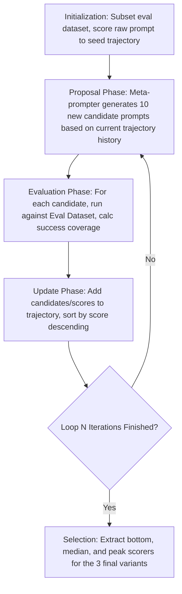
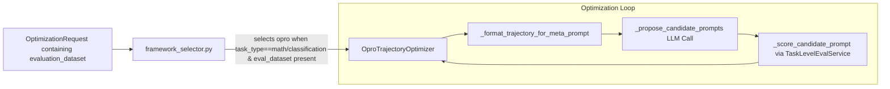

# OPRO: Optimization by PROmpting — A Comprehensive Educational Guide

## 1. Introductory Overview

OPRO (Optimization by PROmpting) is a framework that treats prompt engineering as a **black-box optimization problem**. Instead of relying on human intuition to rewrite a prompt—adding structure, separating concerns, or applying stylistic heuristics—OPRO uses an LLM to **search** through the space of possible prompts. The search is guided by actual performance measurements on a dataset of examples.

In practice, this means you provide a set of input-output pairs that define what “success” looks like. OPRO then runs multiple cycles (iterations) where:

- A **meta-prompter** (an LLM acting as the search algorithm) proposes new candidate prompts.
- Each candidate is tested against your dataset to compute a **score** (e.g., accuracy, exact-match percentage).
- The prompts and their scores are recorded in a **trajectory** (a history of attempts).
- The meta-prompter reads this history and uses it to propose even better prompts in the next round.

After a fixed number of iterations, OPRO returns **three distinct variants** of the prompt—each representing a different point on the optimization curve—so you can choose the one that best balances raw performance, stability, and readability.

> **Why use OPRO?**  
> When your task is well-defined (e.g., classification, mathematical reasoning, structured extraction) and you have a dataset of correct answers, OPRO can push performance past the plateaus that human-written prompts hit. It discovers phrasings that may look unintuitive or even “ugly” to a person, but that empirically make the target model perform better.

---

## 2. Framework-Specific Terminology Explained

This section defines the core vocabulary of OPRO. Understanding these terms is essential for following how the framework operates.

| Term | Plain-Language Definition | Why It Matters in OPRO |
|------|---------------------------|------------------------|
| **Trajectory** | A chronological list of prompts that have been tried, along with their measured scores. Think of it as the “lab notebook” of the optimization process. | The trajectory is the **memory** of the search. The meta-prompter reads it to learn what worked and what didn’t, just as a human scientist reviews past experiments to design the next one. |
| **Trajectory Entry** | One row in the trajectory: a pair `(prompt_text, score)`. | Each entry is a data point for the meta-prompter’s analysis. OPRO sorts the trajectory by score so the best attempts are always visible. |
| **Meta-prompter** | The LLM that **generates new candidate prompts** based on the trajectory and a description of the task. | This is the “optimizer brain.” It is **not** the model you are ultimately trying to prompt; it is a separate (often more capable) LLM that acts as the search algorithm. |
| **Meta-Prompt** | A large system instruction sent to the meta-prompter. It contains: <br> • The task description <br> • A small sample of the evaluation dataset <br> • The current trajectory, sorted by score <br> • An instruction to propose 10 new, improved prompts. | The meta-prompt is the **communication channel** that transforms the trajectory into new candidate prompts. Its design is critical—it must clearly show the relationship between prompt wording and resulting score. |
| **Evaluation Dataset** | A set of examples where each entry has an `input`, an `expected_output`, and (optionally) `evaluation_criteria`. | Without this dataset, OPRO **cannot run**. The dataset provides the **ground truth** against which every candidate prompt is scored. |
| **Candidate Prompt** | One of the new prompts proposed by the meta-prompter during a single iteration. | A typical OPRO loop generates 8–10 candidates per iteration. Each candidate will be evaluated and added to the trajectory. |
| **Empirical Score** | A numeric value (usually 0–100) that quantifies how well a candidate prompt performs on the evaluation dataset. | The score is the **objective function** that OPRO tries to maximize. It is computed by running the candidate prompt against all (or a sampled subset of) the evaluation dataset. |
| **Iteration / Loop** | One full cycle of: <br> 1. **Proposal** – generate new candidates <br> 2. **Evaluation** – score each candidate <br> 3. **Update** – append results to trajectory | Each iteration refines the search. More iterations give the meta-prompter more history to work with, but also increase cost and runtime. |
| **Conservative / Structured / Advanced Tiers** | The three final prompt variants that OPRO outputs. They are **not** different “rigidity” settings; they are different **selections from the trajectory history**: <br> • **Conservative** – best prompt from the **first iteration** (safe, low-hanging fruit) <br> • **Structured** – median scorer among the **top quartile** (stable high performer) <br> • **Advanced** – **absolute highest-scoring prompt** ever found (may be overfitted or strange) | These tiers let you choose a trade-off between performance and other concerns like readability or generalization. |

---

## 3. Problem the Framework Solves

### The Intuition Failure Problem

Most prompt-engineering frameworks (like KERNEL or XML-based structuring) rely on **human intuition** about what makes a prompt “good.” For example, we *assume* that:

- Putting constraints in a separate section improves adherence.
- Using `<output_format>` tags forces structured output.
- Asking the model to “think step by step” always helps reasoning.

These assumptions work **most of the time**. But for **highly complex reasoning tasks**, **mathematical problem-solving**, or **specific classification edge cases**, human intuition can fail. A prompt that looks “messy” or “poorly written” to a human might unexpectedly score 95% accuracy on a test set, while a clean, well-structured prompt scores only 70%.

**OPRO solves this by removing intuition from the equation.** It treats the prompt as a **hyperparameter** to be optimized empirically, using a dataset of correct answers as the objective function. The resulting prompt may be unintuitive—it might contain unusual phrasing, repeated keywords, or odd formatting—but it is **mathematically proven** to perform better on your specific evaluation data.

> **Analogy**  
> Think of KERNEL as a **code linter**—it makes your code clean and structurally sound.  
> Think of OPRO as **gradient descent**—it doesn’t care if the final weights are human-readable; it only cares that they minimize the loss.

### What OPRO Actually Produces

OPRO does **not** just rewrite your prompt once. It runs a **multi-iteration search loop** that systematically explores the prompt space. The output is **three empirical winners** from different stages of the search:

- A **safe baseline** (Conservative).
- A **robust high performer** (Structured).
- The **mathematical champion** (Advanced).

---

## 4. Core Mental Model

### The Meta-Prompter as the Search Algorithm

Imagine you are trying to find the highest point in a foggy landscape. You can’t see the whole terrain; you can only take steps and measure the elevation at your feet.

- **The landscape** is the space of all possible prompt strings.
- **Elevation** is the empirical score on your evaluation dataset.
- **Your steps** are the candidate prompts proposed by the meta-prompter.
- **Your notebook** is the trajectory—recording where you’ve been and how high each point was.

The meta-prompter is an LLM that has been trained to **read your notebook and suggest promising next steps**. It looks at the history of prompts and their scores and tries to infer **patterns**: “Ah, when the word ‘verify’ appeared, the score went up. When the prompt asked for JSON output, accuracy improved further.”

This is the core insight from DeepMind’s research: **LLMs can act as optimizers for their own prompts** if you give them a trajectory of past attempts.

### The Meta-Prompt Structure

The engine that makes this work is the **meta-prompt**—a carefully constructed instruction that looks conceptually like this:

```text
You are an optimizer. Your goal is to maximize the score on a task.

Here are examples of the task (Input → Expected Output):
[ A few rows from the evaluation dataset ]

Here is the history of prompts you have tried, sorted by score:
- Score 40%: "Solve this problem."
- Score 65%: "Think step by step and solve this problem."
- Score 85%: "Let's work this out logically, verify your answer, and output JSON."

Notice that adding verification and JSON formatting improved the score.
Generate 10 NEW prompts that explore this direction to achieve a higher score.
```

The meta-prompter reads this and outputs 10 new candidate prompts—each an attempt to climb higher in the landscape. It is essentially performing guided exploration, not random guessing.

---

## 5. Main Principles or Pillars

OPRO is built on three foundational ideas:

**Principle 1: Trajectory-Based Learning**  
The meta-prompter does not design prompts from scratch. It learns from a history of successes and failures. By showing the meta-prompter a sorted list of past attempts, you give it the ability to detect correlations between specific phrasings and higher scores. This is the core of the optimization loop.

**Principle 2: Empirical Scoring via an Evaluation Dataset**  
Every candidate prompt is measured, not judged subjectively. The framework runs the candidate against a dataset of known correct answers and computes a numeric score (e.g., exact-match accuracy). This score is the only feedback that matters. Without this dataset, OPRO has no gradient to climb.

**Principle 3: Separation of Meta-Prompter and Evaluation Model**  
The LLM that proposes new prompts (the meta-prompter) is often a more capable, slower, and more expensive model (e.g., Claude 3.5 Sonnet). The LLM that evaluates the candidate prompts (during scoring) can be a cheaper, faster model (e.g., Claude Haiku) or even a deterministic exact-match function. This separation keeps the cost of the evaluation loop manageable while preserving the intelligence of the search.

---

## 6. Step-by-Step Algorithm or Workflow

Below is the exact sequence of steps OPRO follows from start to finish.

**Step 0: Input Validation**  
The `OptimizationRequest` must contain an evaluation dataset. If the dataset is missing or too small, OPRO aborts and falls back to a default prompt.

**Step 1: Initialization**  
A small random subset of the evaluation dataset is selected (default: 10 cases). This speeds up scoring during the search. The original prompt (the one you want to optimize) is scored against this subset to create the first trajectory entry. This seeds the history.

**Step 2: Proposal Phase (First Iteration)**  
The meta-prompt is constructed with:
- Task description and sample evaluation rows.
- The current trajectory (at first, just the baseline score).
The meta-prompter (LLM) generates N new candidate prompts (default: 8–10).

**Step 3: Evaluation Phase**  
For each candidate prompt:
- Run the candidate against every case in the training subset.
- Compare the model’s output to the expected output using the evaluation criteria (e.g., exact match, regex, or LLM-as-judge).
- Compute a success coverage percentage (0–100%).
This yields a score for each candidate.

**Step 4: Update Phase**  
Each candidate and its score is appended to the trajectory as a new `OproTrajectoryEntry`. The trajectory is sorted by score descending so the best prompts are at the top.

**Step 5: Repeat**  
The loop (Proposal → Evaluation → Update) repeats for a fixed number of iterations (default: 5). In each new iteration, the meta-prompter sees the updated trajectory and uses the additional history to propose even better prompts.

**Step 6: Selection of Three Tiers**  
After all iterations complete, OPRO extracts three distinct prompts from the trajectory history:
- **Conservative**: The highest-scoring prompt from Iteration 1.
- **Structured**: The median score among the top quartile of all prompts in the trajectory.
- **Advanced**: The absolute highest-scoring prompt in the entire trajectory.

**Step 7: Quality Gate (Minimal Intervention)**  
OPRO’s quality gate does not rewrite the prompt, even if the `quality_gate_mode` is set to “strict.” It may append analysis metadata about the prompt’s structure, but the empirical score is preserved exactly as discovered.

---

## 7. Diagrams and Architectural Explanations

### Diagram 1: OPRO Algorithm Loop



**Explanation of the Diagram:**
- **Initialization (top block):** Before the loop starts, OPRO creates a smaller subset of your evaluation dataset (to keep scoring fast) and scores your original prompt. That score becomes the first entry in the trajectory—the baseline.
- **Proposal Phase:** The meta-prompter reads the current trajectory (which shows past prompts and their scores) and generates a batch of new candidate prompts. This is where the “learning” happens: the meta-prompter tries to extrapolate patterns that led to higher scores.
- **Evaluation Phase:** Each new candidate is tested against the training subset. The framework runs the candidate prompt, compares the model’s output to the expected answer, and computes a numeric score (0–100%). This is the empirical feedback that drives the search.
- **Update Phase:** The new prompts and their scores are added to the trajectory. The trajectory is then re-sorted so the best-performing prompts are at the top. This updated history becomes the input for the next Proposal Phase.
- **Looping:** The cycle repeats for a fixed number of iterations. Each iteration gives the meta-prompter more data points so it can climb higher.
- **Selection (final block):** After loops finish, OPRO picks three prompts from the trajectory history (Conservative, Structured, Advanced).

### Diagram 2: Codebase Integration Map



**Explanation of the Architecture:**
- **OptimizationRequest** is the input object. For OPRO to be selected, the request must include an `evaluation_dataset`.
- **framework_selector.py** examines the request. If the task type is math- or classification-oriented and a dataset is present, it routes to the OPRO framework.
- **OproTrajectoryOptimizer** is the main class executing OPRO.
- **_format_trajectory_for_meta_prompt()** builds the meta-prompt from the trajectory history.
- **_propose_candidate_prompts()** calls the meta-prompter LLM (often the most powerful LLM available) to generate new prompts.
- **_score_candidate_prompt()** uses `TaskLevelEvaluationService` to test a candidate against the evaluation dataset and return a score. This could use a cheaper LLM evaluator or exact deterministic match.
This separation of concerns keeps the optimization logic clean and makes it easy to swap out the evaluation service or the meta-prompter model.

---

## 8. Optimization Tiers / Variants / Modes

As explained, OPRO outputs three tiers, which represent checkpoints throughout the trajectory:

| Tier | How It’s Selected | When to Use It |
|------|-------------------|----------------|
| **Conservative** | Best prompt from iteration 1 of the search. | Use when you want a safe, reliable improvement that generalizes well beyond the specific evaluation dataset. Ideal when you suspect the training subset might not fully represent production data. |
| **Structured** | Median score among the top 25% of all prompts in the trajectory. | Use when you want high performance but also robustness. This prompt has been vetted by being in the top quartile and is less likely to be an overfitted outlier than the absolute peak. |
| **Advanced** | Highest score ever recorded in the entire trajectory. | Use when every fraction of a percentage point matters, and you are willing to accept a prompt that may look strange or be less readable. Ideal for competitive benchmarks or when you can retest the prompt on a separate held-out dataset. |

> **Important Note:** The “Advanced” prompt is the mathematical optimum on your training subset. Because OPRO only scores candidates on a small subset of the evaluation dataset (for speed), there is a risk that the Advanced prompt has overfit to that subset. If you need the absolute best generalization, consider testing the Advanced prompt on a larger, held-out set before deployment.

---

## 9. Implementation and Production Considerations

### Configuration Parameters
OPRO is compute-intensive. The following parameters (typically found in `optimizer_configuration.py`) control the cost and depth of the search.

| Parameter | Default | What It Does | Tuning Advice |
|-----------|---------|--------------|---------------|
| `OPRO_DEFAULT_ITERATION_COUNT` | 5 | Number of proposal-evaluation cycles. | Increasing to 10 yields better prompts but multiplies cost/latency. Start with 5 and monitor score trajectories. |
| `OPRO_CANDIDATES_PER_ITERATION`| 8 | Number of new prompts generated per iteration. | More candidates = broader exploration. Values >10 provide diminishing returns. |
| `OPRO_MAX_TRAINING_CASES` | 10 | Number of evaluation examples used to score candidates. | Small subset enables speed. Keep small (10–20) and meticulously curate hard edge cases. |
| `OPRO_PROPOSAL_TEMPERATURE` | 0.8 | Sampling temperature for the meta-prompter. | Must be > 0.5 to encourage exploration of diverse phrasings. A low temp flatlines the trajectory search. |

### Cost and Latency Considerations
Each iteration of OPRO requires:
1. **1 call** to the meta-prompter (proposal phase).
2. **N calls** to the evaluation service per candidate (evaluation phase).

If `OPRO_CANDIDATES_PER_ITERATION = 8` and `OPRO_MAX_TRAINING_CASES = 10`, a single iteration involves **80 evaluation calls**. Over 5 iterations, that’s 400 evaluation calls plus 5 meta-prompter calls.

**Strategies to manage cost:**
- Use a cheaper model for evaluation (e.g. Claude Haiku or GPT-3.5-Turbo for `TaskLevelEvaluationService`) while using a powerful model (Claude Sonnet 3.5) for the meta-prompter.
- Hand-pick the 10 hardest evaluation database examples. Easy examples do nothing to help the meta-prompter differentiate good prompts from bad ones.
- Utilize batched evaluation APIs if your provider supports it.

### Production Deployment
When moving an OPRO-optimized prompt to production:
- **Validate** the prompt on a held-out test set that wasn't used in the tuning process.
- **Monitor** performance drift, as provider-level model updates will change how an empirically fitted prompt behaves.

---

## 10. Common Failure Modes and Diagnostics

| Symptom | Likely Cause | How to Investigate / Fix |
|---------|--------------|--------------------------|
| **Trajectory scores remain flat** | Meta-prompter cannot detect patterns because eval cases are too easy. | Increase `OPRO_MAX_TRAINING_CASES` with harder edge cases. Check that the metric distinguishes good prompts effectively. |
| **Advanced variant looks bizarre or nonsensical** | Prompt has overfit to the small training subset. | This is expected empirical behavior. Choose the Structured variant if readability is important, or validate on a held-out set. |
| **API Rate Limit Errors during evaluation** | Evaluation loop is sending massive concurrent volume. | Implement exponential backoff in `TaskLevelEvaluationService`, or use a batch API. |
| **Meta-prompter generates duplicate prompts** | Temperature is too low, or trajectory lacks diversity. | Increase `OPRO_PROPOSAL_TEMPERATURE` to at least 0.8. Give clear instructions to "generate diverse variations". |
| **Scores are inconsistent or jumpy** | The evaluation metric has inherent variability. | Use deterministic exact-matches or regex when possible. If an LLM acts as the Judge, use low temperature (0.0). |

---

## 11. When to Use OPRO (and When Not To)

**Strong Candidates for OPRO**
- ✅ Rigid classification tasks (sentiment analysis, PII detection, topic labeling) with clear right/wrong answers.
- ✅ Mathematical reasoning or algorithmic problem-solving.
- ✅ Structured extraction tasks matching a known JSON ground truth dataset.
- ✅ Situations where human-engineered structural prompts have hit a ceiling and you need another 5-10% boost.
- ✅ When you have a large, high-quality empirical dataset to sample from.

**Consider Alternatives When**
- ⚠️ There is no evaluation dataset. OPRO cannot run without one. Route to KERNEL or CREATE.
- ⚠️ The task is highly subjective (creative writing, tone adjustment). Empirical scoring falls apart.
- ⚠️ Latency is critical. Search loops can take minutes instead of seconds.
- ⚠️ Cost is strictly constrained. Running hundreds of evaluation calls is expensive.

---

## 12. Research-Based Insights

OPRO is grounded in peer-reviewed machine learning research:

1. **Yang, C., et al. (2023). "Large Language Models as Optimizers." DeepMind, arXiv:2309.03409.**  
   This foundational paper defines the use of an LLM to optimize its own prompt via an evaluation trajectory. It demonstrates derivative-free optimization by allowing models to detect high-scoring patterns within a history array.

2. **Pryzant, R., et al. (2023). "Automatic Prompt Optimization with 'Gradient Descent' and Beam Search." arXiv:2305.03495.**  
   This work justifies using small, curated subsets of evaluation examples for fast scoring loops, demonstrating that sub-optimizing locally generalizes well on broader datasets without immense compute costs.

---

## 13. Final Synthesis: The OPRO Cheat Sheet

| Concept | One-Sentence Summary |
|---------|----------------------|
| **What is OPRO?** | A framework that uses an LLM as a black-box optimizer to search for the best prompt by iteratively testing candidates against an eval dataset. |
| **Key Idea** | Feed a trajectory of past prompts and their empirical scores to a meta-prompter; it learns patterns and proposes better prompts. |
| **Data Requirement** | Must have an `evaluation_dataset` of input-output examples with clear success criteria. |
| **Algorithm Loop** | Initialize → Propose candidates → Evaluate on subset → Update trajectory → Repeat for N iterations → Select three tiers. |
| **Three Output Tiers** | Conservative (Iteration 1 best) → safe baseline. Structured (median of top quartile) → robust high performer. Advanced (overall peak) → mathematical champion. |
| **Cost Drivers** | Iterations × candidates × evaluation cases. Mitigate with a cheap evaluation model and small training subset. |
| **Common Failure** | Flat scores → training subset too easy. Bizarre Advanced prompt → overfitting subset (use Structured). |
| **When to Use** | Classification, math, extraction tasks with a rich dataset for maximum empirical performance. |
