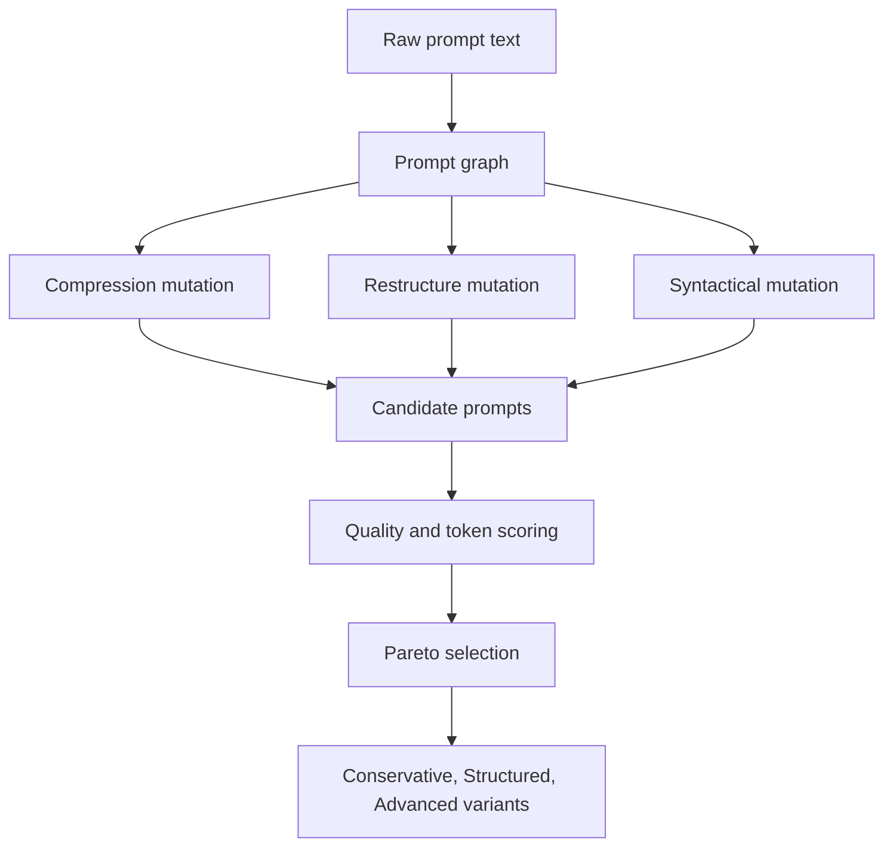
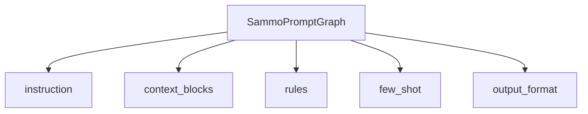
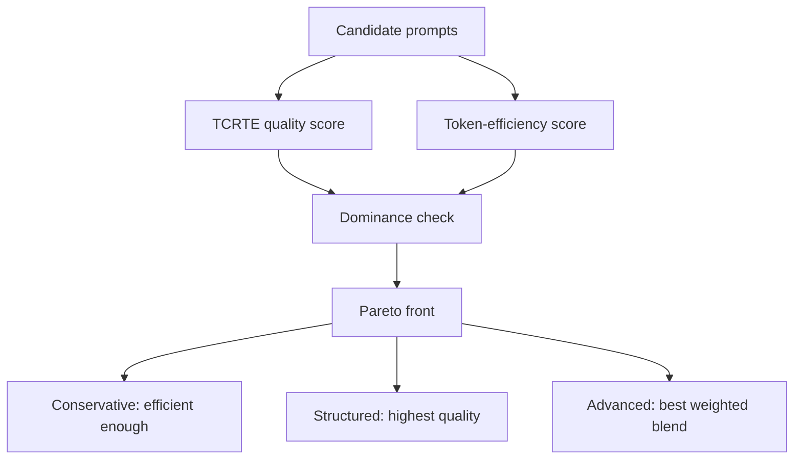

# SAMMO Topological Prompt Optimization: Educational Guide
### Structure-Aware Multi-Objective Mutation

> **Who this guide is for:** Developers and prompt engineers who need to understand how APOST optimizes a prompt's structure, token cost, and quality at the same time. SAMMO is an advanced framework, but this guide explains it from first principles before moving into the engineering details.

## 1. Introductory Overview

SAMMO is APOST's framework for optimizing prompt structure rather than merely rewriting prompt wording. SAMMO stands for **Structure-Aware Multi-Objective prompt optimization**. In plain language, it treats a prompt like a structured object with parts that can be rearranged, compressed, or clarified, then chooses the best variants by balancing more than one goal.

The two goals SAMMO balances in APOST are **quality** and **token efficiency**. Quality means the prompt still contains enough task, context, rules, and output-format information to work reliably. Token efficiency means the prompt uses fewer tokens, which can reduce latency and cost. A token is a small unit of text used by language models for billing and processing. You do not need to know the exact tokenizer to understand SAMMO; the important point is that shorter prompts usually cost less and run faster.

SAMMO exists because many optimization frameworks make prompts longer. They add sections, rules, examples, reminders, and safety instructions. That can improve reliability, but it can also create token bloat. SAMMO asks a sharper question: can we change the prompt's topology, or internal arrangement, so it keeps the useful structure while reducing waste?

In APOST, SAMMO is implemented by `SammoTopologicalOptimizer` in `backend/app/services/optimization/frameworks/sammo_topological_optimizer.py`. The optimizer parses the raw prompt into a structured graph, mutates that graph with several operators, serializes each mutated graph back into a runnable system prompt, scores each candidate on quality and token efficiency, selects candidates from the Pareto front, injects runtime variables, and finally runs the shared quality gate.

Use SAMMO when a prompt is already substantial enough to have structure, but you need to control quality-versus-cost trade-offs. It is especially relevant for high-throughput systems, long prompts, prompts that have accumulated too many guardrails, or workflows where token budget matters.

## 2. Framework-Specific Terminology Explained

This terminology is specific to SAMMO as implemented in APOST.

### SAMMO

**Plain meaning:** A framework that optimizes prompts by changing their structure and selecting variants that balance quality and token cost.

**Example:** SAMMO may compress the context section while preserving rules and output format.

**Why it matters:** It is designed for prompts where the question is not only "is this prompt good?" but also "is this prompt efficient enough?"

**How it connects:** The full pipeline is graph parse, graph mutation, prompt assembly, scoring, Pareto selection, and quality gating.

### Structure-Aware

**Plain meaning:** The optimizer knows that different parts of the prompt have different roles.

**Example:** A rule should not be compressed the same way a background paragraph can be compressed.

**Why it matters:** Naive compression treats the prompt as plain text. SAMMO treats it as labeled structure.

### Multi-Objective

**Plain meaning:** The optimizer evaluates candidates against more than one goal at the same time.

**Example:** Candidate A may be shorter, while Candidate B may preserve more task detail. SAMMO scores both quality and token efficiency.

**Why it matters:** A single "best" prompt may not exist. SAMMO exposes trade-offs.

### Prompt Graph

**Plain meaning:** A structured representation of the prompt split into named parts.

**Example:** A graph contains `instruction`, `context_blocks`, `rules`, `few_shot`, and `output_format`.

**Why it matters:** The graph is SAMMO's intermediate representation. Mutation operators work on graph fields instead of blindly editing text.

### Topology

**Plain meaning:** The arrangement and relationships between prompt parts.

**Example:** Whether rules appear before examples, whether context blocks are compressed, or whether instruction wording is sharpened.

**Why it matters:** Prompt quality depends not only on what text exists, but also on where it appears and how sections relate.

### `SammoPromptGraph`

**Plain meaning:** The dataclass APOST uses to store the parsed prompt graph.

**Example:** It has fields for instruction, context blocks, rules, few-shot hints, and output format.

**Why it matters:** This class makes the prompt structure explicit and serializable.

### Instruction

**Plain meaning:** The core task the model should perform.

**Example:** "Summarize the incident report and identify root causes."

**Why it matters:** The instruction is the main behavioral anchor. Mutation should clarify it, not distort it.

### Context Blocks

**Plain meaning:** Background information the model needs to interpret the task.

**Example:** Domain notes, source text, policy background, or user-provided constraints.

**Why it matters:** Context can often be compressed, but compressing it too aggressively can remove critical facts.

### Rules

**Plain meaning:** Constraints or required behaviors the model must follow.

**Example:** "Do not invent facts" or "Use only the provided source material."

**Why it matters:** Rules are high-value structural elements. SAMMO tries to preserve them while exploring whether some low-value rules can be removed safely.

### Few-Shot Hints

**Plain meaning:** Examples or demonstrations included in the prompt.

**Example:** A sample input-output pair that shows the desired response style.

**Why it matters:** Examples can improve behavior, but they can also add many tokens. SAMMO keeps them separate so their cost is visible.

### Output Format

**Plain meaning:** The required response structure.

**Example:** "Return JSON with `summary`, `risks`, and `next_steps`."

**Why it matters:** A short prompt that breaks the parser is not actually efficient. Output format must remain explicit.

### Mutation Operator

**Plain meaning:** A transformation applied to the prompt graph.

**Example:** `compression` shortens context blocks. `restructure` reorders sections and may remove a low-value rule. `syntactical` sharpens the instruction wording.

**Why it matters:** Mutation operators are how SAMMO explores alternative prompt designs.

### Deterministic Mutation Fallback

**Plain meaning:** A non-LLM backup transformation used when an LLM mutation fails.

**Example:** If the compression call fails, Python truncates long context blocks instead of crashing the pipeline.

**Why it matters:** SAMMO launches multiple mutation calls. Fallbacks keep the optimizer reliable under API errors or malformed JSON.

### Candidate

**Plain meaning:** One assembled prompt produced from the base graph or a mutated graph.

**Example:** The base candidate, compression candidate, restructure candidate, and syntactical candidate.

**Why it matters:** SAMMO scores candidates before selecting final variants.

### `SammoCandidate`

**Plain meaning:** The dataclass that stores one candidate prompt and its metrics.

**Example:** It stores the mutation label, system prompt, TCRTE score, token-efficiency score, and combined score.

**Why it matters:** Candidate metadata makes selection explainable.

### TCRTE Score

**Plain meaning:** A quality estimate based on APOST's Task, Context, Role, Tone, and Execution rubric.

**Example:** A candidate with explicit instruction, context, rules, and output format usually scores higher than a vague candidate.

**Why it matters:** This is the quality side of SAMMO's multi-objective scoring.

### Token-Efficiency Score

**Plain meaning:** A 0-100 score showing how compact a candidate is compared with the baseline prompt.

**Example:** If a mutated candidate uses fewer estimated tokens than the baseline, its efficiency score can improve.

**Why it matters:** This is the cost side of SAMMO's multi-objective scoring.

### Combined Score

**Plain meaning:** A weighted blend of quality and token efficiency.

**Example:** APOST defaults to 70 percent TCRTE quality and 30 percent token efficiency.

**Why it matters:** The Advanced variant uses this blended score when choosing among Pareto candidates.

### Pareto Front

**Plain meaning:** The set of candidates where no other candidate is better on both quality and token efficiency.

**Example:** A shorter prompt with slightly lower quality and a longer prompt with higher quality can both be on the Pareto front.

**Why it matters:** SAMMO avoids pretending one objective is everything. The Pareto front preserves meaningful trade-offs.

### Dominated Candidate

**Plain meaning:** A candidate that is worse than another candidate on both objectives.

**Example:** If Candidate B has higher TCRTE and higher token efficiency than Candidate A, Candidate A is dominated.

**Why it matters:** Dominated candidates are not useful final choices.

### Quality Gate

**Plain meaning:** A shared APOST critique-and-enhancement step applied after SAMMO selects variants.

**Example:** A selected candidate can still be judged and improved before being returned.

**Why it matters:** SAMMO optimizes structure and scores, but the quality gate provides an additional review layer.

## 3. Problem the Framework Solves

SAMMO solves the token-versus-quality dilemma.

The first failure mode is **token bloat**. A prompt may work well but become too long after repeated additions of safety rules, examples, context blocks, and formatting instructions. Long prompts increase cost and latency.

The second failure mode is **brittle compression**. A human or automated minifier may delete text without knowing which sections are structurally important. The prompt becomes shorter but loses behavior.

The third failure mode is **one-dimensional optimization**. Some systems optimize only for quality, producing expensive prompts. Others optimize only for length, producing weak prompts. SAMMO evaluates both.

The fourth failure mode is **unreviewable prompt editing**. If edits happen as raw text, engineers cannot easily tell whether the instruction, rules, examples, or format changed. SAMMO makes those parts explicit.

The fifth failure mode is **poor variant selection**. A single "best" prompt hides trade-offs. SAMMO returns three variants aligned to different points on the quality-cost curve.

## 4. Core Mental Model

Think of SAMMO like a compiler optimizer for prompts.

A normal text editor sees a prompt as words and paragraphs. SAMMO sees a prompt more like a program with sections that have different jobs. A compiler can optimize a program by changing structure while preserving behavior. SAMMO tries to do the same for prompts: compress the parts that can shrink, preserve the parts that carry task logic, and choose candidates that balance cost and quality.

This diagram reads from top to bottom. The raw prompt becomes a graph. The graph is mutated in several ways. Each mutation becomes a candidate prompt. Candidates are scored for quality and token efficiency. Pareto selection chooses final variants.

The practical lesson is that SAMMO does not just shorten text. It explores prompt structures and keeps the candidates that represent useful trade-offs.

## 5. Main Principles or Pillars

### Principle 1: Optimize Structure, Not Just Words

**What it means:** SAMMO changes prompt sections and their arrangement, not only surface phrasing.

**Failure it prevents:** Deleting important instructions during naive compression.

**How it works:** The prompt is parsed into `SammoPromptGraph` before mutation.

**Why it matters:** Structural awareness lets the optimizer treat instructions, context, examples, rules, and output format differently.

### Principle 2: Preserve Task Intent

**What it means:** Mutations should change topology or wording without changing what the prompt asks the model to do.

**Failure it prevents:** Efficient prompts that solve the wrong task.

**How it works:** Mutation prompts explicitly say to preserve task intent, and deterministic fallbacks preserve core fields.

**Why it matters:** Cost savings are useless if behavior drifts.

### Principle 3: Evaluate Multiple Objectives

**What it means:** Candidates are scored on quality and token efficiency.

**Failure it prevents:** Choosing a prompt that is short but weak, or strong but unnecessarily expensive.

**How it works:** SAMMO computes TCRTE score, token-efficiency score, and combined weighted score.

**Why it matters:** Production optimization is usually a trade-off, not a single-axis contest.

### Principle 4: Select Non-Dominated Candidates

**What it means:** SAMMO uses Pareto selection to keep candidates that are not clearly worse than another candidate on both objectives.

**Failure it prevents:** Throwing away a useful short prompt just because it is not the highest-quality prompt.

**How it works:** `_pareto_front()` filters candidates that are dominated.

**Why it matters:** Different deployment environments value cost and quality differently.

### Principle 5: Keep the Pipeline Resilient

**What it means:** If an LLM parse or mutation fails, SAMMO has fallback paths.

**Failure it prevents:** A multi-call optimizer breaking because one sub-call returned malformed JSON.

**How it works:** Mutation failures use `_deterministic_mutation_fallback()`.

**Why it matters:** Advanced optimizers need graceful degradation to be useful in production.

## 6. Step-by-Step Algorithm or Workflow

### Step 1: Enrich the prompt

SAMMO first calls `integrate_gap_interview_answers_into_prompt()`. A gap-interview answer is extra clarification the user provided after APOST asked follow-up questions.

This matters because graph parsing should see the best available version of the prompt.

### Step 2: Parse the prompt graph

`_parse_prompt_graph()` asks an LLM to convert the raw prompt into JSON with five fields:

- `instruction`
- `context_blocks`
- `rules`
- `few_shot`
- `output_format`

The result is normalized into a `SammoPromptGraph` dataclass. Normalization means the code cleans and defaults fields so later stages receive a predictable structure.

### Step 3: Run mutation operators

SAMMO runs three mutation operators:

- `compression`: compresses context blocks while preserving critical facts.
- `restructure`: reorders sections and may remove one low-value rule if safe.
- `syntactical`: rewrites the instruction for clearer imperative wording.

These mutations run asynchronously with `asyncio.gather()`, which means APOST can request them in parallel instead of waiting for one after another.

### Step 4: Use deterministic fallback if mutation fails

If a mutation call fails, `_deterministic_mutation_fallback()` applies a Python-based backup.

For compression, it truncates long context blocks. For restructure, it reverses context order and trims the last rule if more than one exists. For syntactical mutation, it appends a deterministic stepwise-execution instruction.

This keeps the pipeline moving even when an LLM sub-call fails.

### Step 5: Assemble prompt candidates

`_assemble_prompt_from_graph()` serializes each graph back into a runnable system prompt with Markdown sections such as `### Instruction`, `### Context`, `### Rules`, `### Few-Shot Hints`, and `### Output Format`.

SAMMO then deduplicates candidates so repeated or equivalent prompts do not crowd out useful variants.

### Step 6: Score candidates

Each candidate receives:

- a TCRTE score from `score_tcrte()` or a heuristic fallback,
- a token-efficiency score relative to the baseline candidate,
- a combined score using `SAMMO_TCRTE_WEIGHT` and `SAMMO_TOKEN_WEIGHT`.

This stage converts qualitative prompt differences into comparable metrics.

### Step 7: Select final variants

`_select_variant_candidates()` chooses three variants:

- Conservative: most token-efficient candidate that clears the minimum quality threshold.
- Structured: candidate with the highest TCRTE quality estimate.
- Advanced: Pareto-front candidate with the highest weighted combined score.

If there are not enough unique candidates, the selector creates guarded fallback variants based on the best candidate.

### Step 8: Inject variables and run quality gate

SAMMO appends input variables with `inject_input_variables_block()`, adds an Advanced prefill suggestion when applicable, and then calls the shared quality gate.

The quality gate provides final critique and possible enhancement after SAMMO's structural selection.

## 7. Diagrams and Architectural Explanations

### Diagram 1: SAMMO Pipeline

Read this diagram from left to right. SAMMO starts with the request, enriches it, converts it into graph form, mutates the graph, assembles candidate prompts, removes duplicates, scores candidates, selects tiers, injects variables, and quality-checks the result.

The practical lesson is that SAMMO is a multi-stage optimizer. Each stage has a narrow responsibility, which makes failures easier to diagnose.

### Diagram 2: Prompt Graph Topology

This diagram shows the graph fields. `instruction` holds the main task. `context_blocks` hold background. `rules` hold constraints. `few_shot` holds examples. `output_format` holds the required response shape.

The practical lesson is that SAMMO can mutate each part differently because it has separated the prompt into roles.

### Diagram 3: Pareto Selection

This diagram explains selection. Every candidate is scored on quality and token efficiency. Dominated candidates are removed. The remaining candidates form the Pareto front. The final variants are chosen for different deployment needs.

The practical lesson is that SAMMO keeps trade-offs visible instead of hiding them inside one opaque score.

## 8. Optimization Tiers / Variants / Modes

### Conservative

**Purpose:** Choose the most token-efficient candidate that still clears the minimum quality threshold.

**Cost:** Lowest token cost among acceptable candidates.

**Best use:** High-throughput systems where prompt cost and latency matter.

**Trade-off:** It may sacrifice some clarity or redundancy for compactness.

### Structured

**Purpose:** Choose the candidate with the highest TCRTE quality estimate.

**Cost:** Usually higher than Conservative.

**Best use:** Complex tasks where quality matters more than prompt length.

**Trade-off:** It may preserve more tokens than strictly necessary.

### Advanced

**Purpose:** Choose the best Pareto-front candidate by weighted combined score.

**Cost:** Balanced.

**Best use:** Production systems that need a principled middle ground between quality and efficiency.

**Trade-off:** The default 70/30 quality-to-token weighting may not match every organization's cost tolerance.

### Quality Gate Modes

| Mode | What happens | Good fit |
|---|---|---|
| `full` | Critiques and conditionally enhances all variants | Production release |
| `sample_one_variant` | Fully evaluates one variant | Cost-sensitive review |
| `critique_only` | Scores without enhancing | Benchmarking and audits |
| `off` | Skips final judge pass | Fast local iteration |

## 9. Implementation and Production Considerations

The implementation lives in `backend/app/services/optimization/frameworks/sammo_topological_optimizer.py`. The key dataclasses are `SammoPromptGraph` and `SammoCandidate`. The main generation workflow is `generate_variants()`.

### Routing

The auto-router selects `sammo` for complex or expert tasks in extraction, QA, or analysis when recommended techniques include `structure_aware`, `topological_mutation`, or `prompt_compression`.

In plain language, APOST routes to SAMMO when the task is complex and there is a signal that structure or compression should be optimized.

### Configuration

The main SAMMO configuration values are:

- `MAX_TOKENS_SAMMO_STRUCTURAL_PARSE`: token budget for graph parsing and mutation calls.
- `SAMMO_MIN_TCRTE_THRESHOLD`: minimum quality score for the Conservative slot, default 60.
- `SAMMO_TCRTE_WEIGHT`: quality weight in the combined score, default 0.70.
- `SAMMO_TOKEN_WEIGHT`: token-efficiency weight in the combined score, default 0.30.

### Performance trade-offs

SAMMO uses multiple LLM calls: one graph parse and three mutation calls. Mutation calls run concurrently, which helps latency, but this framework is still heavier than simple single-pass rewrites.

The return on that cost is better visibility into prompt structure and a principled set of quality-cost variants.

### Operational concerns

Because SAMMO uses score estimates, teams should validate selected variants with real task evaluations when possible. The TCRTE estimate is useful for triage, but it is not a substitute for measuring output quality on representative examples.

Because token efficiency is relative to the baseline assembled prompt, very short prompts may not benefit much. SAMMO is strongest when there is enough structure to mutate.

## 10. Common Failure Modes and Diagnostics

| Symptom | Likely cause | Where to inspect | Correction |
|---|---|---|---|
| Graph parse fails | The model returned malformed JSON or the prompt was too ambiguous | `_parse_prompt_graph()` and raw provider logs | Improve prompt structure or retry with quality gate on |
| Compression loses critical detail | Important facts were placed in context blocks and treated as compressible | `context_blocks` and compression candidate | Move critical facts into rules or instruction |
| Rules disappear after restructure | Restructure can remove one low-value rule if judged safe | `rules` before and after mutation | Use Structured variant or strengthen critical rules |
| Candidates are nearly identical | Mutation operators did not meaningfully alter the graph | assembled prompts and mutation labels | Increase source prompt structure or inspect mutation prompts |
| Conservative is too weak | Token efficiency dominated selection | `SAMMO_MIN_TCRTE_THRESHOLD` and TCRTE score | Raise threshold or use Structured |
| Advanced is not compressed enough | Quality weight dominates token weight | `SAMMO_TCRTE_WEIGHT` and `SAMMO_TOKEN_WEIGHT` | Adjust weights if cost matters more |
| Scores look surprising | TCRTE scorer fell back to heuristic or prompt sections are misleading | `_estimate_tcrte_score()` | Run task-specific evals and inspect quality gate output |
| Too much latency | Graph parse plus parallel mutation calls are expensive | provider usage logs | Use KERNEL or a simpler framework for short prompts |

The quickest diagnostic is to compare the graph before and after mutation. If the graph is wrong, parsing is the issue. If the graph is right but the candidate is weak, mutation or selection is the issue. If the selected prompt still performs poorly, use task-level evaluations.

## 11. When to Use It and When Not To

### Use SAMMO when

- The prompt is long enough that token cost matters.
- The prompt already has real structure to mutate.
- You need explicit trade-offs between quality and prompt length.
- The workflow is high-throughput or latency-sensitive.
- Recommended techniques include structure-aware optimization, topology mutation, or prompt compression.

### Avoid SAMMO when

- The prompt is very short.
- The prompt is missing basic task, context, or output details; use TCRTE first.
- The main need is persona or creative direction; use CREATE.
- The main risk is untrusted dynamic context; use XML Structured Bounding.
- You have labeled eval data and want empirical prompt search; consider OPRO.

### Trade-offs versus other frameworks

Compared with KERNEL, SAMMO is more expensive but more strategic about compression. Compared with TCRTE, SAMMO assumes the prompt already has enough material to restructure. Compared with OPRO, SAMMO does not learn from labeled examples; it uses structural mutation and heuristic scoring. Compared with XML Structured Bounding, SAMMO focuses on topology and cost, not primarily on instruction/data isolation.

## 12. Research-Based Insights

SAMMO in APOST is inspired by structure-aware prompt optimization research, especially work that treats prompts as structured programs rather than flat strings.

The closest research anchor is **Symbolic Prompt Program Search: A Structure-Aware Approach to Efficient Compile-Time Prompt Optimization** by Schnabel and Neville, which introduces SAMMO as a framework for prompt-program optimization using structural transformations and search. This supports APOST's choice to parse prompts into structured components and mutate those components instead of only editing text. Source: [arXiv:2404.02319](https://arxiv.org/abs/2404.02319).

Multi-objective optimization is a long-running optimization paradigm where candidates are evaluated across more than one objective and Pareto dominance is used to preserve trade-offs. SAMMO applies this idea to prompts by scoring both quality and token efficiency. A widely cited foundation is Deb et al.'s NSGA-II work on fast elitist multi-objective genetic algorithms. Source: [IEEE Xplore: NSGA-II](https://ieeexplore.ieee.org/document/996017).

Prompt compression research also supports the idea that shorter prompts can preserve task behavior when compression is targeted rather than blind. For example, LLMLingua studies prompt compression for efficient inference while trying to preserve useful information. SAMMO is different because it mutates graph structure, but it shares the practical goal of reducing token cost without destroying behavior. Source: [LLMLingua](https://arxiv.org/abs/2310.05736).

The research takeaway is careful: APOST's SAMMO is a local implementation of structure-aware, multi-objective prompt mutation. It should be validated on real tasks, but its design is well aligned with research trends in prompt programs, structured search, compression, and Pareto trade-off selection.

## 13. Final Synthesis

SAMMO is APOST's structure-aware optimizer for prompts that need quality-cost trade-off control.

The workflow is:

1. Enrich the prompt with gap-interview answers.
2. Parse the prompt into a graph.
3. Mutate the graph with compression, restructure, and syntactical operators.
4. Assemble graph variants back into prompts.
5. Score candidates on TCRTE quality and token efficiency.
6. Select Conservative, Structured, and Advanced variants using threshold, quality, and Pareto logic.
7. Inject runtime variables and run the quality gate.

| Need | SAMMO answer |
|---|---|
| Reduce prompt cost | Use compression and Conservative selection |
| Preserve best quality | Use Structured selection |
| Balance quality and cost | Use Advanced Pareto blend |
| Understand prompt parts | Inspect `SammoPromptGraph` |
| Debug weak candidates | Compare graph fields before and after mutation |
| Tune behavior | Adjust threshold and quality/token weights |

The central idea is simple: SAMMO treats the prompt as a structured object, not a wall of text. That lets APOST explore safer compression and topology changes while keeping quality and cost visible at the same time.
