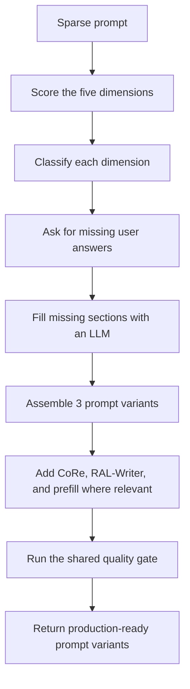
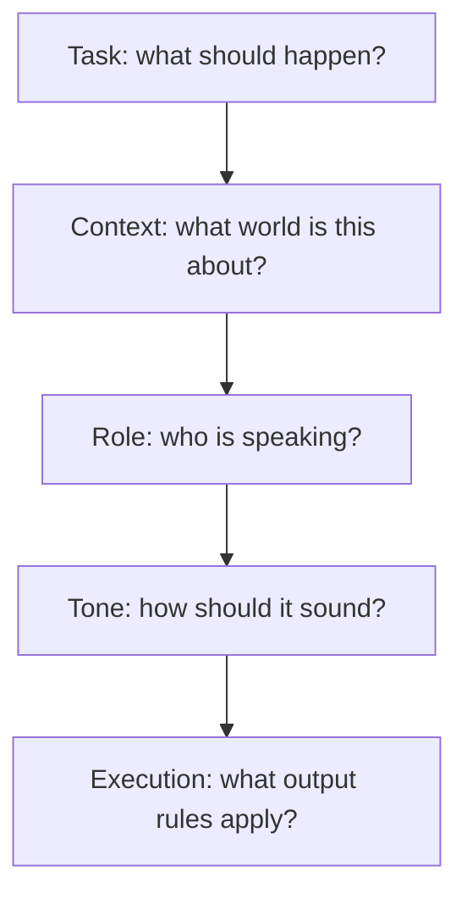
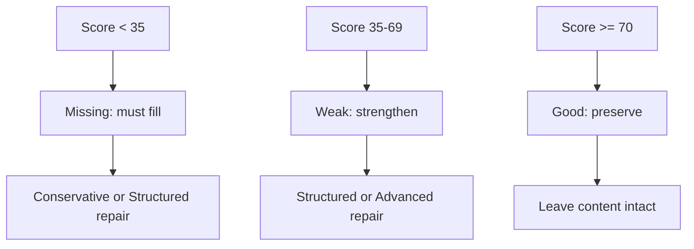

# TCRTE Coverage Optimization: Educational Guide
### The Prompt Foundation Builder for Underspecified Prompts

> **Who this guide is for:** People who start with a prompt that is too short, too vague, or too missing-to-be-helpful, and want to understand how APOST turns it into a usable production prompt. This is a framework-specific guide, not a general prompt-engineering overview.

## 1. Introductory Overview

TCRTE Coverage Optimization is APOST's foundation-building framework. It is used when the original prompt is so underspecified that other optimizers cannot do much with it. If a user says only "Write a marketing email" or "Refactor this code," there may be no usable task scope, no audience, no output format, and no execution constraints. In that situation, rearranging the prompt is not enough. The framework has to fill in the missing pieces.

TCRTE stands for **Task, Context, Role, Tone, Execution**. Those are the five coverage dimensions APOST uses to decide whether a prompt has enough structure to optimize. In plain English: what should the model do, what world is it operating in, who should it sound like, what tone should it use, and what output rules must it obey?

In APOST, the TCRTE optimizer does four things in order. First, it scores each dimension and labels it as missing, weak, or good. Second, it incorporates any user-provided gap interview answers, which are follow-up answers collected by the UI when the original prompt is too thin. Third, it asks an LLM to fill the missing or weak sections and returns a structured JSON payload with explicit sections. Fourth, it assembles three variants of the repaired prompt: Conservative, Structured, and Advanced.

The beginner-level idea is simple: TCRTE converts a prompt from "too little to work with" into "just enough structure to be usable." The advanced-level idea is that it is not mainly a style framework. It is a coverage repair framework that establishes a minimum viable instruction architecture before more specialized optimizers take over.

Use TCRTE when the prompt is underspecified, especially when the overall coverage score is low. The router in APOST is designed to select TCRTE first when the overall TCRTE score is below 50, because no later framework can reliably optimize a prompt that does not yet say what it wants.

## 2. Framework-Specific Terminology Explained

This section focuses on the internal terms that matter for TCRTE itself.

### TCRTE

**Plain meaning:** The five-part coverage rubric used by APOST to decide whether a prompt has enough foundation to optimize.

**Example:** A prompt may have a clear task but no role, tone, or execution rules. TCRTE will mark those dimensions as missing or weak.

**Why it matters:** TCRTE is the framework's organizing logic. Every repair decision comes from these five dimensions.

**How it connects:** The dimension scores drive triage, the triage drives repair instructions, and the repair instructions drive the variant assembly.

### Coverage

**Plain meaning:** How much of the essential prompt structure is already present.

**Example:** A prompt that includes task, context, and output format may have decent coverage even if it is still rough.

**Why it matters:** TCRTE is coverage-first, not style-first. It repairs missing structure before it attempts any polish.

### Gap Data

**Plain meaning:** The structured assessment APOST already has about the prompt's missing or weak parts.

**Example:** `gap_data` may say that context scored 20, role scored 0, and execution scored 25.

**Why it matters:** The optimizer does not guess blindly. It uses the audit data as the starting point for repair.

**How it connects:** In `TcrteCoverageOptimizer`, `gap_data` feeds `_classify_dimensions_by_score()`.

### Gap Interview Answers

**Plain meaning:** Extra user answers collected after APOST asks follow-up questions about the prompt.

**Example:** If the prompt says "Write an email," the UI may ask who the audience is, what tone is wanted, and what the email should accomplish.

**Why it matters:** User answers are better than model guesses. TCRTE prefers verbatim human clarification when it exists.

**How it connects:** `integrate_gap_interview_answers_into_prompt()` merges these answers into the raw prompt before section filling begins.

### Missing / Weak / Good

**Plain meaning:** The three score buckets used to triage each TCRTE dimension.

**Example:** A score below 35 is missing, 35 to 69 is weak, and 70 or above is good.

**Why it matters:** This classification determines whether the framework must fill, strengthen, or preserve a dimension.

### Dimension Triage

**Plain meaning:** The step that assigns each dimension a status based on its score.

**Example:** Task may be good while tone is missing.

**Why it matters:** TCRTE does not treat all prompt holes equally. It repairs the weak parts and preserves the strong parts.

### Repair Instructions

**Plain meaning:** The prompt text that tells the LLM what to fill and what to preserve.

**Example:** "Task is missing, so generate substantial task content. Tone is good, so preserve it."

**Why it matters:** These instructions turn the score audit into a rewrite plan.

### Section Fill

**Plain meaning:** The LLM-generated JSON object that contains the repaired TCRTE sections.

**Example:** Separate fields for `task_section`, `context_section`, `role_section`, `tone_section`, `execution_section`, and `constraints`.

**Why it matters:** This is the framework's main intermediate representation. It is the bridge between raw prompt and assembled variants.

### Critical Context for CoRe

**Plain meaning:** The single most important context element extracted during repair so it can be repeated later in the Advanced tier.

**Example:** In a healthcare prompt, the critical context might be "cardiology - cardiac catheterisation reporting."

**Why it matters:** TCRTE uses this to support the Advanced tier's context repetition technique.

### Conservative Variant

**Plain meaning:** The lightest repaired prompt version.

**Example:** It only inserts content for dimensions that are truly missing.

**Why it matters:** It preserves the user's original structure as much as possible.

### Structured Variant

**Plain meaning:** The fully sectioned baseline version.

**Example:** Role, task, context, tone, execution, and constraints are all explicitly separated.

**Why it matters:** This is the framework's strongest general-purpose repair form.

### Advanced Variant

**Plain meaning:** The most heavily reinforced version.

**Example:** Full TCRTE structure plus context repetition, constraint echo, and stronger guardrails.

**Why it matters:** This is used when the prompt is severely underspecified or the stakes are higher.

### CoRe

**Plain meaning:** Context Repetition. The same critical context is repeated at multiple attention-favorable positions.

**Example:** If the context is crucial, Advanced may repeat it so it is harder for the model to lose track of it in a long prompt.

**Why it matters:** It helps reduce the "lost in the middle" problem for long repaired prompts.

### RAL-Writer

**Plain meaning:** A constraint restatement technique that repeats important rules near the end of the prompt.

**Example:** The Structured and Advanced variants can echo key constraints again in a recency zone.

**Why it matters:** It gives important rules a second chance to stay salient right before generation.

### Prefill Suggestion

**Plain meaning:** A suggested opening for the assistant's answer, used where the provider supports it.

**Example:** For JSON-like tasks, the suggestion may simply be `{`.

**Why it matters:** It helps lock the output shape in some providers and some task types.

### Quality Gate

**Plain meaning:** The shared critique-and-enhancement step that evaluates each repaired variant after TCRTE assembles it.

**Example:** A weak repaired variant can be critiqued and improved before returning to the user.

**Why it matters:** TCRTE repairs structure, but the quality gate checks whether the repaired prompt is actually strong enough to ship.

## 3. Problem the Framework Solves

TCRTE exists because very short prompts often fail in predictable ways.

The first failure is **task ambiguity**. If the prompt does not say what the model should produce, the model will fill in the blanks itself. That can lead to outputs that are plausible but not actually useful.

The second failure is **missing context**. A prompt like "Refactor this code" does not tell the model which codebase, which language, which standards, or which constraints matter. Without context, the model defaults to generic assumptions.

The third failure is **role drift**. If the prompt does not define the model's persona or level of expertise, the response can feel mismatched in voice and depth.

The fourth failure is **tone mismatch**. A prompt may need a formal, concise, cautious, or friendly response, but if tone is not specified, the result may be inconsistent.

The fifth failure is **execution failure**. Even if the model understands the task, the output may not fit a parser, a downstream API, a document template, or a length limit.

TCRTE solves all five by creating a baseline prompt architecture first. Only after the prompt has enough structure does it become worth applying stylistic or structural refinements from other frameworks.

## 4. Core Mental Model

Think of TCRTE as a form-filling system for prompts.

If a prompt is too empty, trying to optimize it is like trying to decorate a house before the walls exist. TCRTE starts by drawing the missing blueprint. It decides what rooms are missing, what the house is for, who will live there, how the rooms should feel, and what rules the building must obey.

This diagram reads from top to bottom. The sparse prompt is scored first. The scores tell TCRTE what is missing, weak, or already good. If the user has answered follow-up questions, those answers are merged in. The LLM then fills in explicit sections for the five dimensions. Those sections are assembled into three variants, enhanced where appropriate, checked by the quality gate, and returned.

The practical lesson is that TCRTE is not mainly a rewrite style. It is a recovery workflow for underbuilt prompts.

## 5. Main Principles or Pillars

### Principle 1: Coverage Before Style

TCRTE assumes style cannot fix a prompt that lacks basic intent. If the task is unclear, polishing the prose does not help much.

**Failure it prevents:** Pretty but unusable prompts.

**How it works:** The framework repairs missing dimensions first and only then produces variants that can be further improved.

**Why it matters:** This keeps the system from wasting effort on cosmetic changes when the real problem is structural absence.

### Principle 2: Score the Prompt, Don't Guess

TCRTE uses the gap analysis score to decide what to do next. It does not rely on a human reading the prompt and making a vague judgment.

**Failure it prevents:** Inconsistent human triage.

**How it works:** Each dimension gets a numeric score and a status bucket.

**Why it matters:** The pipeline becomes repeatable, debuggable, and easier to tune.

### Principle 3: Preserve What Is Already Good

Not every dimension needs rewriting. If tone or role already scored well, TCRTE should preserve it instead of overwriting it for no reason.

**Failure it prevents:** Overfitting the prompt into something less faithful than the original.

**How it works:** Good dimensions are explicitly marked to preserve existing content.

**Why it matters:** Repair should be selective, not destructive.

### Principle 4: Prefer Human Answers Over Hallucinated Defaults

When the user has already supplied gap interview answers, TCRTE should use them.

**Failure it prevents:** The model inventing a domain, audience, or format that sounds reasonable but is wrong.

**How it works:** The answers are merged into the prompt before section filling.

**Why it matters:** Prompt repair is only useful if the repair is grounded in real intent.

### Principle 5: Escalate Reinforcement Only When Needed

The Advanced tier adds stronger techniques like CoRe and RAL-Writer, but only after the baseline structure exists.

**Failure it prevents:** Overloading a weak prompt with unnecessary reinforcement before it even has a stable foundation.

**How it works:** Advanced starts with the full five-section architecture and then applies additional context and constraint reinforcement.

**Why it matters:** This keeps the reinforcement proportional to the problem.

## 6. Step-by-Step Algorithm or Workflow

### Step 1: Read the TCRTE scores

`_classify_dimensions_by_score()` looks at `gap_data` and assigns each dimension a status. The thresholds are simple: below 35 is missing, below 70 is weak, and 70 or above is good.

This triage is important because the optimizer needs to know whether it should fill, strengthen, or preserve a dimension.

### Step 2: Integrate user answers

`integrate_gap_interview_answers_into_prompt()` merges any user-provided follow-up answers into the raw prompt before the repair pass runs.

This means the LLM sees the enriched prompt, not just the original underspecified one.

### Step 3: Build repair instructions

`_build_dimension_repair_instructions()` translates the score labels into explicit instructions. It tells the LLM which dimensions are missing, which are weak, and which should be preserved.

The beginner version of this step is "tell the model what to fix." The expert version is "turn the audit into a structured rewrite contract."

### Step 4: Ask the LLM to fill the sections

`_extract_tcrte_sections()` sends the repair prompt to an LLM and asks for valid JSON with the filled sections.

The expected JSON includes:

- `task_section`
- `context_section`
- `role_section`
- `tone_section`
- `execution_section`
- `constraints`
- `critical_context_for_core`

If the output is malformed, the optimizer repairs the payload once and tries again. That is a production safeguard, not a cosmetic choice.

### Step 5: Assemble the three variants

TCRTE then builds three versions of the prompt:

- **Conservative:** only inserts missing dimensions into the original prompt.
- **Structured:** creates a full five-section architecture in plain sectioned form.
- **Advanced:** creates the full architecture plus extra guardrails and reinforcement.

These variants let downstream selection choose the right trade-off between fidelity, structure, and token cost.

### Step 6: Apply shared enhancements

The Advanced variant can receive `inject_context_repetition_at_attention_positions()`, which repeats the critical context at multiple positions. The Structured and Advanced variants can receive `apply_ral_writer_constraint_restatement()`, which repeats important constraints near the end. Where supported, the optimizer can also attach a prefill suggestion.

These are shared APOST techniques, but in TCRTE they are used only after the prompt has been repaired into a workable baseline.

### Step 7: Run the quality gate

Finally, the shared quality gate critiques each variant, may enhance weak ones, and attaches real quality evaluation metadata.

This matters because TCRTE is a repair framework, not a guarantee. The quality gate is what checks whether the repaired prompt is actually strong enough to return.

## 7. Diagrams and Architectural Explanations

### Diagram 1: TCRTE Workflow

```mermaid
flowchart LR
  A["Input prompt"] --> B["Score task, context, role, tone, execution"]
  B --> C["Classify missing, weak, good"]
  C --> D["Merge gap interview answers"]
  D --> E["LLM fills explicit sections"]
  E --> F["Assemble Conservative, Structured, Advanced"]
  F --> G["Apply CoRe / RAL-Writer / prefill"]
  G --> H["Quality gate critique and enhancement"]
  H --> I["Final variants"]
```

Read this diagram as a repair ladder. The framework starts with a score, turns that score into an action plan, fills the prompt's missing structure, then assembles increasingly strong variants.

The practical lesson is that TCRTE is a pipeline with safeguards, not a single rewrite prompt.

### Diagram 2: The Five Dimensions

This diagram shows the five coverage dimensions in a simple sequence. It is not claiming that the model literally processes them in this order. It is showing that the framework wants each dimension to be explicitly represented so none of them is left to inference.

The practical lesson is that a prompt is stronger when task, grounding, persona, voice, and output constraints are all present and distinct.

### Diagram 3: Triage and Tiers

This diagram explains the decision rule. Missing dimensions must be filled. Weak dimensions should be strengthened. Good dimensions should be preserved.

The practical lesson is that TCRTE is selective. It does not flatten everything into a generic prompt template.

## 8. Optimization Tiers / Variants / Modes

### Conservative

This is the least disruptive repair mode. It keeps the original prompt and only adds the dimensions that are truly missing.

**Cost:** Lowest token overhead.

**Use case:** Slightly underspecified prompts that still have a recognizable shape.

**Trade-off:** It may not be strong enough for heavily underspecified prompts.

### Structured

This is the baseline production repair mode. It rewrites the prompt into a clear five-section layout with explicit task, context, role, tone, and execution blocks.

**Cost:** Moderate token overhead.

**Use case:** Most production prompts that need a stable, readable baseline.

**Trade-off:** More verbose than Conservative, but much more complete.

### Advanced

This is the strongest repair mode. It uses the full five-section architecture and then adds reinforcement techniques such as CoRe, RAL-Writer, and prefill where appropriate.

**Cost:** Highest token overhead.

**Use case:** Severely underspecified prompts and higher-risk workflows where missing context would be costly.

**Trade-off:** Stronger, but also more verbose and more expensive.

### Provider-aware structured response

The section-filling pass uses provider-aware structured output hints when available. In practice, that means OpenAI can use JSON schema style output hints, Google can use schema-aware output, and other providers fall back to a simpler structured JSON request.

The plain-English reason is that the optimizer wants the section-fill step to return parseable JSON, not a free-form essay.

## 9. Implementation and Production Considerations

The main implementation lives in `backend/app/services/optimization/frameworks/tcrte_coverage_optimizer.py:100-520`. The key thresholds are defined near the top of the file, and the main `generate_variants()` workflow starts around line 276. The auto-router sends low-coverage prompts to TCRTE when the overall TCRTE score is below 50 in `backend/app/services/analysis/framework_selector.py:103-112`.

### Configuration that matters

- `TCRTE_SCORE_THRESHOLD_MISSING` is 35.
- `TCRTE_SCORE_THRESHOLD_WEAK` is 70.
- `MAX_TOKENS_TCRTE_DIMENSION_FILL` controls the section-fill call's output budget.
- `quality_gate_mode` controls whether the returned variants are critiqued, enhanced, or left alone.

### Production shape

The optimizer is not a single prompt template. It is a multi-stage repair pipeline:

1. Score the five dimensions.
2. Integrate user answers.
3. Generate section-filled JSON.
4. Assemble three variants.
5. Apply shared enhancements.
6. Run the quality gate.

That shape matters because the system can fail gracefully at multiple points. If JSON extraction fails, the code retries. If the LLM call fails, the framework still has deterministic fallback behavior. If the output is weak, the quality gate can improve it.

### Performance trade-offs

TCRTE is intentionally heavier than a simple rewrite. It may add token cost because it fills missing sections, adds structured boundaries, and sometimes repeats critical context or constraints.

The benefit is that it gives downstream frameworks something stable to work with. That is why the router prefers it when the prompt score is low: it is a foundation layer, not a finishing layer.

### Practical integration

The important shared helpers are:

- `integrate_gap_interview_answers_into_prompt()` for merging user clarification.
- `inject_input_variables_block()` for keeping dynamic data visible and separate.
- `inject_context_repetition_at_attention_positions()` for the Advanced context repetition step.
- `apply_ral_writer_constraint_restatement()` for repeating constraints near the end.
- `generate_claude_prefill_suggestion()` for provider-specific prefilling.

## 10. Common Failure Modes and Diagnostics

| Symptom | Likely cause | Where to look | What to do |
|---|---|---|---|
| The prompt is still vague after optimization | The input was so underspecified that even repair could only infer a generic baseline | `gap_data` and the gap interview answers | Add more user answers before rerunning |
| The LLM invented the wrong domain | The optimizer had no grounded context to work from | `integrate_gap_interview_answers_into_prompt()` and the section-fill output | Supply clearer gap answers |
| The JSON section fill failed | The model returned malformed JSON or the schema was not followed | `_extract_tcrte_sections()` | Let the one-shot repair retry run, then inspect the prompt if it keeps happening |
| The Structured variant feels repetitive | The prompt needed a full five-section rewrite, not just additive repair | `variant_2_system_prompt` assembly | Use Structured only when completeness matters |
| The Advanced variant is too long | CoRe and RAL-Writer expanded the prompt | `inject_context_repetition_at_attention_positions()` and `apply_ral_writer_constraint_restatement()` | Fall back to Structured for simpler use cases |
| The output still does not fit downstream systems | The execution section was too weak or the output contract was not clear enough | `execution_section` and the quality gate result | Strengthen execution constraints and keep the quality gate on |
| The router did not choose TCRTE | The overall score was not low enough, or another higher-priority rule matched first | `backend/app/services/analysis/framework_selector.py` | Confirm the prompt score and the routing rules |

The simplest diagnostic rule is this: if the prompt still feels empty, the problem is coverage. If the prompt is structured but still weak, the problem is likely in the section fill or the tier choice.

## 11. When to Use It and When Not To

### Use TCRTE when

- The prompt is very short.
- The prompt is missing obvious prompt anatomy.
- You need a production baseline before applying more specialized optimizers.
- The gap interview has useful answers that can be folded back into the prompt.
- The overall TCRTE score is below 50.

### Avoid or defer TCRTE when

- The prompt is already well-specified.
- The task is mostly stylistic or structural, not foundational.
- You already know the prompt has enough task, context, role, tone, and execution detail.
- You want a lighter rewrite with less overhead.

### Trade-offs versus other frameworks

Compared with KERNEL, TCRTE is more about recovery than tidy structure. Compared with XML Structured Bounding, it is less about instruction boundaries and more about filling missing foundations. Compared with TextGrad, it does not iterate over critique loops as its main idea. TCRTE is the "make it complete enough to optimize" framework.

## 12. Research-Based Insights

TCRTE itself is an APOST-specific rubric, not a public research acronym. Its design is supported by broader prompt engineering and instruction-following research.

OpenAI's prompt engineering guidance emphasizes that effective prompting requires clear, specific instructions and iterative refinement. That supports TCRTE's basic idea that vague prompts need to be expanded into explicit sections before further optimization makes sense. Sources: [OpenAI Prompting](https://platform.openai.com/docs/guides/prompting) and [OpenAI best practices for prompt engineering](https://help.openai.com/en/articles/6654000-best-practices-for-prompt-engineering-with-chatgpt).

Anthropic's prompt engineering overview says you should start with a clear definition of success criteria and a first draft prompt, then improve from there. Anthropic also recommends clear and direct prompting, using XML tags when prompts contain multiple components, and giving Claude a role when needed. That fits TCRTE's emphasis on explicit dimensions like task, context, role, tone, and execution. Sources: [Anthropic prompt engineering overview](https://docs.anthropic.com/en/docs/build-with-claude/prompt-engineering/overview) and [Use XML tags to structure your prompts](https://docs.anthropic.com/en/docs/build-with-claude/prompt-engineering/use-xml-tags).

Ouyang et al.'s InstructGPT paper shows that making language models follow instructions better depends on aligning them with explicit demonstrations and human feedback, not just scaling model size. That supports the broader idea that explicit guidance and feedback matter more than vague intent. Source: [Training language models to follow instructions with human feedback](https://arxiv.org/abs/2203.02155).

Liu et al.'s "Lost in the Middle" paper is not the main basis for TCRTE, but it supports the Advanced tier's use of repeated critical context and end-of-prompt constraint reminders. If the repaired prompt becomes long, key information can still fade unless it is reinforced. Source: [Lost in the Middle: How Language Models Use Long Contexts](https://arxiv.org/abs/2307.03172).

The research takeaway is narrow and practical: prompts perform better when they are explicit, structured, and iteratively improved. TCRTE operationalizes that idea for prompts that are too thin to optimize otherwise.

## 13. Final Synthesis

TCRTE is APOST's foundation-building framework for underspecified prompts.

The short version is:

1. Score the five dimensions.
2. Decide what is missing, weak, or good.
3. Merge real user answers if available.
4. Fill the missing sections with a structured LLM pass.
5. Assemble Conservative, Structured, and Advanced variants.
6. Reinforce the strongest variant with CoRe and RAL-Writer when needed.
7. Let the shared quality gate check the result before return.

### Cheat sheet

| Need | TCRTE response |
|---|---|
| Prompt is too short | Fill task, context, role, tone, and execution |
| Prompt has some structure but not enough | Strengthen weak dimensions |
| Prompt already has good sections | Preserve them |
| User answered follow-up questions | Use those answers instead of guessing |
| Need a light fix | Conservative |
| Need a production baseline | Structured |
| Need maximum reinforcement | Advanced |

The main idea is simple: TCRTE makes a prompt complete enough to be worth optimizing. Once the prompt has a real foundation, the rest of APOST can do its job much better.
